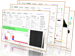

#  MASH-FRET


## What is MASH-FRET?
MASH-FRET is a GUI-based software package written in **Matlab** for the analysis of **single-molecule FRET trajectories**. The framework encompasses the entire workflow from spot detection and trace processing to histogram and dwell time analysis. The program is structured in five modules:
- Simulation
- Movie Processing
- Trace Processing
- Histogram Analysis
- Transition Analysis

Inputs for analysis can be generated from simulations or single-molecule experiments.

## Getting started

Clone or download MASH-FRET into a directory of your choice.
```
git clone https://github.com/RNA-FRETools/MASH-FRET.git
```
Within Matlab, add MASH-FRET to you path by going to `Home → Set Path → Add with Subfolders`

**Note:** *MASH-FRET is tested to run under Matlab version R2011a and above*

## Documentation

For information about the different modules of MASH-FRET and step-by-step tutorials please visit https://rna-fretools.github.io/MASH-FRET/. The documentation is under continuous development. If you have any questions, do not hesitate to contact us at rnafretools@chem.uzh.ch.

## Getting involved

MASH-FRET was developed by Mélodie Hadzic and Danny Kowerko in the group of Prof. Roland Sigel at the University of Zurich and is currently maintained by Fabio Steffen and Richard Börner.

Please report any **bugs** or **feature requests** through the [issue tracker](https://github.com/RNA-FRETools/MASH-FRET/issues) on Github.

## Updates

MASH-FRET will constantly develop. If you are interested in updates and future release notes, please subscribe to our email list https://www.chem.uzh.ch/en/sigel/software/MASH.html .

## Citing MASH-FRET

The various submodules of MASH-FRET (simulation, movie / trace processing, bootstrapping) have been described in several articles. If you use MASH-FRET in your work, please refer to the respective publication listed below.


### Simulation

R. Börner, D. Kowerko, M.C.A.S. Hadzic, S.L.B. König, M. Ritter, R.K.O. Sigel, "Simulations of Camera-Based Single-Molecule Fluorescence Experiments", *PLoS One* **2018**, *13*, e0195277. [](https://doi.org/10.1371/journal.pone.0195277)

> **Note:** Supporting Information for parameter optimization and benchmarking of different single-molecule localization methods (including test data sets) is available for download at http://skinner.informatik.tu-chemnitz.de:9081/#/.


### Video processing and algorithm testing

M.C.A.S. Hadzic, D. Kowerko, R. Börner, S. Zelger-Paulus, R.K.O. Sigel, "Detailed analysis of complex single molecule FRET data with the software MASH", *Proc. SPIE* **2016**, *9711*, 971119. [](https://doi.org/10.1117/12.2211191)


### Histogram analysis and BOBA-FRET

S.L.B König, M.C.A.S. Hadzic, E. Fiorini, R. Börner, D. Kowerko, W. Blanckenhorn, R.K.O. Sigel, "Reliable State Identification and State Transition Detection in Fluorescence Intensity-Based Single-Molecule FRET Data", *Plos One* **2013**, *8*, 1-17. [](https://doi.org/10.1371/journal.pone.0084157)


### Transition analysis and algorithm testing

M.C.A.S. Hadzic, R. Börner, D. Kowerko, S.L.B. König, R.K.O. Sigel, "Reliable State Identification and State Transition Detection in Fluorescence Intensity-Based Single-Molecule FRET Data", *J. Phys. Chem. B* **2018**, *122*, 6134-6147. [](https://doi.org/10.1021/acs.jpcb.7b12483)


## Licence

MASH-FRET is licensed under the GNU General Public License (GPLv3)
