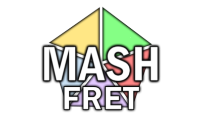
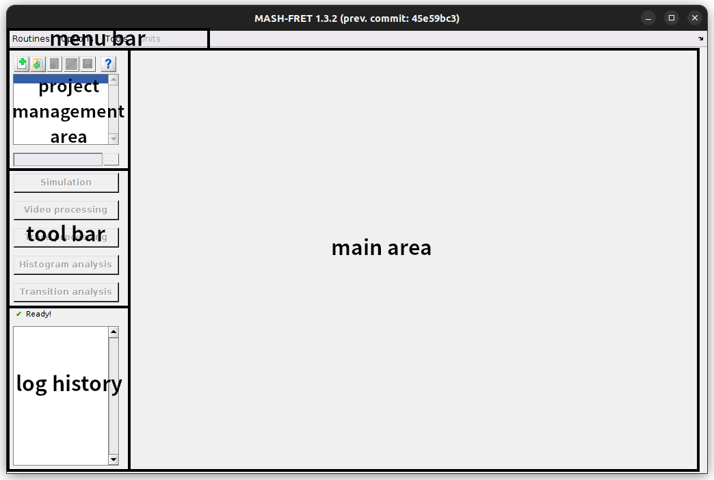
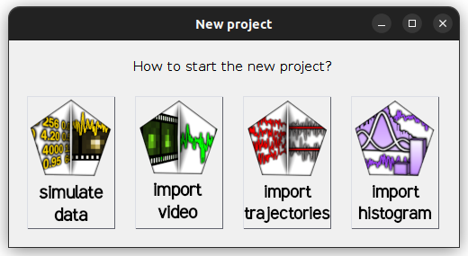
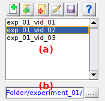

# Getting started
{: .no_toc }

## Table of contents
{: .no_toc .text-delta }

1. TOC
{:toc}


---

## System requirements

To run MASH-FRET, the software 
[MATLAB](https://fr.mathworks.com/products/matlab.html) and a list of specific toolboxes must be installed on your computer.
For more information about system requirements, please refer to the documentation section 
[System requirements](System_requirements.html).


---

## Installation
Clone MASH-FRET into a directory of your choice:

```
git clone https://github.com/RNA-FRETools/MASH-FRET.git
```

or [download](https://github.com/RNA-FRETools/MASH-FRET/archive/master.zip) the source code.

Within MATLAB, add MASH-FRET to your search path by going to `Home → Set Path → Add with Subfolders`
{: .pb-3 }

Start MASH-FRET by typing `MASH` at the MATLAB command prompt.


---

## First steps

### Interface
{: .no_toc }

When you start MASH-FRET the **main user interface** opens.

<a href="assets/images/gui/interface-default.png"></a>

The main user interface appears in its default layout and includes:
* a **menu bar** that allows the execution of program <u>routines</u>, the setting of <u>file overwriting</u> options and <u>time/intensity units</u>, as well as the access to <u>external tools</u> 
[Restructure files](trace-processing/functionalities/merge-projects.html#restructure-alex-data), 
[Bin time axis](trace-processing/functionalities/bin-trajectories.html#bin-traces-and-export-ascii-files) and 
[Check toolbox dependencies](System_requirements.html).
* a [**Project management area**](#project-management-area) for managing the opened projects,
* a **tool bar** for accessing the different <u>modules</u>,
* a **log history** that streams information about running processes and failures (to keep track, logs are automatically written in a 
[daily log file](output-files/log-daily-logs.html)),
* a **main area** that contains the selected module.


### Create a new project
{: .no_toc }

To create a new MASH project, press  in the project management area; a window pops up:

 <a href="assets/images/gui/newproj-interface.png"></a>
 
You can start a project in three different ways:

* [`Simulate data`](tutorials/set-experiment-settings/simulate-data.html#tutorials_steps): from scratch, by creating a single molecule video and/or trajectories, 
* [`Import video`](tutorials/set-experiment-settings/import-video.html#tutorials_steps): from an existing single molecule video file, 
* [`Import trajectories`](tutorials/set-experiment-settings/import-trajectories.html#tutorials_steps): from an existing set of trajectories written in files.

Select the appropriate option and follow the instructions given in the corresponding section to inform MASH about your experiment settings.

After completing your experiment settings, the new project is created and appears in the project list of the 
[project management area](#project-management-area). 
Set the default file export destination, *i.e.* the root folder, in the 
[project management area](#project-management area) and proceed with your data analysis by using the different 
[Modules](#modules-and-tutorials). 


### Project management area
{: .no_toc }

<a href="assets/images/gui/interface-projarea.png"></a>

This area allows to navigate through your open projects via the project list **(a)**, and to perform the following actions:
* to create a **new project** by pressing 
* to **open** existing projects by pressing 
* to **close** opened projects by pressing 
* to **save** project modifications by pressing 
* to **edit** some experimental settings of an opened project by pressing 
* to set the project's **root folder** in **(b)** by pressing ; the root folder is the default destination where all files will be exported. 


---

## Modules and tutorials

MASH-FRET's modules were originally created for the simulation, processing and analysis of video-based surface-immobilized single molecule FRET (smFRET) experiments.
Nonetheless, functionalities can be used for any type of video or trajectories requiring the same treatment.

The program offers five modules to work with:

- [Simulation](simulation.html)
- [Video processing](video-processing.html)
- [Trace processing](trace-processing.html)
- [Histogram analysis](histogram-analysis.html)
- [Transition analysis](transition-analysis.html)

Learn about module's individual functionalities in the respective documentation sections, or follow the 
[Tutorials](tutorials.html) to perform common tasks listed below:

* [Set experiment settings](tutorials/set-experiment-settings.html)
* [Analyze experimental data](tutorials/analyze-data.html)

