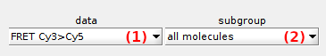

# Data selection area
{: .no_toc }

The data selection area includes two lists that define the data analyzed in module Histogram analysis. 

Use this area to define the data to be analyzed.

## Area components
{: .no_toc .text-delta }

1. TOC
{:toc}

---

## Data list

Use this list to select the data to be analyzed in Histogram analysis.

Supported data are:

* intensities from time traces
* intensities from states trajectories (`discr.`)
* donor intensities in absence of acceptor from time traces (`total`)
* donor intensities in absence of acceptor from states trajectories (`discr.`total)
* FRET from time traces (`FRET`)
* FRET from states trajectories (`discr. FRET`)
* stoichiometries from time traces (`S`)
* stoichiometries from states trajectories (`discr. S`)

---

## Molecule subgroup list

Use this list to select the molecule subgroup to be analyzed in Histogram analysis.

Molecule subgroups are defined by the molecule tags that are created and assigned to molecules in module 
[Trace processing](../../trace-processing.html) exclusively.

Molecule tags are created in 
[Molecule selection](../../trace-processing/functionalities/tm-overview.html#molecule-selection) and can be assigned to individual molecules in 
[Molecule selection](../../trace-processing/functionalities/tm-overview.html#molecule-selection) or in 
[Molecule status](../../trace-processing/components/panel-sample-management.html#molecule-status).

Molecule tags can also be assigned to groups of molecules defined by specific data ranges with 
[Automatic sorting](../../trace-processing/functionalities/tm-automatic-sorting.html#tm-menu).

