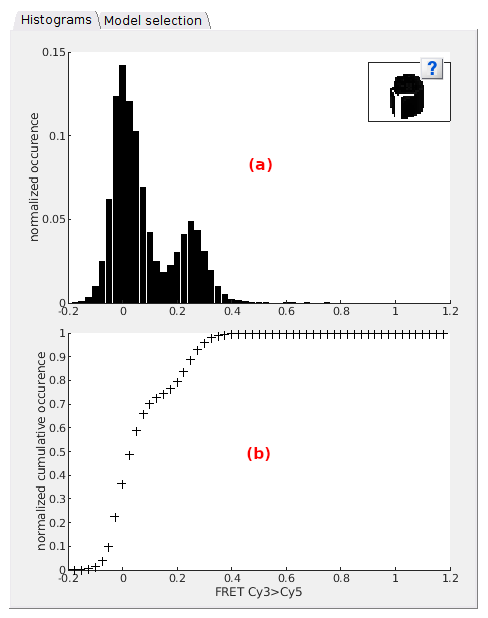
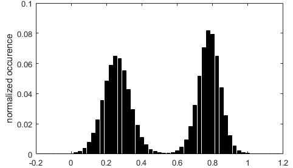
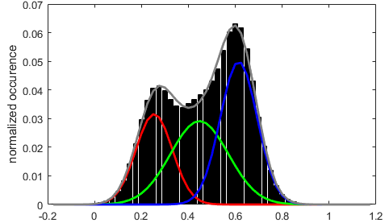
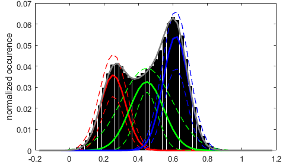
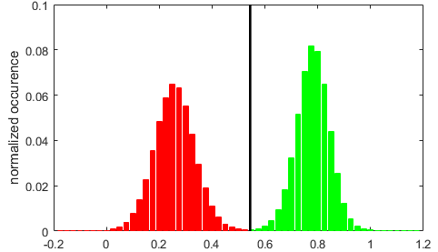
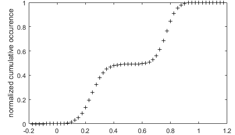
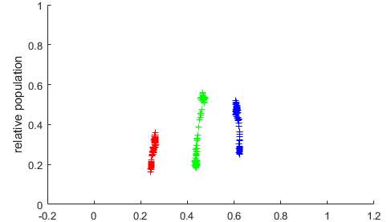
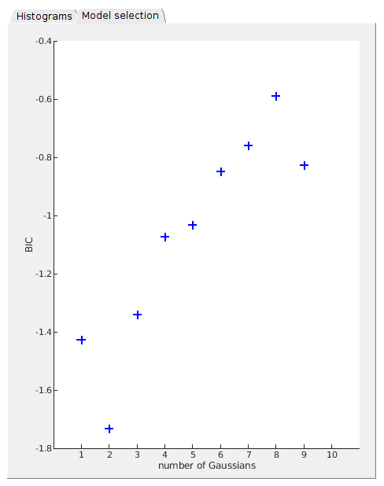
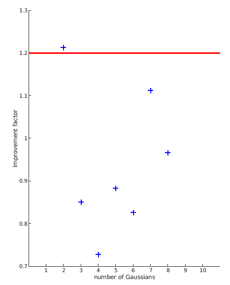

# Visualization area
{: .no_toc }

The visualization area is the main display of module Histogram analysis. 
It consists in two tabs, each showing different analysis-related data.

Use this area to visualize overall data histograms and fit results. 
Any graphics in MASH-FRET can be exported to an image file by right-clicking on the axes and selecting `Export graph`.

## Area components
{: .no_toc .text-delta }

1. TOC
{:toc}

---

## Histograms

Use this tab to visualize histograms, distribution thresholds or gaussian distribution fit results.

This tab contains two axes that display various histogram plots depending on which stage the histogram analysis is at:
* [Top axes](#top-axes) in **(a)**
* [Bottom axes](#bottom-axes) in **(b)**

### Top axes
{: .no_toc }

#### Default
{: .no_toc }

When opening a new project in Histogram analysis and providing that the data selected in the
[Data list](area-data-selection.html#data-list) exists in the project, the normalized data histogram is built as defined in 
[Histogram and plot](panel-histogram-and-plot.html) and is plotted in the top axes.

#### Inferred state configuration
{: .no_toc }

After completing the state configuration analysis, the most sufficient Gaussian mixture model is plotted over the data histogram with each Gaussian being color-coded as shown in 
[Gaussian fitting](panel-state-populations#gaussian-fitting); see 
[State configuration analysis](../workflow.html#determine-the-most-sufficient-state-configuration) of Histogram analysis workflow for more information about state configuration analysis.

#### After Gaussian fitting
{: .no_toc }

After performing a simple Gaussian fitting to estimate state relative populations, the resulting fit is displayed as for 
[Inferred state configuration](#inferred-state-configuration).

When the 
[Method settings](panel-state-populations.html#method-settings) include BOBA-FRET, the Gaussian fit functions giving the lowest and highest populations for each state are plotted in dotted lines. 
This gives an visual estimation of the cross-sample variability of state populations.

#### After thresholding
{: .no_toc }

After setting the thresholding calculation method, the histogram is partitioned into the resulting state populations, each being color-coded as shown in 
[Thresholding](panel-state-populations#thresholding).

### Bottom axes
{: .no_toc }

#### Default
{: .no_toc }

When opening a new project in Histogram analysis and providing that the data selected in the
[Data list](area-data-selection.html#data-list) exists in the project, the normalized cumulative data histogram is plotted in the top axes.

In this plot, histogram peaks are visualized as steps.

#### After Gaussian fitting
{: .no_toc }

After performing a simple Gaussian fitting, the resulting state relative populations are plotted as colored cross markers in function of the respective Gaussian means.

When the 
[Method settings](panel-state-populations.html#method-settings) include BOBA-FRET, state populations are plotted for each bootstrap sample, which gives an visual estimation of the cross-sample variability of state populations.

#### After thresholding
{: .no_toc }

After setting the 
[Thresholding](panel-state-populations#thresholding) calculation method, thresholds are shown as vertical black lines over the normalized cumulative histogram.

---

## Model selection

Use this tab to visualize the results of the 
[State configuration](panel-state-configuration.html) analysis.

Analysis results are summarized in a scatter plot where the BIC or the likelihood improvement factor is presented in function of the number of Gaussians, depending on the chosen 
[Model penalty](panel-state-configuration.html#model-penalty).

In the case where the increase in log-likelihood is used for model penalty, a red cursor is positioned at the minimum improvement factor value. 

