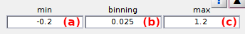

# Histogram and plot
{: .no_toc }

Histogram and plot is the first panel of module Histograms analysis. 
Access the panel content by pressing 
. 
The panel closes automatically after other panels open or after pressing 
. 

Use this panel to select data and build histogram.

## Panel components
{: .no_toc .text-delta }

1. TOC
{:toc}

---

## Histogram binning

Use this interface to define limits for the histogram x-axis and the sorting interval of the histogram.

Histogram binning define the range of data and the sorting interval used to build the histogram. 
The lower limit is set in **(a)**, the bin size in **(b)** and the higher limit in **(c)**.

For more information about the influence of x-axis limits and the bin size on the analysis, please refer to 
[Build histogram](../workflow.html#build-histogram) in Histogram analysis workflow.

<u>default</u>: [-0.2;1.2] axis limits and 0.025 bin size for ratio data.

---

## Overflow bins

Activate this option to remove extreme bins from the histogram.

Sorting data into specific bins often leads to large counts in the two bins flanking the x-axis, which bias the state configuration and state population analysis. 

To prevent such undesired effect, the extreme bins can be removed from the histogram by activating this option. 
To keep extreme bins for analysis, deactivate this option.

<u>default</u>: activated

