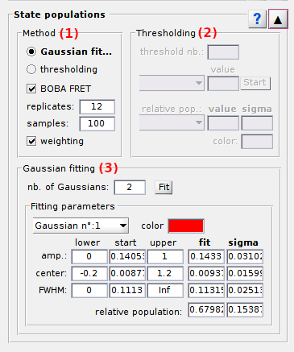
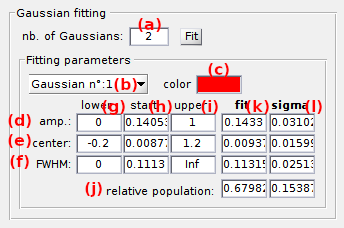

# State populations
{: .no_toc }

State populations is the third panel of module Histograms analysis. 
Access the panel content by pressing 
. 
The panel closes automatically after other panels open or after pressing 
. 

Use this panel to estimate state relative populations and associated cross-sample variability.

## Panel components
{: .no_toc .text-delta }

1. TOC
{:toc}

---

## Method settings

Use this interface to define a method to calculate state populations.

State relative population are calculated as the surface of the corresponding histogram peak normalized by the total histogram surface.

Histogram peaks can be integrated in two ways:
* with [Gaussian fitting](#gaussian-fitting), by activating the option in **(a)**
* with [Thresholds](#thresholding) between histogram peaks, by activating the option in **(b)**

Additionally, the cross-sample variability of state populations can be estimated with the BOBA-FRET method by activating the option in **(c)**.
In that case, the number of replicates to build a bootstrap histogram sample must be set in **(d)** and the number of bootstrap samples in **(e)**.
By default, the number of replicates is set to the number of molecules in the project.

In order to not over-represent short trajectories in the bootstrap histograms, replicates can be given a weight proportional to the length of their time traces.
This is done by activating the option in **(f)**.

---

## Thresholding

Use this interface to define settings to calculate state populations with the Thresholding method.

With the thresholding method, histogram peaks are separated by fixed thresholds, histogram counts are summed up between thresholds and resulting integrals are normalized by the sum of all integrals to obtain the state relative populations as described in the
[State population](../workflow.html#estimate-state-populations-and-associated-cross-sample-variability) section of Histogram analyiss worklfow.

To calculate the relative populations of 
[*J*](){: .math_var } states, a number of 
[*J*-1](){: .math_var } thresholds must be used.
The number of threshold is set in **(a)**, and threshold values in **(c)** after selecting the threshold index in menu **(b)**.

Threshold can also be automatically calculated and imported from an inferred model in 
[Inferred models](panel-state-configuration.html#inferred-models).

Press
 to start calculation of state relative populations.
If the 
[Method settings](#method-settings) include BOBA-FRET, histogram bootstrapping and subsequent thresholding will be performed.

After completion, relative population of the histogram peak selected in menu **(d)** and corresponding to the color **(g)**, is displayed in **(e)**.

When using BOBA-FRET, the bootstrap mean and standard deviation of the state relative population are respectively displayed in **(e)** and **(f)**.

---

## Gaussian fitting

Use this interface to define settings to calculate state populations with the Gaussian fitting method.

With the Gaussian fitting method, the histogram is fitted with a mixture of Gaussian functions with each Gaussian defined as:

{: .equation }

with 
[*A**j*](){: .math_var },
[*&#956;**j*](){: .math_var } and 
[*&#963;**j*](){: .math_var } the amplitude, mean and standard deviation of the Gaussian modelling state 
[*j*](){: .math_var }.

After fitting, Gaussian integrals 
[*S**j*](){: .math_var } are analytically calculated and normalized by the sum of all integrals to obtain the state relative populations as described in the
[State population](../workflow.html#estimate-state-populations-and-associated-cross-sample-variability) section of Histogram analyiss worklfow.

To calculate the relative populations of 
[*J*](){: .math_var } states, a number of 
[*J*](){: .math_var } Gaussian functions are used.
The number of Gaussian functions is set in **(a)** and fitting parameters are set in rows **(d-i)** for each Gaussian selected in menu **(b)**.
Fitting parameters are defined in terms of starting guesses and parameter boundaries.

Parameters 
[*A**j*](){: .math_var },
[*&#956;**j*](){: .math_var } and 
[*&#963;**j*](){: .math_var } are respectively set in rows **(d)**, **(e)** and **(f)**, with the staring guesses in column **(h)**, the lower bound in column **(g)** and higher bound in column **(i)**.

Starting guess of fitting parameters can also be imported from an inferred model in
[Inferred models](panel-state-configuration.html#inferred-models).

Press
 to start Gaussian fitting.
If the 
[Method settings](#method-settings) include BOBA-FRET, histogram bootstrapping and subsequent Gaussian fitting will be performed.

After completion, relative population of the Gaussian selected in menu **(b)** and corresponding to the color **(c)**, is displayed in row **(j)** and column **(k)**.

When using BOBA-FRET, the bootstrap mean and standard deviation of the state relative population are respectively displayed in column **(k)** and **(l)**.
Similarly, the bootstrap mean and standard deviation of fit parameters 
[*A**j*](){: .math_var },
[*&#956;**j*](){: .math_var } and 
[*&#963;**j*](){: .math_var } are respectively shown in rows **(d)**, **(e)** and **(f)**.

