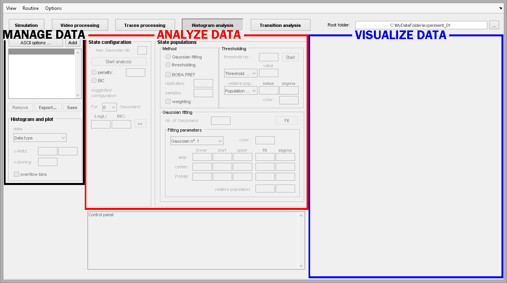

# Histogram analysis interface
{: .no_toc }

The module Histogram analysis is the fourth component of the software MASH-FRET and can be selected in the main 
[tool bar](../Getting_started.html#interface).

The interface can be divided into three subunits that respectively allow to:
* <u>browse and process</u> imported data
* <u>analyze</u> the imported data
* <u>visualize</u> the calculated data

Learn about individual components of the interface in the  
[Panels](panels.html) section.

