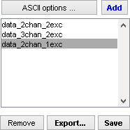

# Management area
{: .no_toc }

## Panel components
{: .no_toc .text-delta }

1. TOC
{:toc}

### Import data

* <u>Import ASCII traces</u>

* <u>Open MASH project(s)</u>

### Export processed data

* <u>Export figures and ASCII data</u>

* <u>Save MASH project</u>

### Close MASH project(s)

