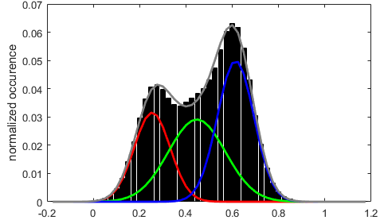
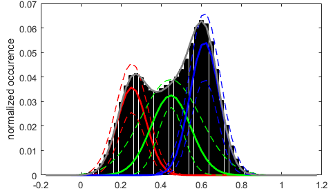
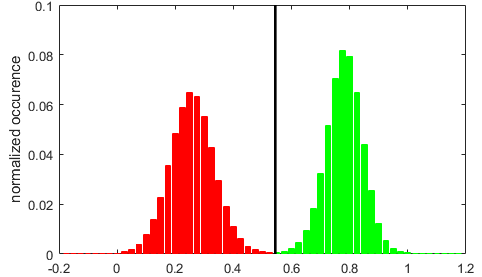
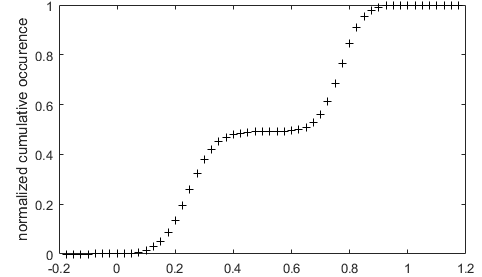
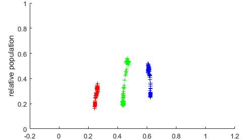

# Visualization area
{: .no_toc }

The visualization area is the main display of module Histogram analysis.

Use this area to visualize histograms and analysis results.

## Panel components
{: .no_toc .text-delta }

1. TOC
{:toc}

---

## Top axes

Top axes display various histogram plots depending on which stage the histogram analysis is at.

Any graphics in MASH can be exported to an image file by right-clicking on the axes and selecting `Export graph`.

### Default
{: .no_toc }

When opening a new project in Histogram analysis and providing that the data selected in the
[Data list](panel-histogram-and-plot.html#data-list) exists in the project, the normalized data histogram is built as defined in 
[Histogram and plot](panel-histogram-and-plot.html) and is plotted in the top axes.

### Inferred state configuration
{: .no_toc }

After completing the state configuration analysis, the most sufficient Gaussian mixture model is plotted over the data histogram with each Gaussian being color-coded as shown in 
[Gaussian fitting](panel-state-populations#gaussian-fitting); see 
[State configuration analysis](../workflow.html#determine-the-most-sufficient-state-configuration) of Histogram analysis workflow for more information about state configuration analysis.

### After Gaussian fitting
{: .no_toc }

After performing a simple Gaussian fitting to estimate state relative populations, the resulting fit is displayed as for 
[Inferred state configuration](#inferred-state-configuration).

When the 
[Method settings](panel-state-populations.html#method-settings) include BOBA-FRET, the Gaussian fit functions giving the lowest and highest populations for each state are plotted in dotted lines. 
This gives an visual estimation of the cross-sample variability of state populations.

### After thresholding
{: .no_toc }

After setting the thresholding calculation method, the histogram is partitioned into the resulting state populations, each being color-coded as shown in 
[Thresholding](panel-state-populations#thresholding).

---

## Bottom axes

Bottom axes display various scatter plots depending on which stage the histogram analysis is at.

Any graphics in MASH can be exported to an image file by right-clicking on the axes and selecting `Export graph`.

### Default
{: .no_toc }

When opening a new project in Histogram analysis and providing that the data selected in the
[Data list](panel-histogram-and-plot.html#data-list) exists in the project, the normalized cumulative data histogram is plotted in the top axes.

In this plot, histogram peaks are visualized as steps.

### After Gaussian fitting
{: .no_toc }

After performing a simple Gaussian fitting, the resulting state relative populations are plotted as colored cross markers in function of the respective Gaussian means.

When the 
[Method settings](panel-state-populations.html#method-settings) include BOBA-FRET, state populations are plotted for each bootstrap sample, which gives an visual estimation of the cross-sample variability of state populations.

### After thresholding
{: .no_toc }

After setting the 
[Thresholding](panel-state-populations#thresholding) calculation method, thresholds are shown as vertical black lines over the normalized cumulative histogram.

