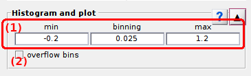

# Histogram and plot
{: .no_toc }

Histogram and plot is the first panel of module Histograms analysis.

Use this panel to select data and build histogram.

## Panel components
{: .no_toc .text-delta }

1. TOC
{:toc}

---

## Data list

Use this list to select the data to be analyzed in Histogram analysis.

Supported data are:

* intensities from time traces
* intensities from states trajectories (`discr.`)
* FRET from time traces (`FRET`)
* FRET from states trajectories (`discr. FRET`)
* stoichiometries from time traces (`S`)
* stoichiometries from states trajectories (`discr. S`)

---

## Histogram bounds

Use this interface to define limits for the histogram x-axis.

Histogram x-axis define the range of data used in the analysis. 
The lower limit is set in **(a)** and the higher limit in **(b)**.

For more information about the influence of x-axis limits on the analysis, please refer to 
[Build histogram](../workflow.html#build-histogram) in Histogram analysis workflow.

<u>default</u>: [-0.2;1.2] for ratio data

---

## Histogram bin size

Defines the sorting interval of the histogram.

For more information about the influence of bin size on the analysis, please refer to 
[Build histogram](../workflow.html#build-histogram) in Histogram analysis workflow.

<u>default</u>: 0.025 for ratio data

---

## Overflow bins

Activate this option to remove extreme bins from the histogram.

Sorting data into specific bins often leads to large counts in the two bins flanking the x-axis, which bias the state configuration and state population analysis. 

To prevent such undesired effect, the extreme bins can be removed from the histogram by activating this option. 
To keep extreme bins for analysis, deactivate this option.

<u>default</u>: activated
