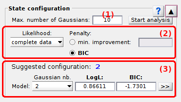

# State configuration
{: .no_toc }

## Panel components
{: .no_toc .text-delta }

1. TOC
{:toc}

---

## Maximum number of Gaussians

---

## Model penalty

Use this interface to set the model overfitting penalty

The 
[*BIC*](){: .math_var } is similar to a penalized likelihood and is expressed such as:

{: .equation }
*BIC* = *p*( *J* ) &#215; log( *N*total ) - log[ *likelihood*( *J* ) ]

with 
[*p**J*](){: .math_var } the number of parameters necessary to describe the model with 
[*J*](){: .math_var } components, 
[*N*total](){: .math_var } the total number of counts in the TDP.
Here, the most sufficient model has the lowest 
[*BIC*](){: .math_var }.

---

## Inferred models

Use this interface to visualize the different inferred models

