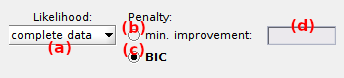

# State configuration
{: .no_toc }

State configuration is the second panel of module Histograms analysis.

Use this panel to determine the optimum number of histogram peaks.

## Panel components
{: .no_toc .text-delta }

1. TOC
{:toc}

---

## Maximum number of Gaussians

Defines the maximum model complexity to consider for model fitting, *i.e.*, the maximum number of Gaussian in the Gaussian mixture models to infer; see 
[Determine the most sufficient state configuration](../workflow.html#determine-the-most-sufficient-state-configuration) in Histogram analysis worklow for more information about state configuration analysis.

The maximum number of Gaussian in the model is the only parameter necessary to infer models.

Press 
 to start model inference.

<u>default</u>: 10

---

## Model penalty

Use this interface to define model overfitting penalty.

The overfitting penalty can be modified before or after inferring the different models, *i.e.*, before or after pressing 
.

Model overfitting can be penalized in two ways:

* Minimum improvement in likelihood, by activating the option in **(a)** 
* using the Bayesian information criterion (BIC), by activating the option in **(c)**

### Minimum improvement in likelihood
{: .no_toc }

With this penalty, a certain improvement in the model <u>log</u>-likelihood is expected when adding a new component to the model. 
The improvement is expressed as a multiplication factor that can be set in **(b)**.
For instance, set a penalty of 1.2 for an improvement of 20% in the <u>log</u>-likelihood, or of 100.2 in the likelihood.

The most sufficient model is the least complex model for which adding a component does not fulfil this requirement.

### Bayesian information criterion
{: .no_toc }

The BIC is used to rank models according to their sufficiency, with the most sufficient model having the lowest 
[*BIC*](){: .math_var }.

The 
[*BIC*](){: .math_var } is similar to a penalized likelihood and it is expressed such as:

{: .equation }

with 
[*p*](){: .math_var } the number of parameters necessary to describe the model with 
[*J*](){: .math_var } components and
[*N*total](){: .math_var } the total number of counts in the histogram.

The number of parameters necessary to describe the model includes the number of Gaussian means 
[*p*means](){: .math_var }, standard deviations 
[*p*widths](){: .math_var } and relative weights 
[*p*weights](){: .math_var }, and is calculated such as:

{: .equation }

---

## Inferred models

Use this interface to visualize the results of state configuration analysis.

The number of components in the most sufficient model according to the 
[Model penalty](#model-penalty) is displayed in **(a)**.

Other inferred models can be visualized in the 
[Top axes](area-visualization.html#top-axes) by selecting the corresponding number of components in the list **(b)**. 
In this case, the log-likelihood and BIC of the selected model are respectively displayed in **(c)** and **(d)**.

The parameters of any model can be imported in 
[Thresholding](panel-state-populations#thresholding) or 
[Gaussian fitting](panel-state-populations#gaussian-fitting) as starting guess for state population analysis, by pressing 
.

Analysis results are summarized in a bar plot where the BIC or the increase in log-likelihood is presented in function of the number of components, depending on the chosen 
[Model penalty](#model-penalty).

Any graphics in MASH can be exported to an image file by right-clicking on the axes and selecting `Export graph`.
