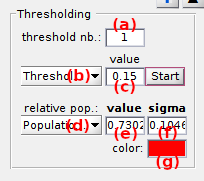

# State populations
{: .no_toc }

## Panel components
{: .no_toc .text-delta }

1. TOC
{:toc}

---

## Method settings

Defines the method to calculate state populations.

State relative population are calculated as the surface of the corresponding histogram peak normalized by the total histogram surface.

Histogram peaks can be integrated in two ways:
* with [Gaussian fitting](#gaussian-fitting), by activating the option in **(a)**
* with [Thresholds](#thresholding) between histogram peaks, by activating the option in **(b)**

Additionally, the cross-sample variability of state populations can be estimated with the BOBA-FRET method by activating the option in **(c)**.
In that case, the number of replicates to build a bootstrap histogram sample must be set in **(d)** and the number of bootstrap samples in **(e)**.
By default, the number of replicates is set to the number of molecules in the project.

In order to not over-represent short trajectories in the bootstrap histograms, replicates can be given a weight proportional to the length of their time traces.
This is done by activating the option in **(f)**.

---

## Thresholding

Defines settings to calculate state populations with the Thresholding method.

With the thresholding method, histogram peaks are separated by fixed thresholds, histogram counts are summed up between thresholds and resulting populations are normalized.

To calculate the relative populations of 
[*J*](){: .math_var } states, a number of 
[*J*-1](){: .math_var } thresholds must be used.
The number of threshold must be set in **(a)**, and each threshold in **(c)** after browsing the list in **(b)**.

Calculation of state relative populations can be started after setting thresholds and by pressing 
.
If the 
[Method settings](#method-settings) include BOBA-FRET, 

After completion, state relative populations are displayed in **(e)** after selecting the corresponding histogram peak in list **(d)**.

---

## Gaussian fitting

Defines settings to calculate state populations with the Gaussian fitting method.

Histogram is fitted with a mixture of Gaussians and 

* <u>Fitting model</u>

* <u>Start fitting</u>

* <u>Fitting results and state populations</u>

