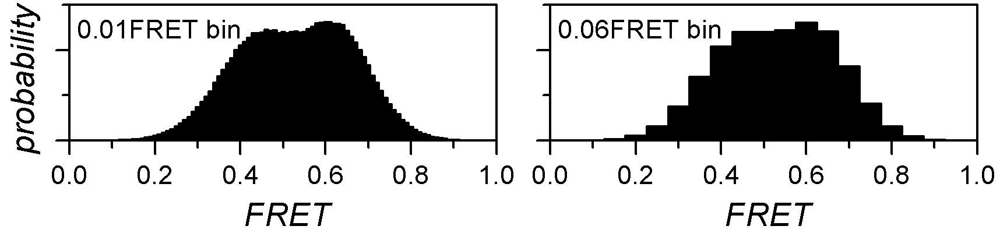
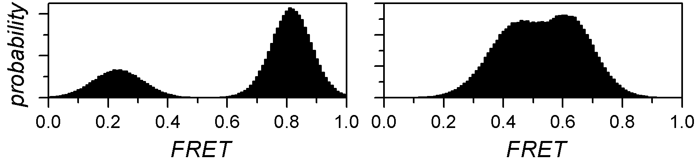
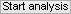
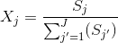
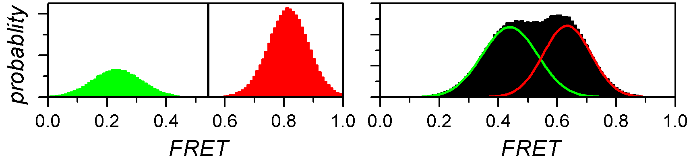
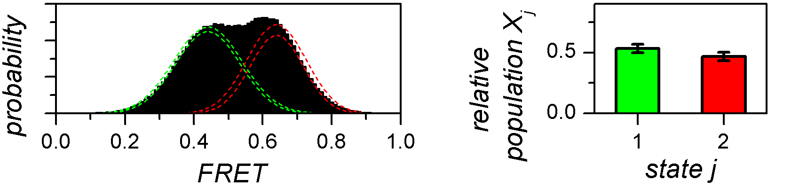
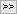

# Workflow
{: .no_toc }

In this section you will learn how to determine the most sufficient state configuration from histograms, to obtain the relative state populations and to estimate the associated cross-sample variability. 
Histogram analysis results are saved in the 
[mash project](../output-files/mash-mash-project.html) and/or exported to ASCII files for traceability.

The procedure includes five steps:

1. TOC
{:toc}

---

## Import single molecule data

Single molecules are imported from a 
[.mash file](../output-files/mash-mash-project.html), which ideally contains time traces that were processed in module Trace processing.

After successful import, the list of available data in the project (*e.g.*, intensities, FRET or stoichiometry) is shown in the 
[Data list](panels/panel-histogram-and-plot.html#data-list), and the overall normalized and cumulative normalized histograms are displayed in the 
[Visualization area](panels/area-visualization.html) for the first data of the list - the intensities collected in the left-most video channel upon first laser illumination.

To import single molecule data:

{: .procedure }
1. Add the project to the list by pressing 
    and selecting the corresponding 
   [.mash file](../output-files/mash-mash-project.html)  

---

## Build histogram

To build an histogram, data are limited to specific boundaries and sorted into bins of specific size.
Ideally, each state population appears as a Gaussian-shaped peak in the histogram.

The bin size has a substantial influence on the histogram shape: large bins will increase the overlap between neighbouring peaks until the extreme case where all peaks are merged in one, whereas short bins will flatten the peaks until the extreme case where no peak is distinguishable.

Histogram boundaries are important as they define the range of data considered for analysis.
Large data ranges can include outliers that would bias the state analysis and narrow ranges can exclude relevant contribution for population analysis.

The histogram limits and bin size have to be carefully chosen in order to enhance the natural shape of data distribution without altering it.

To build the histogram:

{: .procedure }
1. Select the data to work with in the 
   [Data list](panels/panel-histogram-and-plot.html#data-list)  
     
1. Set parameters:  
     
   [Histogram bounds](panels/panel-histogram-and-plot.html#histogram-bounds)  
   [Histogram bin size](panels/panel-histogram-and-plot.html#histogram-bin-size)  
   [Overflow bins](panels/panel-histogram-and-plot.html#overflow-bins)  
     
   The histogram is instantly built with the new parameters and displayed in the 
   [Visualization area](panels/area-visualization.html)

---

## Determine the most sufficient state configuration

In histogram analysis, states are identified as histogram peaks that are ideally modelled by a Gaussian distribution.
Therefore, the overall histogram can be described by the sum of 
[*J*](){: .math_var } Gaussian distributions, with 
[*J*](){: .math_var } the number of states.

In the case of well-separated peaks, 
[*J*](){: .math_var } is easily determined by eye, but most of the time, the histogram peaks overlap each other and can't be accurately distinguished.

One way of objectively identifying the number of overlapping peaks in a histogram is to, first, find the Gaussian mixtures that describe the data the best for different 
[*J*](){: .math_var }, and then to compare optimum models with each other.
As the goodness of fit, or model likelihood, fundamentally increases with the number of components, inferred models can be compared via:

* the improvement in goodness of fit
* the Bayesian information criterion (BIC)

In the first case, a certain improvement in model likelihood is expected when adding a new component to the model, *e. g.* an increase of 20%.
Here, the most sufficient model is the least complex model for which adding a component does not fulfil this requirement.

In the second case, the BIC is used to rank models according to their sufficiency, with the most sufficient model having the lowest BIC.

To determine the most sufficient state configuration:

{: .procedure }
1. If not already done, select the data to work with in the 
   [Data list](panels/panel-histogram-and-plot.html#data-list)  
     
1. Set parameters:  
     
   [Maximum number of Gaussians](panels/panel-state-configuration.html#maximum-number-of-gaussians)  
   [Model penalty](panels/panel-state-configuration.html#model-penalty)  
     
1. Start inference of state configurations by pressing 
   ; after completion, the display is instantly updated with the most sufficient Gaussian mixture

---

## Estimate state populations and associated cross-sample variability

The relative population 
[*X**j*](){: .math_var} of a state 
[*j*](){: .math_var } is associated to the probability of finding a molecule in state 
[*j*](){: .math_var } any time in the sample.

It can be estimated from the histogram by integrating each peak to a value 
[*S**j*](){: .math_var } and calculating the ratio:

{: .equation }

For well-separated histogram peaks, 
[*S**j*](){: .math_var } values are calculated using thresholds between peaks.
For overlapping peaks, a mixture of 
[*J*](){: .math_var } Gaussians is fitted to the histogram and Gaussian integrals are used as 
[*S**j*](){: .math_var } values.

The outcome of such analysis are single estimates of relative state populations, meaning that they carry no information about the variability across the molecule sample.

One way to evaluate the cross-sample variability of relative state populations is to use the bootstrap-based analysis called BOBA-FRET.
BOBA-FRET applies to both threshold and Gaussian-fitting methods, and infers the bootstrap mean 
[*&#956;**X*,*j*](){: .math_var } and bootstrap standard deviation
[*&#963;**X*,*j*](){: .math_var } of state populations for the given sample.

To calculate relative state populations:

{: .procedure }
1. If not already done, select the data to work with in the 
   [Data list](panels/panel-histogram-and-plot.html#data-list)  
     
1. Set parameters in 
   [Method settings](panels/panel-state-populations.html#method-settings)  
     
1. Import parameters of one of the inferred state configurations by selecting the configuration in 
   [Inferred models](panels/panel-state-configuration.html#inferred-models) and pressing 
     
     
1. Adjust parameters in 
   [Thresholding](panels/panel-state-populations.html#thresholding) or 
   [Gaussian fitting](panels/panel-state-populations.html#gaussian-fitting) and respectively press 
    or 
    to calculate state relative populations

---

## Export data

Project modifications must be saved in order to keep traceability and access to the results.
Additionally, histograms, analysis results and analysis parameters can be exported to ASCII files and PDF figures; see 
[Remarks](#remarks) for more information.

To save project modifications:

{: .procedure }
1. Select the data to export in the 
   [Data list](panels/panel-histogram-and-plot.html#data-list)  
     
1. Save modifications to the 
   [.mash file](../output-files/mash-mash-project.html) by pressing 
    and overwriting existing file.  

To export data to files:

{: .procedure }
1. Press
    and browse the desired destination; files will be automatically created in the destination folder.

---
 
## Remarks
{: .no_toc }

The type of exported files depends on which analysis was carried on; see 
[Export analysis results](panels/area-management.html#export-analysis-results) for more information.

