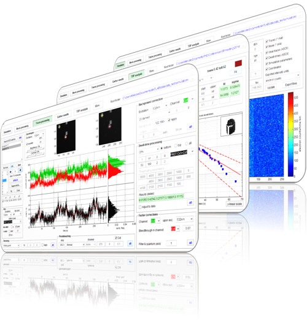

## What is MASH-FRET?
MASH-FRET is a **Matlab**-based software package for the analysis of **single-molecule FRET videos and trajectories**.
The framework encompasses the entire workflow from localizing single molecule on videos to characterizing molecule dynamics.

First visit? Learn how to use MASH-FRET with 
[Getting started](Getting_started.html).


## Download

Clone or 
[download](https://github.com/RNA-FRETools/MASH-FRET/archive/master.zip) MASH-FRET into a directory of your choice.
```
git clone https://github.com/RNA-FRETools/MASH-FRET.git
```


## Getting involved

Please report any **bugs** or **feature requests** through the 
[issue tracker](https://github.com/RNA-FRETools/MASH-FRET/issues) on Github.

If you have any questions, do not hesitate to contact us at 
[rnafretools@chem.uzh.ch](mailto:rnafretools@chem.uzh.ch).


## Citing MASH-FRET

The functionalities of MASH-FRET have been described in several articles. If you use MASH-FRET in your work, please refer to the respective publication listed 
[here](citations.html).


## About

MASH-FRET was developed by Mélodie C.A.S. Hadzic in collaboration with Danny Kowerko, Sebastian L.B. König and Richard Börner in the group of [Prof. Roland Sigel](https://www.chem.uzh.ch/en/sigel/news.html) at the University of Zurich and is currently maintained by Mélodie C.A.S. Hadzic, Fabio D. Steffen and Richard Börner.

MASH-FRET is licensed under the **GNU General Public License (GPLv3)**
