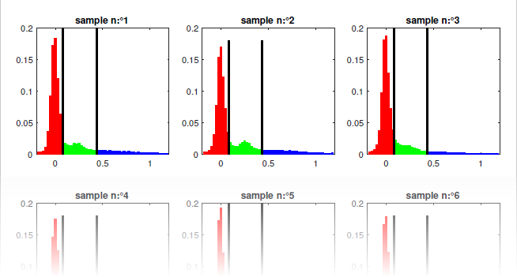
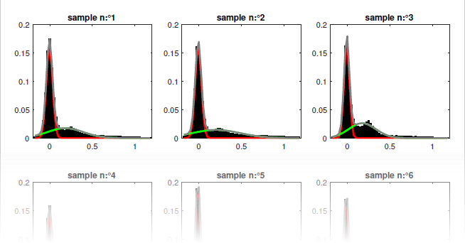

# Histogram analysis figure files
{: .no_toc }

Histogram analysis figure files are PDF files with the extension `.pdf`. They are usually found in the main`/histogram_analysis` folder.

## Table of contents
{: .no_toc .text-delta }

1. TOC
{:toc}

---

## Description

Histogram analysis figure files are data-specific and contain bootstrap histogram and corresponding state populations.

They are created in the `/histogram_analysis` analysis sub-folder after state population analysis combined with BOBA-FRET and when exporting results from the 
[Project management](../histogram-analysis/panels/area-management.html#export-analysis-results) area of module Histogram analysis.

---

## File name

The file is named by the user during the export process.

By default, the file is named after the <u>project file</u> loaded in 
[Histogram analysis](../histogram-analysis/panels/area-management.html#project-list), and is appended with an extension depending on the 
[Method settings](../histogram-analysis/panels/panel-state-populations.html#method-settings):
* `_[Ddd]_gauss` if populations are calculated with Gaussian fitting, where `[Ddd]` is the data type written in the file
* `_[Ddd]_thresh` if populations are calculated with thresholding

Data types supported in state population files are:
* `I[i]-[L]`: intensities in detection channel indexed `[i]` upon illumination with laser wavelength `[L]` nm
* `FRET[D]to[A]`: FRET from donor emitter detected in channel indexed `[D]` to acceptor emitter detected in channel indexed `[A]`
* `S[Eee]`: stoichiometry of emitter detected in channel labelled `[Eee]`

A second extension `_discr` is added when state populations determined from state trajectories are written in the file.

---

## Structure

Histogram analysis figure files contain plots of the bootstrap histogram samples and corresponding state populations.
State populations are presented according to the chosen calculation method.

For population calculated with thresholding, threshold positions are indicated by black vertical lines and each state population is colored in a different color such as:

For population calculated with Gaussian fitting, Gaussian functions that model state populations are plotted in solid line colored accordingly, such as:

