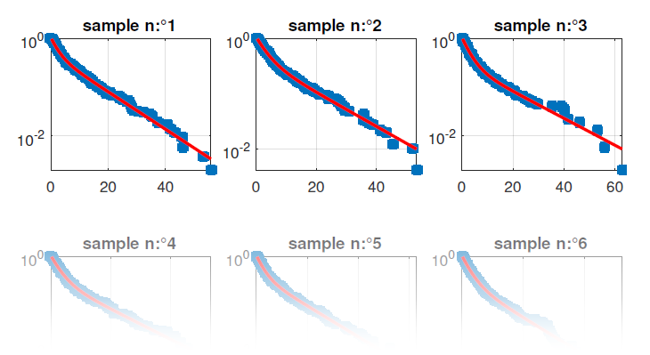

# Transition analysis bootstrap plots
{: .no_toc }

Transition analysis bootstrap plots files are PDF files with the extension `.pdf`. They are usually found in the main`/transition_analysis/kinetics` folder.

## Table of contents
{: .no_toc .text-delta }

1. TOC
{:toc}

---

## Description

Transition analysis bootstrap plots files are dwell-time-histogram-specific and show the bootstrap sample histograms with the associated exponential fit.

They are created in the `/transition_analysis/kinetics` analysis sub-folder after performing an bootstrap exponential fit on dwell time histograms and exporting results from the 
[Project management](../transition-analysis/panels/area-management.html#export-analysis-results) area of module Transition analysis.

---

## File name

The file is named by the user during the export process.

By default, the file is named after the selected <u>project file</u> and is appended with the extension `_[Ddd]_[j]to[j']`, where `[Ddd]` is the data type written in the file and `[j]` and `[j']` are the respective x- and y- coordinates of the transition cluster.

Data types supported in dwell time fit files are:
* `I[i]-[L]`: intensities in detection channel indexed `[i]` upon illumination with laser wavelength `[L]` nm
* `FRET[D]to[A]`: FRET from donor emitter detected in channel indexed `[D]` to acceptor emitter detected in channel indexed `[A]`
* `S[D]to[A]`: stoichiometry associated to donor emitter detected in channel indexed `[D]` and acceptor emitter detected in channel indexed `[A]`

The extension `_[Ttt]` is added to the data type `[Ddd]` if a particular subgroup of molecules is analyzed, with `[Ttt]` the corresponding molecule tag.

---

## Structure

Transition analysis bootstrap plots files contain plots of the bootstrap histogram samples and associated exponential fit.
The fitting function is plotted in solid red line, such as:

