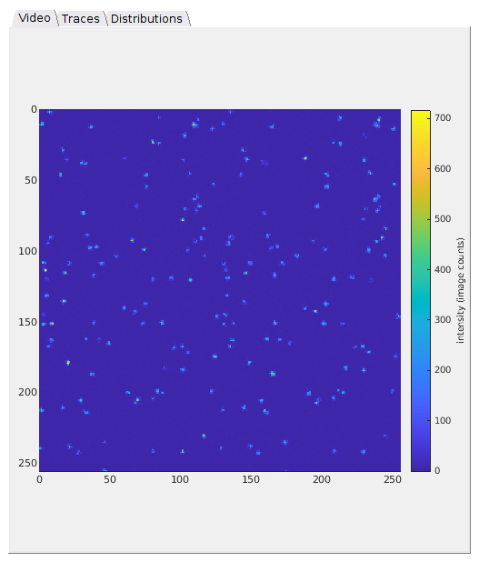
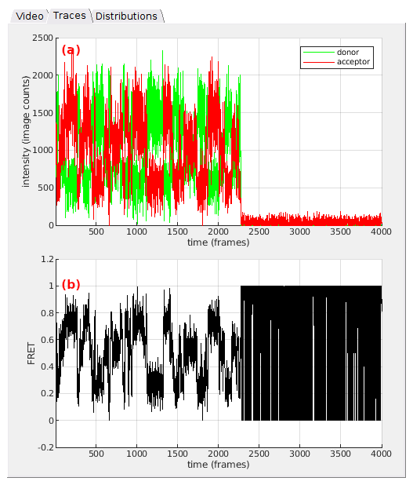
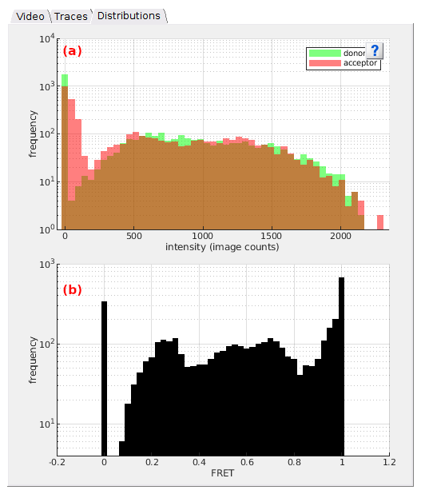

# Visualization area
{: .no_toc }

The visualization area is the main display of module Simulation. 
It is composed of three tabs that show three different plots.

Use this area to visualize simulated data.

## Area components
{: .no_toc .text-delta }

1. TOC
{:toc}

---

## Video

Shows the first frame of the simulated single molecule video. 

The color scale for pixel values is indicated by the color bar. Pixel intensity units are set in the "Units" menu of the 
[Menu bar](../../Getting_started.html#interface).

Any graphics in MASH can be exported to an image file by right-clicking on the axes and selecting `Export graph`.

---

## Traces

Trace axes show intensity-time traces, in **(a)**, and associated FRET-time traces, in **(b)**, for the first molecule in the simulated set. 

Intensity and time units are defined in the menu `Units` of the 
[Menu bar](../../Getting_started.html#interface).

Plot colors are defined in the experiment settings; see 
[Set experiment settings](../..//tutorials/set-experiment-settings/simulate-data.html#option-1-simulation-based-project) for more information.

Any graphics in MASH can be exported to an image file by right-clicking on the axes and selecting `Export graph`.

---

## Distributions

Histogram axes in **(a)** show the intensity histograms built by sorting 
[Traces](#traces) data in 50 bins between the minimum and maximum intensities. 
Histogram axes in **(b)** show the FRET histogram built by sorting 
[Traces](#traces) data in 57 bins between -0.2 and 1.2 FRET.

Intensity units are defined in the menu `Units` of the 
[Menu bar](../../Getting_started.html#interface).

Plot colors are defined in the experiment settings; see 
[Set experiment settings](../..//tutorials/set-experiment-settings/simulate-data.html#option-1-simulation-based-project) for more information.

Any graphics in MASH can be exported to an image file by right-clicking on the axes and selecting `Export graph`.

