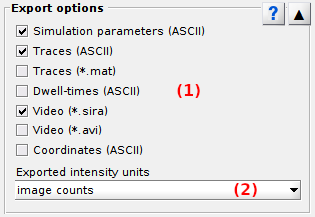

# Export options
{: .no_toc }

Export options is the fourth panel of module Simulation. 
Access the panel content by pressing 
. 
The panel closes automatically after other panels open or after pressing 
. 

Use this panel to export simulated data to different file formats.

## Panel components
{: .no_toc .text-delta }

1. TOC
{:toc}

---

## File options

Use this interface to define the files to export.

### Simulation parameters
{: .no_toc}

Export one ASCII file containing the list of parameters used in the simulation.

See 
[Simulation parameter files](../../output-files/log-simulation-parameters.html) for more information.

### Traces (ASCII)
{: .no_toc}

Export ASCII files that contain simulated data of individual molecules: 
* single molecule coordinates
* intensity-time traces
* ideal photon count-time traces
* apparent FRET-time traces calculated with intensity-time traces
* ideal FRET-time traces
* state sequences

Data can be imported in other MASH-FRET modules for algorithm testing or validating results.

See 
[Traces file from simulation](../../output-files/txt-traces-from-simulation.html) for more information.

### Traces (*.mat)
{: .no_toc}

Export one MATLAB binary file (.mat) that contains simulated data of all molecules: 
* intensity-time traces
* single molecule coordinates

Data can be easily imported by drag-and-dropping the file into Matlab workspace.

See 
[Traces file from simulation](../../output-files/mat-traces-from-simulation.html) for more information.

### Dwell times (ASCII)
{: .no_toc}

Export ASCII files that contain the list of dwell times in individual noiseless FRET-time traces.

*In construction:* data will be importable in Transition analysis module for algorithm testing or validating results.

See 
[Dwell time files](../../output-files/dt-dwelltimes.html) for more information.

### Video (*.sira)
{: .no_toc}

Export simulated single molecule video written in one binary MASH-FRET file.

The file keeps original data accuracy and can be imported in other MASH-FRET models for algorithm testing or validating results.

See 
[MASH video files](../../output-files/sira-mash-video.html) for more information.

### Video (*.avi)
{: .no_toc}

Export simulated single molecule video written in one *uncompressed AVI file with RGB24 video*.

Pixel values are normalized by the sum within the frame: the file loses data accuracy and coherence between frames. 

It can be used for visualization or illustration in presentations for instance.

### Coordinates
{: .no_toc}

Export one ASCII file containing all single molecule coordinates used in the simulation.

Data can be imported in other MASH-FRET modules for algorithm testing.

See 
[Simulated coordinates files](../../output-files/crd-simulated-coordinates.html) for more information.

---

## Intensity units

They are the intensity units of exported data.

Intensity data can be exported in:
* Photon counts (pc)
* Image counts (ic)

Photon counts 
[*&#956;*pc](){: .math_var } and image counts 
[*&#956;*ic](){: .math_var } are linked by the relation:

{: .equation }

with camera characteristics: signal offset 
[*&#956;*ic,d](){: .math_var }, detection efficiency 
[*&#951;*](){: .math_var } and overall gain 
[*K*](){: .math_var }.

If one of the characteristics is not defined within the chosen camera noise model, the following default values are used:
* [*&#951;*](){: .math_var } = 1 ec/pc
* [*K*](){: .math_var } = 1 ic/ec
* [*&#956;*ic,d](){: .math_var } = 0 ic

See 
[Camera SNR characteristics](panel-video-parameters.html#camera-snr-characteristics) for more information.

<u>default</u>: image counts

