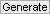
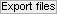

# Main simulation procedure 
{: .no_toc }

At the end of the simulation procedure, the user holds synthetic SMVs and trajectories written to files that can be used for 
[result validation](../../tutorials/validate-results.html), 
[algorithm testing](../../tutorials/test-algorithms.html) or external illustration.

## Table of contents 
{: .no_toc .text-delta }

1. TOC
{:toc}

## Procedure

The procedure is performed in three steps that require specific parameters to be set:

1. [Generate random FRET state sequences](#step1)
1. [Convert sequences into camera-detected intensity trajectories and images](#step2)
1. [Export trajectories and SMV](#step3)

### Generate random FRET state sequences by pressing 
{: .no_toc }

A sequence is created by successively drawing a FRET value and a state duration from the 
[Thermodynamic model](../panels/panel-molecules#thermodynamic-model).

The operation is repeated until the sequence length reaches the given 
[video length](../panels/panel-video-parameters#length) and the number of sequences equals the 
[number of molecules](../panels/panel-molecules#number-of-molecules-n).

*Examples of FRET sequences:*  
[scheme]  

***Parameters to be set:***

- [length](../panels/panel-video-parameters#length),
- [frame rate](../panels/panel-video-parameters#frame-rate),
- [Thermodynamic model](../panels/panel-molecules#thermodynamic-model), 
- [number of molecules](../panels/panel-molecules#number-of-molecules-n).

Generate new state sequences whenever one of these parameters is changed.

### Convert sequences into camera-detected intensity trajectories and images by pressing 
{: .no_toc }

FRET values are converted into donor and acceptor fluorescence intensities according to fluorophore 
[Photophysics](../panels/panel-molecules#photophysics).

Final intensity trajectories are obtained after adding fluorescent
[Background](../panels/panel-experimental-setup#background) and 
[Camera noise](../panels/panel-video-parameters#camera-snr-characteristics).

*Conversion to camera-detected intensity data:*  
[scheme]  

Images of the SMV are created using video 
[dimensions](../panels/panel-video-parameters#dimensions) equally split into donor (left) and acceptor (right) channels.

Pixel values are set to donor or acceptor intensities at 
[Molecule coordinates](../panels/panel-molecules#molecule-coordinates) and to fluorescent 
[Background](../panels/panel-experimental-setup#background) with 
[Camera noise](../panels/panel-video-parameters#camera-snr-characteristics) otherwise.

Final images are obtained after convolution of the pixel values with the channel-specific 
[Point spread functions](../panels/panel-experimental-setup#point-spread-functions).  

*Building SMV images:*  
[scheme]  

After the simulation is completed, intensity trajectories of the first molecule and the first image of the SMV are instantly displayed.

***Parameters to be set:*** 
* [dimensions](../panels/panel-video-parameters#dimensions), 
* [pixel size](../panels/panel-video-parameters#pixel-size), 
* [bit rate](../panels/panel-video-parameters#bit-rate), 
* [Camera SNR characteristics](../panels/panel-video-parameters#camera-snr-characteristics), 
* [Molecule coordinates](../panels/panel-molecules#molecule-coordinates), 
* [Photophysics](../panels/panel-molecules#photophysics), 
* [Point spread functions](../panels/panel-experimental-setup#point-spread-functions), 
* [Background](../panels/panel-experimental-setup#background), 

Update intensity data whenever one of these parameters is changed; see 
[Remarks](#remarks) for details.

### Export trajectories and SMV by pressing 
{: .no_toc }

Simulated trajectories and simulation parameters are exported to files according to file options.  
Video frames are successively written in files until the video 
[length](../panels/panel-video-parameters#length) is reached; see 
[Remarks](#remarks) for details.

***Parameters to be set:***  file options in panel 
* [Export options](../panels/panel-export-options).
 
 
## Remarks

Updating intensity data and writing SMVs to files can be very time consuming depending on which camera characteristics are chosen; see 
[Camera SNR characteristics](../panels/panel-video-parameters#camera-snr-characteristics) for more information.

Some parameters can be set by loading external files. This allows to bypass the limitations of the user interface in order to work with more than five states or set parameters for individual molecules; see 
[Load pre-set parameters](../functionalities/load-preset-parameters.html§) for more information.