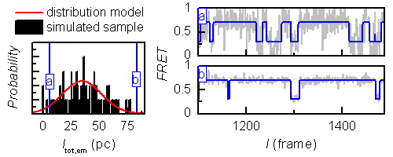

# Simulate sample heterogeneity
{: .no_toc }

Sample heterogeneity is characterized by the presence of molecules with different characteristics in the data set.
It can be simulated for various characteristics by using one of the following methods:

1. TOC
{:toc}


---

## Parameter deviations

This method produces a continuous sample heterogeneity, *i.e.*, molecule characteristics are broadened. 
This is opposed to the creation of sub-populations of molecules with distinguishable characteristics.

Sample heterogeneity can be introduced in FRET states 
[*FRET*<sub>*j*</sub>](){: .math_var }, donor emission in absence of acceptor 
[*I*<sub>tot,em</sub>](){: .math_var } and gamma factors 
[*&#947;*](){: .math_var }.

Parameters are randomly generated for each molecule by drawing from Gaussian distributions with means respectively defined in fields 
`FRETj`, `Itot,em`, `γ`, and standard deviation in fields `wFRETj`, `wItot,em` and `wγ` of the graphical interface.

[*I*<sub>tot,em</sub>](){: .math_var } can be used to introduce heterogeneity in signal-to-noise ratio as shown in the following figure.

<a class="plain" href="../../assets/images/figures/VP-functionalities-scheme-sample-heterogenity.png"></a>


---

## Molecule-specific pre-sets

This method allows to custom the type of sample heterogeneity by either (1) producing a broadening of molecule characteristics, or (2) creating sub-populations of molecules with distinguishable characteristics, or (3) both.

Sample heterogeneity can be introduced in FRET states 
[*FRET*<sub>*j*</sub>](){: .math_var }, state transition rates 
[*k*<sub>*jj'*</sub>](){: .math_var }, donor emission in absence of acceptor 
[*I*<sub>tot,em</sub>](){: .math_var }, gamma factors 
[*&#947;*](){: .math_var } and PSF widths 
[*w*<sub>det</sub>](){: .math_var }.

Parameters are pre-defined for individual molecules in a pre-set parameter file containing the respective variables `FRET`, `trans_rates`, `tot_intensity`, `gamma` and/or `psf_width`. 
For more information about the structure and use of pre-set parameter file, please refer to 
[Pre-set parameters](../components/panel-molecules.html#pre-set-parameters).

As an example, the script below creates two distinct molecule sub-populations of equal size, with one population allowing step-wise and reversible state transitions, and one allowing reversible transitions from state 1 only:

```matlab
%%%%% EDIT HERE %%%%%%%%%%%%%%%%%%%%%%%%%%%%%%%%%%%%%%%%%%%%%%%%%%%%%%%%%%%
% defines 4-by-4 transition rates for the first population
trans_rates1 = [ 0   0.1 0   0
		 0.1 0   0.1 0
		 0   0.1 0   0.1
		 0   0   0.1 0];
		
% defines 4-by-4 transition rates for the second population
trans_rates2 = [ 0   0.1 0.1 0.1
		 0.1 0   0   0
		 0.1 0   0   0
		 0.1 0   0   0];
		 
% defines the number of trajectories to simulate
N = 60;

% replicate the first and second transition rates matrix for half of the molecules with the repmat function
trans_rates1 = repmat(trans_rates1,[1 1 N/2]);
trans_rates2 = repmat(trans_rates2,[1 1 N/2]);

% concatenate both sub-populations into one sample
trans_rates = cat(3,trans_rates1,trans_rates2);

%%%%%%%%%%%%%%%%%%%%%%%%%%%%%%%%%%%%%%%%%%%%%%%%%%%%%%%%%%%%%%%%%%%%%%%%%%%
```

To build and export the pre-set parameter file:

{: .procedure }
1. Open the pre-set template in MATLAB's editor by going to MATLAB's menu `HOME → Open → Open ...` and selecting the file `MASH-FRET/tools/createSimPrm.m`.  
      
1. Define the desired variables in the corresponding section of the template (`trans_rates` for the sub-mentioned example)  
     
1. Run the script by pressing `Run` in MATLAB's menu `EDITOR` and export the pre-set file.
     
1. load the pre-sets by pressing 
 in 
[Pre-set parameters](../components/panel-molecules.html#pre-set-parameters) and selecting the corresponding file

<!--
---

## Partitioned transition rate matrix

This method can be used to introduce sample heterogeneity in state transition rates 
[*k*<sub>*jj'*</sub>](){: .math_var } and consists in defining closed transition networks within the same 
[Transition rates matrix](../components/panel-molecules.html#transition-rates).
As each state has a certain probability to be drawn to start a state trajectory, simulated trajectories can follow only one of the state networks defined in the transition rates matrix.

This method produces a discontinuous sample heterogeneity, *i.e.*, it creates sub-populations of molecules with distinguishable characteristics as opposed to a broadening of molecule characteristics.

As an example, this partition of the transition rate matrix produces two distinct molecule sub-populations following either the state network (1,2) or (3,4,5).

| states  | 1       | 2       | 3       | 4       | 5       |
| :-----: | :-----: | :-----: | :-----: | :-----: | :-----: |
| **1**   | 0       | **0.1** | 0       | 0       | 0       |
| **2**   | **0.1** | 0       | 0       | 0       | 0       |
| **3**   | 0       | 0       | 0       | **0.1** | 0       |
| **4**   | 0       | 0       | **0.1** | 0       | **0.1** |
| **5**   | 0       | 0       | 0       | **0.1** | 0       |

The size of the two sub-populations depends on the overall probability to start the state trajectory with one of the states of the respective network.
-->
