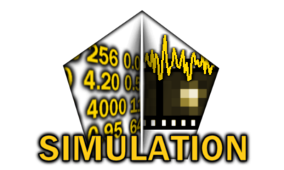
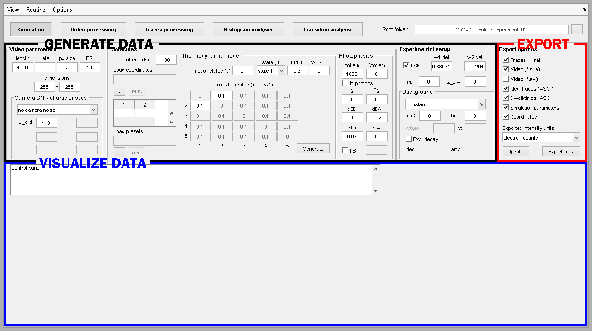

# Interface
{: .no_toc }

Simulation is the first module of MASH-FRET and is accessed by pressing 
 in the main 
[tool bar](../Getting_started.html#interface).

The interface is divided into two units that respectively allow to:
* <u>generate</u> and <u>export</u> data
* <u>visualize</u> generated data

Learn about individual components of the interface in the 
[Components](components.html) section.

