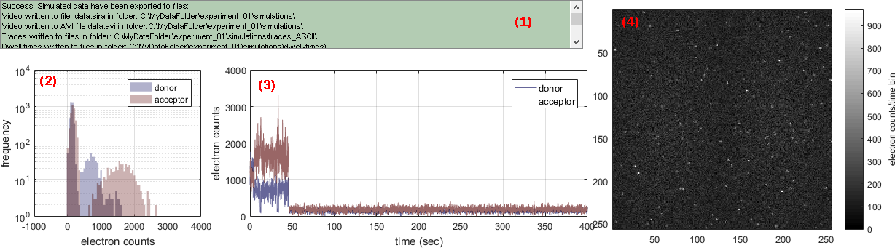

# Visualization area
{: .no_toc }

## Panel components
{: .no_toc .text-delta }

1. TOC
{:toc}

---

## Control panel 

It lists the action logs. Actions are automatically saved in a 
[daily log file](../../output-files/log-daily-logs.html).

---

## Intensity histograms

It displays the donor (blue) and acceptor (red) intensity distributions in simulated intensity-time traces of molecule n:°1. 

Intensity units are set in 
[Exported intensity units](panel-export-options.html#exported-intensity-units).

Any graphics in MASH can be exported to an image file by left-clicking on the axes and selecting `Export graph`.

---

## Simulated intensity-time traces

It displays the simulated donor (blue) and acceptor (red) intensity-time traces for molecule n:°1. 

Intensity units are set in 
[Exported intensity units](panel-export-options.html#exported-intensity-units).

Any graphics in MASH can be exported to an image file by left-clicking on the axes and selecting `Export graph`.

---

## Simulated video

It displays the first frame of the simulated single molecule video. 

The color scale for pixel values is indicated by the color bar. Pixel intensity units are set in 
[Exported intensity units](panel-export-options.html#exported-intensity-units).

Any graphics in MASH can be exported to an image file by left-clicking on the axes and selecting `Export graph`.
