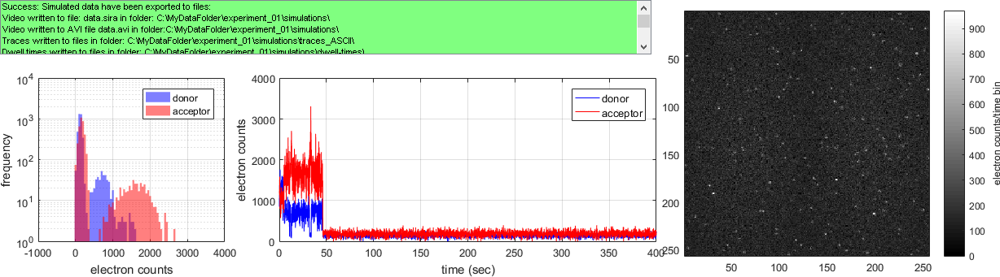

# Visualization area
{: .no_toc }

## (1) Control panel 

Display action logs. The list is automatically saved in a 
[daily log file](../../output-files/log-daily-logs.html).

## (2) Intensity histograms

Donor (blue) and acceptor (red) intensity distributions in simulated intensity-time traces of molecule n:°1. 

Intensity units are set in 
[Exported intensity units](panel-export-options.html#exported-intensity-units).

## (3) Simulated intensity-time traces

Simulated donor (blue) and acceptor (red) intensity-time traces for molecule n:°1. 

Intensity units are set in 
[Exported intensity units](panel-export-options.html#exported-intensity-units).

## (4) Simulated video

First frame of the simulated single molecule video. 

The color scale for pixel values is indicated by the color bar. Pixel intensity units are set in 
[Exported intensity units](panel-export-options.html#exported-intensity-units).
