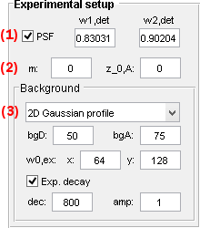
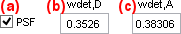
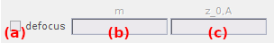
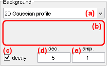

# Experimental setup
{: .no_toc }

## Panel components
{: .no_toc .text-delta }

1. TOC
{:toc}

---

## Point spread functions

They are the settings to build diffraction-limited images.

The point spread function (PSF) shapes the intensity 2D-profile of single molecules in diffraction-limited images. 
The PSF is modelled by a spherical 2D-Gaussian centred on the single molecule coordinates and with a standard deviation *w*det.
As the PSF width depends on the wavelength of the detected light, it is different in donor and acceptor channel.

PSF convolution is activated by checking the box in **(a)**.
The donor and acceptor PSF widths *w*det,D and *w*det,A are set in micrometers in **(b)** and **(c)** respectively.

**<u>default</u>:** PSF convolution is activated with:
* *w*det,D = 0.353 &#956;m
* *w*det,A = 0.383 &#956;m

---

## Defocusing

They are the settings to simulate defocusing while video recording.

*In construction.*

---

## Background

They are the settings to generate channel-specific fluorescent background.

Fluorescent background is a source of unwanted fluorescence that adds up to each video channel. It can be uniform in space or spatially distributed, but also constant or dynamic in time.

### Uniform background
{: .no_toc}

To apply a uniform background, "Uniform" must be selected in the list **(a)**. 
Background intensities are set in **(b)** and **(c)** for donor and acceptor channel respectively.
Intensity units can be given in photon counts (pc) or electron counts (ec); see
[Intensity units](panel-molecules#intensity-units) for more information.

**<u>default</u>:** 
* *bg*D = 0 ec
* *bg*A = 0 ec

### Gaussian-distributed background
{: .no_toc}

The background is spatially distributed following a 2D-Gaussian model. This can be used to model a TIRF excitation profile.

To apply a <u>2D-Gaussian background</u>, "2D Gaussian profile" must be selected in list **(a)**.
In that case, the background follows a 2D-Gaussian distribution centred on each channel, having common x- and y-standard deviations, *w*0,ex,x and *w*0,ex,y, given in pixels and set in **(d)** and **(e)** respectively.
Gaussian amplitudes *bg*D in donor channel and *bg*A in acceptor channel are set in **(b)** and **(c)** respectively.
Gaussian amplitudes can be given in photon counts (pc) or electron counts (ec); see
[Intensity units](panel-molecules#intensity-units) for more information.

**<u>default</u>:** 2D-Gaussian widths are set to half-channel dimensions in a video of 256-by-256 pixels:
* *w*0,ex,x = 64 px
* *w*0,ex,y = 128 px

### Background from image file

The spatial distribution of the background is set by an external image file. This can be used to reproduce image imperfections present in experimental recordings.

To add a <u>background image</u>, "Pattern" must be selected in list **(a)**.
In that case, the background image or video must be loaded after pressing the "Update" button.
Supported graphic file formats are: *.<u>sif</u>, *.<u>sira</u>, *.<u>tif</u>, *.<u>gif</u>, *.<u>png</u>, *.<u>spe</u>, *.<u>pma</u>.
If the loaded file is a video, the first frame will be used as the background image.

**<u>default</u>:** no background image is loaded.

### Background decaying in time
{: .no_toc}

The fluorescent background intensities are decaying in time. This can be used to model the photobleaching of an autofluorescent medium.

Time decay of uniform or spatially distributed background intensities is activated by checking the box in **(f)**.
In that case, the background intensity in each pixel decays exponentially with a time decay *dec* given in seconds and set in **(g)**.
The starting background intensities can be modulated by a factor *amp* set in **(h)**. 

**<u>default</u>:** decay time constant is set to 10 times the default trajectory length:
* *dec* = 4000 seconds
* *amp* = 1

