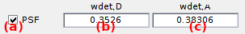
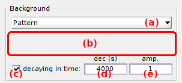
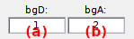

# Experimental setup
{: .no_toc }

Experimental setup is the third panel of module Simulation. 

Use this panel to define experimental variables related to the measuring setup, including the background light and diffraction limit.

## Panel components
{: .no_toc .text-delta }

1. TOC
{:toc}

---

## Point spread functions

Use these settings to simulate diffraction-limited images.

The point spread function (PSF) shapes the intensity 2D-profile of single molecules as diffraction-limited spots. 
The PSF is modelled with a spherical 2D-Gaussian centred on the single molecule coordinates and with a standard deviation 
[*w*det](){: .math_var }.
As the PSF width depends on the wavelength of the detected light, it is different for the donor and the acceptor channel.

PSF convolution is activated by activating the option in **(a)**.
The donor and acceptor PSF widths 
[*w*det,D](){: .math_var } and 
[*w*det,A](){: .math_var } are set in micrometers in **(b)** and **(c)** respectively.

<u>default</u>: PSF convolution is activated and defined according to our setup:
* [*w*det,D](){: .math_var } = 0.353 &#956;m
* [*w*det,A](){: .math_var } = 0.383 &#956;m

**Note:** *Pixel values are calculated by numerical integration of each 2D-Gaussian and can be relatively time consuming for large PSF.*

---

## Defocusing

Use these settings to simulate defocusing while video recording.

*Under construction.*

---

## Background

Use this panel to set channel-specific background signals.

The background is a source of unwanted photons that adds up to each video channel. 
It can be distributed in space and in time.
Background decay in time can be used, for instance, to model the photobleaching of an autofluorescent medium.

Select the type of spatial distribution in list **(a)**.

The interface **(b)** depends on the chosen distribution, which includes:

* [`Uniform`](#uniform-background): constant background in space 
* [`2D Gaussian profile`](#gaussian-distributed-background): TIRF-like background profile
* [`Pattern`](#background-from-image-file): background from image

To simulate time-decaying background intensities, activate the option in **(c)**.

In that case, the background intensity in each pixel decays exponentially with a time decay constant
[*dec*](){: .math_var } given in seconds and set in **(d)**.
The starting background intensities can be modulated by a factor 
[*amp*](){: .math_var } set in **(e)**. 

<u>default</u>: decay time constant is set to 10 times the default trajectory length:
* [*dec*](){: .math_var } = 4000 seconds
* [*amp*](){: .math_var } = 1

### Uniform background
{: .no_toc}

Background intensities are set in **(a)** and **(b)** for donor and acceptor channel respectively and are given in units defined by 
[Intensity units](panel-molecules.html#intensity-units).

Experimental 
[*bg*D](){: .math_var } and 
[*bg*A](){: .math_var } values in image counts are obtained by subtracting the known camera offset to the background intensities calculated in Trace processing; see 
[Background correction](../../trace-processing/panels/panel-subimage-background-correction.html#background) for more information about background correction.

<u>default</u>: no background light
* [*bg*D](){: .math_var } = 0 pc
* [*bg*A](){: .math_var } = 0 pc

### Gaussian-distributed background
{: .no_toc}

The background is spatially distributed following a 2D-Gaussian model. 
This can be used to model a realistic TIRF excitation profile.

In that case, the background follows a 2D-Gaussian distribution centred on each channel, having common x- and y-standard deviations, 
[*w*0,ex,x](){: .math_var } and 
[*w*0,ex,y](){: .math_var }, given in pixels and set in **(c)** and **(d)** respectively.

Gaussian amplitudes 
[*bg*D](){: .math_var } in donor channel and 
[*bg*A](){: .math_var } in acceptor channel are set in **(a)** and **(b)** respectively and are given in units defined in 
[Intensity units](panel-molecules.html#intensity-units).

<u>default</u>: 2D-Gaussian widths are set to half-channel dimensions in a video of 256-by-256 pixels:
* [*w*0,ex,x](){: .math_var } = 64 px
* [*w*0,ex,y](){: .math_var } = 128 px

### Background from image file
{: .no_toc}

The spatial distribution of the background is set by an external image file. 
This can be used to reproduce image imperfections present in experimental recordings.

To import a background image, press  
.
The image file name will be shown in **(a)**.

The pixel size of the background image must be identical to the video.

Supported graphic file formats are: *.<u>sif</u>, *.<u>sira</u>, *.<u>tif</u>, *.<u>gif</u>, *.<u>png</u>, *.<u>spe</u>, *.<u>pma</u>.
If the loaded file is a video, the first frame will be used as the background image.

<u>default</u>: no background image is loaded.

