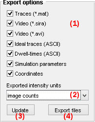
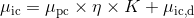

# Export options
{: .no_toc }

## Panel components
{: .no_toc .text-delta }

1. TOC
{:toc}

---

## File options

They are the possible files to export after simulation.

### Traces (*.mat)
{: .no_toc}

Export one Matlab binary file that contains simulated data of all molecules: 
* noisy intensity-time traces
* single molecule coordinates

Data can be easily imported by drag-and-dropping the file into Matlab workspace.

See 
[Traces file from simulation](../../output-files/mat-traces-from-simulation.html) for more information.

### Video (*.sira)
{: .no_toc}

Export simulated <u>single molecule video</u> written in one binary MASH-FRET file.

The file keeps original data accuracy and can be imported in other MASH-FRET models <u>for algorithm testing or validating results</u>.

See 
[MASH video files](../../output-files/sira-mash-video.html) for more information.

### Video (*.avi)
{: .no_toc}

Export simulated <u>single molecule video</u> written in one *uncompressed AVI file with RGB24 video*.

Pixel values are normalized by the sum within the frame: the file loses data accuracy and coherence between frames. 

It can be used <u>for visualization or illustration</u> in presentations for instance.

### Ideal traces (ASCII)
{: .no_toc}

Export ASCII files that contain simulated data of individual molecules: 
* single molecule coordinates
* noisy and noiseless intensity-time traces
* noisy and noiseless FRET-time traces
* state sequences

Data can be imported in other MASH-FRET modules <u>for algorithm testing or validating results</u>.

See 
[Traces file from simulation](../../output-files/txt-traces-from-simulation.html) for more information.

### Dwell times (ASCII)
{: .no_toc}

Export ASCII files that contain the list of dwell times in individual noiseless FRET-time traces.

*In construction:* data will be importable in Transition analysis module <u>for algorithm testing or validating results</u>.

See 
[Dwell time files](../../output-files/dt-dwelltimes.html) for more information.

### Simulation parameters
{: .no_toc}

Export one ASCII file that contains the list of parameters and export options used in the simulation.

See 
[Simulation parameter files](../../output-files/log-simulation-parameters.html) for more information.

### Coordinates
{: .no_toc}

Export one ASCII file that contains all single molecule coordinates used in the simulation.

Data can be imported in other MASH-FRET modules <u>for algorithm testing</u>.

See 
[Simulated coordinates files](../../output-files/crd-simulated-coordinates.html) for more information.

---

## Intensity units

They are the intensity units of exported data.

Intensity data can be exported in:
* Photon counts (pc)
* Image counts (ic)

Photon counts 
[*&#956;*pc](){: .math_var } and image counts 
[*&#956;*ic](){: .math_var } are linked by the relation:

{: .equation }

<!--
{: .equation }
*&#956;*ic = *&#956;*pc &#215; *&#951;* &#215; *K* + *&#956;*ic,d
-->

with camera characteristics: signal offset 
[*&#956;*ic,d](){: .math_var }, detection efficiency 
[*&#951;*](){: .math_var } and overall gain 
[*K*](){: .math_var }.

If one of the characteristics is not defined within the chosen camera noise model, the following default values are used:
* [*&#951;*](){: .math_var } = 1 ec/pc
* [*K*](){: .math_var } = 1 ic/ec
* [*&#956;*ic,d](){: .math_var } = 0 ic

See 
[Camera SNR characteristics](panel-video-parameters.html#camera-snr-characteristics) for more information.

**<u>default:</u>** electron counts

---

## Update intensities

It is the command to refresh simulation display; see 
[Visualization area](area-visualization.html) for more information.

It updates intensity-time trace and image calculations starting with generated noiseless FRET-time traces.

Calculations include fluorescence intensity, gamma factor, cross-talks, background, camera noise and PSF convolution.

See
[Simulation workflow](../workflow.html#create-intensity-trajectories-and-images) for more information

---

## Export files

It is the command that exports simulated data to selected file formats in 
[File options](#file-options).

