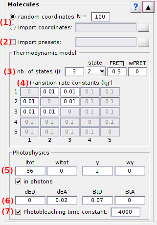
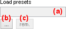
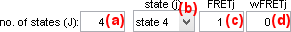
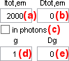
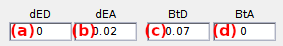

# Molecules
{: .no_toc }

## (1) number of molecules (*N*)

## (2) Molecule coordinates

By default, molecule coordinates are generated randomly.

## (3) Pre-set parameters

## (4) State configuration

## (5) Transition rates

## (6) Generate data

## (7) Donor emission

## (8) Cross-talks

## (9) Photobleaching

