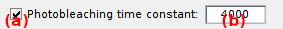

# Molecules
{: .no_toc }

<a href="../../assets/images/gui/sim-panel-molecules.png"></a>


## Panel components
{: .no_toc .text-delta }

1. TOC
{:toc}

---

## Number of molecules

It is the number of single molecules to simulate, noted 
[*N*](){: .math_var }.

If single molecules coordinates or pre-set parameters are loaded from external files, the number of molecules is derived from the file dimensions; see
[Molecule coordinates](#molecule-coordinates) and 
[Pre-set parameters](#pre-set-parameters) for more details. 

**<u>default</u>:** 100

---

## Molecule coordinates

They are the (x,y) pixel coordinates of single molecules in the simulated video.

<a href="../../assets/images/gui/sim-panel-molecules-coordinates.png"></a>

The `N`-by-4 molecule coordinates are displayed in table **(d)** where x- and y-positions are written in columns 1 and 2 for left channel and 3 and 4 for right channel.

Coordinates can be loaded from an external ASCII file by pressing **(b)**. In this case:
* loaded file name is displayed in **(a)**
* the file must be structured in two or four columns, with x and y positions written in odd and even columns respectively.
* if the file contains left- or right-channel coordinates only, coordinates in the other channel are automatically calculated by adding or subtracting one channel width to x-positions. 
* loaded coordinates can me removed by pressing **(c)**


Coordinates can also be defined in pre-set parameters; see
[Pre-set parameters](#pre-set-parameters) for more details.

**<u>default</u>:** `N` pairs of random coordinates uniformly distributed within the video dimensions.

---

## Pre-set parameters

They are pre-defined parameters set for individual molecules and loaded from an external Matlab binary file.

<a href="../../assets/images/gui/sim-panel-molecules-preset.png"></a>

Pre-set parameters file can be loaded by pressing **(b)**. In that case:
* loaded file name is displayed in **(a)**
* the file must contain a structure with at least one of the following fields:

| field name      | description                                                                                                                  | data type               |
| --------------- | ---------------------------------------------------------------------------------------------------------------------------- | ----------------------- |
| `FRET`          | [*FRET<sub>j</sub>*](){: .math_var } values and deviations [*wFRET<sub>j</sub>*](){: .math_var } for a `J`-state model       | `N`-by-`2*J`double      |
| `trans_rates`   | [*k<sub>jj'</sub>*](){: .math_var } transition rate matrix                                                                   | `J`-by-`J`-by`N` double |
| `gamma`         | gamma factors and deviations                                                                                                 | `N`-by-2 double         |
| `tot_intensity` | intensities [*I*<sub>tot,em</sub>](){: .math_var } of donor emission in absence of acceptor and deviations                   | `N`-by-2 double         |
| `coordinates`   | x- and y- molecule coordinates in donor and/or acceptor channel                                                              | `N`-by-2 or -4 double   |
| `psf_width`     | PSF standard deviations in donor and/or acceptor channel                                                                     | `N`-by-1 or -2 double   |

* if parameter `coordinates` concerns one channel only, x-positions are automatically translated to obtain coordinates in the other channel. 
* if parameter `psf_width` is of dimension `N`-by-1,  values applies automatically to both channels.
* loaded pre-sets can me removed by pressing **(c)**

A template *.m file is provided in the source code to help building a pre-set parameter file. It can be found at:

```
MASH-FRET/source/project/createSimPrm.m
```

**<u>default</u>:** no parameters file is loaded, all parameters are set by the GUI.

---

## State configuration

It is the FRET state model used in the simulation.

<a href="../../assets/images/gui/sim-panel-molecules-state-configuration.png"></a>

The model consists of a number 
[*J*](){: .math_var } of FRET states, set in **(a)**, and the corresponding 
[*FRET<sub>j</sub>*](){: .math_var } values. 
[*FRET<sub>j</sub>*](){: .math_var } values can be set in **(c)** by first selecting "state 
[*j*](){: .math_var }" in list **(b)**.

If needed, sample heterogeneity can be introduce by attributing a strictly positive deviation 
[*wFRET<sub>j</sub>*](){: .math_var } **(d)** to the 
[*FRET<sub>j</sub>*](){: .math_var } value.
In this case, a random *FRET* value is drawn for each molecule, using a Gaussian distribution with mean 
[*FRET<sub>j</sub>*](){: .math_var } and standard deviation 
[*wFRET<sub>j</sub>*](){: .math_var }.

**<u>default</u>:** 
* [*J*](){: .math_var } = 2
* for state 1: 
[*FRET*<sub>1</sub>](){: .math_var } = 0, 
[*wFRET*<sub>1</sub>](){: .math_var } = 0
* for state 2: 
[*FRET*<sub>2</sub>](){: .math_var } = 1, 
[*wFRET*<sub>2</sub>](){: .math_var } = 0

---

## Transition rates

They are the rate constants that govern state transitions, noted 
[*k<sub>jj'</sub>*](){: .math_var }.

Transition rates are given in second<sup>-1</sup> and are organized in a matrix, where the cell (row 
[*j*](){: .math_var }, column 
[*j'*](){: .math_var }) concerns the unidirectional transition from state 
[*j*](){: .math_var } to state 
[*j'*](){: .math_var }. 

When a rate equal to zero, the transition is considered forbidden.

Heterogeneous transition kinetics characterized by multiple rate coefficients can be simulated by using degenerated states, *i.e.*, using states with same 
[*FRET*<sub>*j*</sub>](){: .math_var } value but different transition rate coefficients.
For an example, please refer to the 
literature [1](#references).

**<u>default</u>:** 0.1 second<sup>-1</sup>.

**Note:** *For more practicability, the transition rate matrix is limited to five states. 
To simulate a system with more than five states, please refer to 
[Simulate more than five states](../functionalities/simulate-more-states.html)*


### References

1. S. Schmid, T. Hugel, *Efficient use of single molecule time traces to resolve kinetic rates, models and uncertainties*, *J. Chem. Phys.* **2017**, DOI: [10.1063/1.5006604](https://doi.org/10.1063/1.5006604)


---

## Generate data

Command to generate new FRET state sequences.

It generates random FRET state sequences using the state configuration, the transition rates and the photobleaching parameters.

See
[Simulation workflow](../workflow.html#generate-random-fret-state-sequences) for more information

---

## Donor emission

It is the donor emission intensity in absence of acceptor, noted 
[*I*<sub>tot,em</sub>](){: .math_var }.

<a href="../../assets/images/gui/sim-panel-molecules-intensity.png"></a>

Intensity 
[*I*<sub>tot,em</sub>](){: .math_var } is et in **(a)**

If needed, sample heterogeneity can be introduced by attributing a strictly positive deviation 
[*wI*<sub>tot,em</sub>](){: .math_var } **(b)**.
In this case, a random intensity value is drawn for each molecule, using a Gaussian distribution with mean 
[*I*<sub>tot,em</sub>](){: .math_var } and standard deviation 
[*wI*<sub>tot,em</sub>](){: .math_var }.

### Gamma factor
{: .no_toc}

Differences in donor and acceptor quantum yields and detection efficiencies can be modulated by setting a factor 
[&#947;](){: .math_var } in **(d)**. 
Donor emission is affected according to the relation:

{: .equation }


<!--
{: .equation }
*I*<sub>D,em</sub> = *I*<sub>D,em,0</sub> / *&#947;*
-->

with 
[*I*<sub>D,em,0</sub>](){: .math_var } the original donor fluorescence intensity in presence of acceptor, and 
[*I*<sub>D,em</sub>](){: .math_var } the gamma-modified version.

Similarly, sample heterogeneity in gamma factor can be introduced by setting a strictly positive deviation 
[*w&#947;*](){: .math_var } in **(e)**.

### Intensity units
{: .no_toc}

Intensity units of 
[*I*<sub>tot,em</sub>](){: .math_var } and 
[*wI*<sub>tot,em</sub>](){: .math_var } can be set in photon counts (pc) or camera offset-free image counts (ic) when the box in **(c)** is checked or unchecked respectively.
This choice also affects the units of background intensities set in 
[Background](panel-experimental-setup.html#background).

Photon counts 
[*&#956;*<sub>pc</sub>](){: .math_var } and camera offset-free image counts 
[*&#956;*<sub>ic</sub>](){: .math_var } are linked by the relation:

{: .equation }


<!--
{: .equation }
*&#956;*<sub>ic</sub> = *&#956;*<sub>pc</sub> &#215; *&#951;* &#215; *K*
-->

with camera characteristics: detection efficiency *&#951;* and overall gain *K*.

Camera offset-free image counts are used here because experimental 
[*I*<sub>tot,em</sub>](){: .math_var } value can be obtained by averaging the sum of donor and acceptor intensity-time traces in Trace processing after background correction, which includes subtraction of camera offset.

If one of the characteristics is not defined within the chosen camera noise model, the following default values are used:
* [*&#951;*](){: .math_var } = 1 ec/pc
* [*K*](){: .math_var } = 1 ic/ec

See 
[Camera SNR characteristics](panel-video-parameters.html#camera-snr-characteristics) for more information.

Only photon counts 
[*&#956;*<sub>pc</sub>](){: .math_var } are registered in memory.
If intensities are recorded in image counts, they will be converted to photon counts before being saved in memory.
This means that selecting another camera noise model will change the image counts intensities as they are convert and using the new camera parameters 
[*&#951;*](){: .math_var } and 
[*K*](){: .math_var }.

**<u>default</u>:** 
* [*I*<sub>tot,em</sub>](){: .math_var } = 36 pc
* [*wI*<sub>tot,em</sub>](){: .math_var } = 0 pc
* [*&#947;*](){: .math_var } = 1
* [*w&#947;*](){: .math_var } = 0;


---

## Cross-talks

They are the bias in collected intensities caused by instrumental imperfections.

<a href="../../assets/images/gui/sim-panel-molecules-crosstalks.png"></a>

The donor and acceptor direct excitation coefficients 
[*dE*<sub>D</sub>](){: .math_var } and 
[*dE*<sub>A</sub>](){: .math_var }, i.e., the fraction of signal collected when illuminated by the pair's excitation wavelength, can be set in **(a)** and **(b)** respectively.
Here, setting 
[*dE*<sub>D</sub>](){: .math_var } is senseless as simulations are limited to continuous- (donor-) wavelength excitation.

The donor and acceptor bleedthrough coefficients 
[*bt*<sub>D</sub>](){: .math_var } and 
[*bt*<sub>A</sub>](){: .math_var }, i.e., the fraction of signal leaking in the pair's channel, can be set in **(c)** and **(d)** respectively.

**<u>default</u>:** default coefficients are based on our experimental setup:
* [*dE*<sub>D</sub>](){: .math_var } = 0
* [*dE*<sub>A</sub>](){: .math_var } = 0.02
* [*bt*<sub>D</sub>](){: .math_var } = 0.07
* [*bt*<sub>A</sub>](){: .math_var } = 0

---

## Photobleaching

It is the time-settings of fluorophore photochemical destruction.

<a href="../../assets/images/gui/sim-panel-molecules-photobleaching.png"></a>

Photochemical destruction of the donor, i.e., photobleaching, can be activated by checking the box in **(a)**.
In that case, intensity-time traces are interrupted at the photobleaching time by a sudden and irreversible extinction of donor emission.

Photobleaching times are randomly drawn from an exponential distribution with a decay constant set by **(b)**.

**<u>default</u>:** no photobleaching, the observation time is set by video length 
[*L*](){: .math_var }. 
