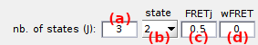

# Molecules
{: .no_toc }

Molecules is the second panel of module Simulation.

Use this panel to define the molecule sample in terms of size, positions, molecule and dye properties, and to start simulation.

<a class="plain" href="../../assets/images/gui/sim-panel-molecules.png"></a>


## Panel components
{: .no_toc .text-delta }

1. TOC
{:toc}

---


## Number of molecules

Defines the number of single molecules to simulate, noted 
[*N*](){: .math_var }.

If single molecule coordinates or pre-set parameters are loaded from external files, the number of molecules is derived from the dimensions of the file content; see
[Molecule coordinates](#molecule-coordinates) and 
[Pre-set parameters](#pre-set-parameters) for more details. 

<u>default</u>: [*N*](){: .math_var } = 100

---


## Molecule coordinates

Use this interface to import and/or visualize the (x,y) pixel coordinates of single molecules in simulation.

<a class="plain" href="../../assets/images/gui/sim-panel-molecules-coordinates.png"></a>

The 
[*N*](){: .math_var }-by-4 molecule coordinates are displayed in table **(d)** where x- and y-positions are written in columns 1 and 2 for left channel and 3 and 4 for right channel.

Coordinates can be imported from an external ASCII file by pressing **(b)**. 
In this case:
* the file must be structured in two or four columns, with x- and y-positions written in odd and even columns respectively.
* if the file contains left- or right-channel coordinates only, coordinates in the other channel are automatically calculated by adding or subtracting one channel width to x-positions. 
* imported file name is displayed in **(a)**
* imported coordinates can me removed by pressing **(c)**

Coordinates can also be imported from a pre-set parameter file; see
[Pre-set parameters](#pre-set-parameters) for more details.

<u>default</u>: [*N*](){: .math_var } pairs of random coordinates uniformly distributed within the video dimensions.

---


## Pre-set parameters

Use this interface to import pre-defined parameters for individual molecules from an external MATLAB binary file (.mat).

<a class="plain" href="../../assets/images/gui/sim-panel-molecules-preset.png"></a>

Pre-set parameters can be imported from an external .mat file by pressing **(b)**. 
In that case:
* the file must contain a MATLAB structure with at least one of the following fields:

| field name      | description                                                                                                                                                                                                                                  | data type                                                                      |
| --------------- | -------------------------------------------------------------------------------------------------------------------------------------------------------------------------------------------------------------------------------------------- | ------------------------------------------------------------------------------ |
| `FRET`          | [*FRET<sub>j</sub>*](){: .math_var } values and deviations [*wFRET<sub>j</sub>*](){: .math_var } for a [*J*](){: .math_var }-state model; see [State configuration](#state-configuration) for more details about the meaning of these values | [*N*](){: .math_var }-by-2[*J*](){: .math_var }double                          |
| `trans_rates`   | transition rate matrix [*k<sub>jj'</sub>*](){: .math_var }                                                                                                                                                                                   | [*J*](){: .math_var }-by-[*J*](){: .math_var }-by-[*N*](){: .math_var } double |
| `gamma`         | [*&#947;*](){: .math_var } factors and deviations [*w&#947;*](){: .math_var }; see [Gamma factor](#gamma-factor) for more details about the meaning of these values                                                                          | [*N*](){: .math_var }-by-2 double                                              |
| `tot_intensity` | intensities [*I*<sub>tot,em</sub>](){: .math_var } and deviations [*wI*<sub>tot,em</sub>](){: .math_var }; see [Donor emission](#donor-emission) for more details about the meaning of these values                                          | [*N*](){: .math_var }-by-2 double                                              |
| `coordinates`   | x- and y- molecule coordinates in donor and/or acceptor channel                                                                                                                                                                              | [*N*](){: .math_var }-by-2 or -4 double                                        |
| `psf_width`     | PSF standard deviations [*w*<sub>det,D</sub>](){: .math_var } and/or [*w*<sub>det,A</sub>](){: .math_var } in donor and/or acceptor channel respectively                                                                                     | [*N*](){: .math_var }-by-1 or -2 double                                        |

* if parameter `coordinates` contains coordinates in only one channel, x-positions are automatically translated to obtain coordinates in the other channel. 
* if parameter `psf_width` is of dimension [*N*](){: .math_var }-by-1, PSF widths are applied to both channels.
* imported file name is displayed in **(a)**
* loaded pre-sets can me removed by pressing **(c)**

A *.m template file is provided with the source code at:

```
MASH-FRET/tools/createSimPrm.m
```

<u>default</u>: no parameter file is loaded, all parameters are set via the GUI.

---


## State configuration

Use this interface to define the number of states and corresponding FRET values.

<a class="plain" href="../../assets/images/gui/sim-panel-molecules-state-configuration.png"></a>

The state configuration is described by a number 
[*J*](){: .math_var } of states set in **(a)**, and the corresponding 
[*FRET<sub>j</sub>*](){: .math_var } values set in **(c)** after selecting `state [j]` in list **(b)**, with `[j]` the state index.

If needed, sample heterogeneity can be introduce by attributing a strictly positive deviation 
[*wFRET<sub>j</sub>*](){: .math_var } **(d)** to the 
[*FRET<sub>j</sub>*](){: .math_var } value.
In this case, a random *FRET* value is drawn for each molecule, using a Gaussian distribution with mean 
[*FRET<sub>j</sub>*](){: .math_var } and standard deviation 
[*wFRET<sub>j</sub>*](){: .math_var }.

<u>default</u>: 
* [*J*](){: .math_var } = 2
* for state 1: 
[*FRET*<sub>1</sub>](){: .math_var } = 0, 
[*wFRET*<sub>1</sub>](){: .math_var } = 0
* for state 2: 
[*FRET*<sub>2</sub>](){: .math_var } = 1, 
[*wFRET*<sub>2</sub>](){: .math_var } = 0

---

## Transition rates

Use this interface to define the rate coefficients that govern state transitions, noted 
[*k<sub>jj'</sub>*](){: .math_var }.

Transition rates are given in second<sup>-1</sup> and are organized in a matrix, where the cell (row 
[*j*](){: .math_var }, column 
[*j'*](){: .math_var }) concerns the unidirectional transition from state 
[*j*](){: .math_var } to state 
[*j'*](){: .math_var }. 

A rate set to zero defines a forbidden transition.

Heterogeneous transition kinetics are characterized by multiple rate coefficients and can be simulated by using degenerated states, *i.e.*, using states with same 
[*FRET*<sub>*j*</sub>](){: .math_var } value but different transition rate coefficients.
For an example, please refer to the 
literature<sup>[1](#references)</sup>.

<u>default</u>: 0.1 second<sup>-1</sup>.

**Note:** *For more practicability, the transition rate matrix is limited to five states. 
To simulate a system with more than five states, please refer to 
[Simulate more than five states](../functionalities/simulate-more-states.html)*


### References
{: .no_toc }

1. S. Schmid, T. Hugel, *Efficient use of single molecule time traces to resolve kinetic rates, models and uncertainties*, *J. Chem. Phys.* **2017**, DOI: [10.1063/1.5006604](https://doi.org/10.1063/1.5006604)


---

## Start simulation

Press 
 generate new FRET state sequences.

Random FRET state sequences are automatically generated using the 
[State configuration](#state-configuration), the 
[Transition rates](#transition-rates) and the 
[Photobleaching](#photobleaching) parameters.

FRET state sequences are then automatically converted to intensity-time traces and single molecule images as in 
[Update intensities](panel-export-options.html#update-intensities).

See
[Simulation workflow](../workflow.html#generate-random-fret-state-sequences) for more information.

---


## Donor emission

Sets the donor emission intensity in absence of acceptor, noted 
[*I*<sub>tot,em</sub>](){: .math_var }.

<a class="plain" href="../../assets/images/gui/sim-panel-molecules-intensity.png"></a>

Intensity 
[*I*<sub>tot,em</sub>](){: .math_var } is set in **(a)** and is given in units defined in 
[Intensity units](#intensity-units).

If needed, sample heterogeneity can be introduced by attributing a strictly positive deviation 
[*wI*<sub>tot,em</sub>](){: .math_var } **(b)**.
In this case, a random intensity value is drawn for each molecule, using a Gaussian distribution with mean 
[*I*<sub>tot,em</sub>](){: .math_var } and standard deviation 
[*wI*<sub>tot,em</sub>](){: .math_var }.

Donor intensity can be placed on a different scale than acceptor intensity by introducing a
[Gamma factor](#gamma-factor) lower or higher than 1.


### Gamma factor
{: .no_toc}

Differences in donor and acceptor quantum yields and detection efficiencies can be modulated by setting a factor 
[&#947;](){: .math_var } in **(d)**. 
Donor emission is affected according to the relation:

{: .equation }


with 
[*I*<sub>D,em,0</sub>](){: .math_var } the original donor fluorescence intensity in presence of acceptor, and 
[*I*<sub>D,em</sub>](){: .math_var } the gamma-modified version.

Similarly, sample heterogeneity in gamma factor can be introduced by setting a strictly positive deviation 
[*w&#947;*](){: .math_var } in **(e)**.

### Intensity units
{: .no_toc}

Intensity units of 
[*I*<sub>tot,em</sub>](){: .math_var } and 
[*wI*<sub>tot,em</sub>](){: .math_var } can be set in photon counts (pc) or camera offset-free image counts (ic) when the option in **(c)** is activated or inactivated respectively.
This choice also affects the units of background intensities set in 
[Background](panel-experimental-setup.html#background).

Photon counts 
[*&#956;*<sub>pc</sub>](){: .math_var } and camera offset-free image counts 
[*&#956;*<sub>ic</sub>](){: .math_var } are linked by the relation:

{: .equation }


with camera characteristics 
[*&#951;*](){: .math_var } and 
[*K*](){: .math_var }, the detection efficiency and overall gain respectively.

Camera offset-free image counts are used here because experimental 
[*I*<sub>tot,em</sub>](){: .math_var } value can be obtained by averaging the sum of donor and acceptor intensity-time traces in Trace processing after background correction, which includes subtraction of camera offset.

If one of the characteristics is not defined within the chosen camera noise model, the following default values are used:
* [*&#951;*](){: .math_var } = 1 ec/pc
* [*K*](){: .math_var } = 1 ic/ec

See 
[Camera SNR characteristics](panel-video-parameters.html#camera-snr-characteristics) for more information.

Only photon counts 
[*&#956;*<sub>pc</sub>](){: .math_var } are registered in memory.
Image counts are recalculated every time another camera noise model with different 
[*&#951;*](){: .math_var } and 
[*K*](){: .math_var } is selected.

<u>default</u>: 
* [*I*<sub>tot,em</sub>](){: .math_var } = 36 pc
* [*wI*<sub>tot,em</sub>](){: .math_var } = 0 pc
* [*&#947;*](){: .math_var } = 1
* [*w&#947;*](){: .math_var } = 0;


---

## Cross-talks

Use this interface to set the direct excitation and bleedthrough coefficients.

<a class="plain" href="../../assets/images/gui/sim-panel-molecules-crosstalks.png"></a>

Cross-talks bias the measured fluorescence intensities because of instrumental imperfections.

The donor and acceptor direct excitation coefficients 
[*dE*<sub>D</sub>](){: .math_var } and 
[*dE*<sub>A</sub>](){: .math_var } are the fractions of signal collected when illuminated by the pair's excitation wavelength.
They can be set in **(a)** and **(b)** respectively.
Here, setting 
[*dE*<sub>D</sub>](){: .math_var } is senseless as simulations are limited to continuous- (donor-) wavelength excitation.

The donor and acceptor bleedthrough coefficients 
[*bt*<sub>D</sub>](){: .math_var } and 
[*bt*<sub>A</sub>](){: .math_var } are the fractions of signal leaking in the pair's channel.
They can be set in **(c)** and **(d)** respectively.

<u>default</u>: default coefficients are based on our experimental setup:
* [*dE*<sub>D</sub>](){: .math_var } = 0
* [*dE*<sub>A</sub>](){: .math_var } = 0.02
* [*bt*<sub>D</sub>](){: .math_var } = 0.07
* [*bt*<sub>A</sub>](){: .math_var } = 0

---


## Photobleaching

Defines the time spent before photochemical destruction of the donor fluorophore.

<a class="plain" href="../../assets/images/gui/sim-panel-molecules-photobleaching.png"></a>

Photochemical destruction of the donor, *i.e.*, photobleaching, can be activated by activating the option in **(a)**.
In that case, intensity-time traces are interrupted at random photobleaching time by a sudden and irreversible extinction of donor emission.

Photobleaching times are randomly drawn for each molecule from an exponential distribution with a decay constant set by **(b)**.

<u>default</u>: no photobleaching, the observation time is set by video length 
[*L*](){: .math_var }. 
