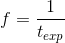
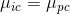
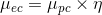
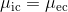
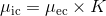
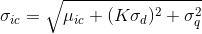
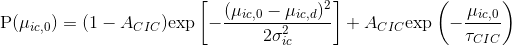
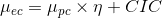
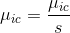
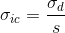

# Video parameters
{: .no_toc }

Video parameters is the first panel of module Simulation.

Use this panel to define the settings of data acquisition like camera noise and video characteristics.

<a class="plain" href="../../assets/images/gui/sim-panel-video-parameters.png"></a>

## Panel components
{: .no_toc .text-delta }

1. TOC
{:toc}

---


## Video length

Defines the total number of image frames in the video. 

It is usually noted 
[*L*](){: .math_var }

<u>default</u>: 
[*L*](){: .math_var } = 4000 frames

---


## Frame rate

Defines the acquisition rate of the video in frames per second (fps). 

It is usually noted 
[*f*](){: .math_var } and is linked to the acquisition time 
[*t*<sub>exp</sub>](){: .math_var } by the relation:

{: .equation }


with 
[*t*<sub>exp</sub>](){: .math_var } in seconds

<u>default</u>: 
[*f*](){: .math_var } = 10 fps

---


## Pixel size

Defines the square dimensions of a pixel in micrometers. 

It is used in the conversion of PSF widths from micrometers to pixels.

<u>default</u>: 0.53 &#956;m

---


## Bit rate

Defines the camera digitization bit depth in bit/pixel and defines the range of pixel values. 

It is used to calculate the saturation pixel value in the video.

<u>default</u>: 14 bit/pixel

---


## Video dimensions

Define the dimensions of video frames in pixels , following the x- **(a)** and y- **(b)** directions.

<u>default</u>: 256-by-256 pixels

---


## Camera SNR characteristics

Use this interface to define the camera noise distribution and the conversion of photon counts to images counts.

<a class="plain" href="../../assets/images/gui/sim-panel-video-parameters-camera.png"></a>

Select the camera noise model in **(a)** and set the corresponding parameters in **(b)**.

Available camera noise models are:
* [Offset only](#offset-only)
* [P- or Poisson](#p--or-poisson)
* [N- or Gaussian](#n--or-gaussian)
* [NExpN- or Gaussian + exponential tail](#nexpn--or-gaussian--exponential-tail) which is relatively time consuming; expect spending around 20 minutes to simulate a 256-by-256-wide and 4000 frame-long video
* [PGN- or Hirsch](#pgn--or-hirsch)

Refer to table 
[Model parameters](#model-parameters) for an exhaustive list of model parameters.


### Offset only
{: .no_toc }

Photon counts 
[*&#956;*<sub>pc</sub>](){: .math_var } are ideally converted to image counts 
[*&#956;*<sub>ic</sub>](){: .math_var } such as:

{: .equation }


A constant camera dark count 
[*&#956;*<sub>ic,d</sub>](){: .math_var } is then added.

<u>default</u>: 
[*&#956;*<sub>ic,d</sub>](){: .math_var } = 113 ic


### P- or Poisson
{: .no_toc }

Photon counts 
[*&#956;*<sub>pc</sub>](){: .math_var } are converted to electron counts 
[*&#956;*<sub>ec</sub>](){: .math_var } with a detection efficiency 
[*&#951;*](){: .math_var } such as:

{: .equation }


Electron counts are distributed following a Poisson distribution and are ideally converted to image counts 
[*&#956;*<sub>ic</sub>](){: .math_var } such as:

{: .equation }


A constant camera dark count 
[*&#956;*<sub>ic,d</sub>](){: .math_var } is then added.

<u>default</u>:
* [*&#956;*<sub>ic,d</sub>](){: .math_var } = 113 ic
* [*&#951;*](){: .math_var } = 0.95 ec/pc


### N- or Gaussian
{: .no_toc }

Photon counts 
[*&#956;*<sub>pc</sub>](){: .math_var } are converted to electron counts 
[*&#956;*<sub>ec</sub>](){: .math_var } with a detection efficiency 
[*&#951;*](){: .math_var } such as:

{: .equation }


Electron counts are converted to image counts 
[*&#956;*<sub>ic</sub>](){: .math_var } with an overall gain 
[*K*](){: .math_var } such as:

{: .equation }


A constant camera dark count 
[*&#956;*<sub>ic,d</sub>](){: .math_var } is added and image counts are distributed following a Gaussian distribution of mean 
[*&#956;*<sub>ic</sub>](){: .math_var } and standard deviation 
[*&#963;*<sub>ic</sub>](){: .math_var }.

[*&#963;*<sub>ic</sub>](){: .math_var } depends on 
[*&#956;*<sub>ic</sub>](){: .math_var }, the readout noise standard deviation 
[*&#963;*<sub>d</sub>](){: .math_var } and the analog-to-digital noise standard deviation 
[*&#963;*<sub>q</sub>](){: .math_var } such as:

{: .equation }


<u>default</u>: values taken from the literature (reference 
[here](../../citations.html#simulation-algorithm-testing)):
* [*&#956;*<sub>ic,d</sub>](){: .math_var } = 113 ic
* [*&#951;*](){: .math_var } = 0.95 ec/pc
* [*K*](){: .math_var } = 57.8 ic/ec
* [*&#963;*<sub>d</sub>](){: .math_var } = 0.067 ec
* [*&#963;*<sub>q</sub>](){: .math_var } = 0 ic


### NExpN- or Gaussian + exponential tail
{: .no_toc }

Photon counts 
[*&#956;*<sub>pc</sub>](){: .math_var } are converted to electron counts 
[*&#956;*<sub>ec</sub>](){: .math_var } with a detection efficiency 
[*&#951;*](){: .math_var } such as:

{: .equation }


Electron counts are converted to image counts 
[*&#956;*<sub>ic</sub>](){: .math_var } with an overall gain 
[*K*](){: .math_var } such as:

{: .equation }


A constant camera dark count 
[*&#956;*<sub>ic,d</sub>](){: .math_var } is added and image counts are distributed following an exponential-tailed Gaussian distribution with mean 
[*&#956;*<sub>ic</sub>](){: .math_var }, standard deviation 
[*&#963;*<sub>ic</sub>](){: .math_var }, tail contribution 
[*A*<sub>CIC</sub>](){: .math_var } and exponential decay constant 
[*&#964;*<sub>CIC</sub>](){: .math_var }.

This model is purely empirical: model parameters are obtained by fitting the distribution 
[P](){: .math_var } of image counts obtain from a camera with closed shutter 
[*&#956;*<sub>ic,0</sub>](){: .math_var } with the function:

{: .equation }


To fit dark count distribution with the NExpN model, you can use our home-written script located at:

```
MASH-FRET/fit_NExpN.m
```

<u>default</u>: values taken from the literature (reference 
[here](../../citations.html#simulation-algorithm-testing)):
* [*&#956;*<sub>ic,d</sub>](){: .math_var } = 106.9 ic
* [*A*<sub>CIC</sub>](){: .math_var } = 0.02 
* [*&#963;*<sub>ic</sub>](){: .math_var } = 4.9 ic
* [*&#964;*<sub>CIC</sub>](){: .math_var } = 20.5 ic
* [*&#951;*](){: .math_var } = 0.95 ec/pc
* [*K*](){: .math_var } = 57.8 ic/ec


### PGN- or Hirsch
{: .no_toc }

Photon counts 
[*&#956;*<sub>pc</sub>](){: .math_var } are converted to electron counts 
[*&#956;*<sub>ec</sub>](){: .math_var } with a detection efficiency 
[*&#951;*](){: .math_var } and a contribution of clock-induced charges 
[*CIC*](){: .math_var } such as:

{: .equation }


Electron counts are distributed following a Poisson distribution of mean 
[*&#956;*<sub>ec</sub>](){: .math_var } and are then multiplied in the electron-multiplier (EM) register following a gamma distribution with shape parameter 
[*&#956;*<sub>ec</sub>](){: .math_var } and the EM gain 
[*g*](){: .math_var }, for scale parameter.

Multiplied electron counts are converted to image counts 
[*&#956;*<sub>ic</sub>](){: .math_var } with an analog-to-digital factor 
[*s*](){: .math_var } such as:

{: .equation }


A constant camera dark count 
[*&#956;*<sub>ic,d</sub>](){: .math_var } is added and image counts are distributed following a Gaussian distribution of mean 
[*&#956;*<sub>ic</sub>](){: .math_var } and standard deviation 
[*&#963;*<sub>ic</sub>](){: .math_var } that represent the readout noise standard deviation 
[*&#963;*<sub>d</sub>](){: .math_var } converted to image counts with the analog-to-digital factor 
[*s*](){: .math_var } such as:

{: .equation }


<u>default</u>: values taken from the literature (reference [here](../../citations.html#simulation-algorithm-testing)):
* [*&#956;*<sub>ic,d</sub>](){: .math_var } = 113 ic
* [*&#951;*](){: .math_var } = 0.95 ec/pc
* [*g*](){: .math_var } = 300
* [*&#963;*<sub>d</sub>](){: .math_var } = 0.067 ec
* [*s*](){: .math_var } = 5.199 ec/ic
* [*CIC*](){: .math_var } = 0.02 ec


### Model parameters
{: .no_toc }

The parameters used in camera noise models are summarized in the table below:

| parameter                                     | units             | description                                  | in model               |
| :-------------------------------------------: | :---------------: | -------------------------------------------- | ---------------------- |
| [*&#956;*<sub>ic,d</sub>](){: .math_var }     | ic                | signal offset                                | none, P, N, NexpN, PGN |
| [*&#951;*](){: .math_var }                    | ec/pc             | detection efficiency                         | P, N, NexpN, PGN       |
| [*K*](){: .math_var }                         | ic                | overall gain                                 | N, NExpN               |
| [*sat*](){: .math_var } (read only)           | ic                | saturation value                             | N                      |
| [*&#963;*<sub>d</sub>](){: .math_var }        | ec                | readout noise deviation                      | N, PGN                 |
| [*&#963;*<sub>q</sub>](){: .math_var }        | ic                | analog-to-digital conversion noise deviation | N                      |
| [*&#964;*<sub>CIC</sub>](){: .math_var }      | ic                | exponential tail decay constant              | NExpN                  |
| [*A*<sub>CIC</sub>](){: .math_var }           |                   | exponential decay contribution               | NExpN                  |
| [*&#963;*<sub>ic</sub>](){: .math_var }       | ic                | Gaussian standard deviation                  | NExpN                  |
| [*g*](){: .math_var }                         |                   | system gain                                  | PGN                    |
| [*s*](){: .math_var }                         | ec/ic             | analog-to-digital factor                     | PGN                    |
| [*CIC*](){: .math_var }                       | ec                | CIC offset                                   | PGN                    |


The saturation value is calculated from random distributions using the 
[Bit rate](#bit-rate). 
For more information about the saturation value calculations, please refer to the source code at:

```
MASH-FRET/source/mod_simulation/Saturation.m
```

<u>Abbreviations</u>:
* **ic**: image count
* **pc**: photon count
* **ec**: electron count
* **CIC**: clock-induced charges
