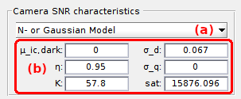

# Video parameters
{: .no_toc }

## (1) video length

Total number of image frames in the video. It is usually noted *L*

## (2) frame rate

Number of frames per second. It is usually noted *f*. It is linked to the acquisition time *acq_t* by the relation:

{: .bg-grey-lt-000 .pt-3 .pb-3 .pl-3 .pr-3 .fs-2}

<i>f</i> = 1 / <i>acq_t</i>

## (3) pixel size

Dimensions of a square pixel in micrometers. It is used in the conversion of PSF widths from micrometers to pixels.

## (4) bit rate

Camera bit rate in bits per second. It is used to calculate the saturation value in the video.

## (5) video dimensions

Dimensions in pixels of video frames, in the x- **(a)** and y- **(b)** directions.

## (6) Camera SNR characteristics

The models available to generate camera noise are listed in **(a)**. The parameters to be set in **(b)** are automatically adapted to the model selected in **(a)**.

### model: none

Add a constant offset value *&#956;*_ic,d.

### model: P- or Poisson

Distribute intensities following a Poisson distribution with mean *&#955;*:

{: .bg-grey-lt-000 .pt-3 .pb-3 .pl-3 .pr-3 .fs-2}

<i>&#955;</i> = <i>intensity</i> x <i>&#951;</i> + <i>&#956;</i>_ic,d

### model: N- or Gaussian

Distribute intensities following a Gaussian distribution with mean *&#956;*:

{: .bg-grey-lt-000 .pt-3 .pb-3 .pl-3 .pr-3 .fs-2}

<i>&#956;</i> = <i>intensity</i> x <i>&#951;</i> x <i>K</i> + <i>&#956;</i>_ic,d

and standard deviation *&#963;*:

{: .bg-grey-lt-000 .pt-3 .pb-3 .pl-3 .pr-3 .fs-2}

<i>&#963;</i> = (  <i>intensity</i> x <i>&#951;</i> x <i>K</i> + ( <i>K</i> x <i>&#963;</i>_d ) ^ 2 + <i>&#963;</i>_q ^ 2 ) ^ 0.5

### model: NExpN- or Gaussian + exponential tail

Distribute intensities following an exponential-tailed Gaussian distribution with mean *&#956;*_ic,d, standard deviation *&#963;*_CIC, tail contribution *A*_CIC and exponential decay *&#964;*_CIC.

This model is purely empirical: model parameters are obtained by fitting the dark count distribution with the function:

{: .bg-grey-lt-000 .pt-3 .pb-3 .pl-3 .pr-3 .fs-2}

P = ( 1-<i>A</i>_CIC ) x exp( -( <i>intensity</i> - <i>&#956;</i>_ic,d ) ^ 2 / ( 2 x <i>&#963;</i>_CIC ^ 2 ) ) + <i>A</i>_CIC x exp( - <i>intensity</i> / <i>&#964;</i>_CIC )

### model: PGN- or Hirsch

Distribute intensities following the convolution of a Poisson distribution of mean *&#955;*_p:

{: .bg-grey-lt-000 .pt-3 .pb-3 .pl-3 .pr-3 .fs-2}

<i>&#955;</i>_p = <i>intensity</i> x <i>&#951;</i> + <i>CIC</i>

with a Gamma distribution of scale parameter *g*, and with a Gaussian distribution of mean *&#956;*_g:

{: .bg-grey-lt-000 .pt-3 .pb-3 .pl-3 .pr-3 .fs-2}

<i>&#956;</i>_g = <i>intensity</i> + <i>&#956;</i>_ic,d

and standard deviation *&#963;*_g:

{: .bg-grey-lt-000 .pt-3 .pb-3 .pl-3 .pr-3 .fs-2}

<i>&#963;</i>_g = <i>&#963;</i>_d x <i>g</i> / <i>s</i>

### model parameters

Parameters specific to camera noise model:

| parameter         | units             | description                                  | in model               |
| :---------------: | :---------------: | -------------------------------------------- | ---------------------- |
| *&#956;*_ic,d     | ic                | signal offset                                | none, P, N, NexpN, PGN |
| *&#951;*          |                   | detection efficiency                         | P, N, NexpN, PGN       |
| *K*               | pc/ec             | overall gain                                 | N, NExpN               |
| *sat* (read only) | ic                | saturation value                             | N                      |
| *&#963;*_d        | pc                | readout noise deviation                      | N, PGN                 |
| *&#963;*_q        | pc                | analog-to-digital conversion noise deviation | N                      |
| *&#964;*_CIC      | ec                | CIC exponential decay constant               | NExpN                  |
| *A*_CIC           |                   | CIC exponential decay contribution           | NExpN                  |
| *&#963;*_CIC      | ic                | Gaussian noise deviation                     | NExpN                  |
| *g*               | pc/ic             | System gain                                  | PGN                    |
| *s*               | ic/pc             | analog-to-digital factor                     | PGN                    |
| *&#963;*_d        | pc                | read-out noise deviation                     | PGN                    |
| *CIC*             | pc                | CIC offset                                   | PGN                    |

<u>Abbreviations</u>:
* **ic**: image count
* **pc**: photon count
* **ec**: electron count
* **CIC**: clock-induced charges
