# Workflow
{: .no_toc }

In this section you will learn how to create synthetic single molecule videos and trajectories. 
Exported data can be used for 
[result validation](../tutorials/validate-results.html), 
[algorithm testing](../tutorials/test-algorithms.html) or external illustration.

The procedure includes three steps:

1. TOC
{:toc}

---

## Generate random FRET state sequences

A FRET state sequence is the ideal FRET trajectory of a single molecule. 
It consists in a succession of plateaus dwelling at a particular 
[*FRET**j*](){: .math_var } value before transiting to the next 
[*FRET**j'*](){: .math_var } value. 

Sequences are started by randomly drawing a FRET value from the pre-defined state configuration 
[*FRET**j*](){: .math_var } and using the vector of normalized initial state probabilities 
[&#928;](){: .math_var } such as:

{: .equation }
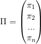

with 
[*&#960;**j*](){: .math_var } the probability to start a chain in state 
[*j*](){: .math_var }.

Considering a population of unsynchronized molecules, the probability 
[*&#960;**j*](){: .math_var } is the probability to be in state 
[*j*](){: .math_var } at a random time of the process, obtained by solving the equation system:

{: .equation }
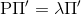

where 
[&#928;'](){: .math_var } is the non-normalized initial state probability vector, 
[*&#955;*](){: math_var } is the eigenvalue associated to 
[&#928;'](){: .math_var }, and 
[P](){: .math_var } is the transition probability matrix described such as:

{: .equation }
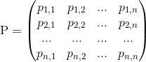

Initial state probabilities are then normalized by the sum, such as:

{: .equation }
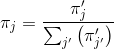

This approach comes down to segmenting an infinitely long chain at a random position. 
Therefore, it is only valid for chains that complete there cycles within an observation time, meaning with no discontinuity in folding kinetics like kinetic traps or other sudden changes in folding dynamics.
For such limiting cases, transition probabilities must be pre-defined; see 
[Remarks](#remarks) for details.

In MASH-FRET, off-diagonal transition probabilities are calculated from dwell times 
[&#916;*t**jj'*](){: .math_var } given in second, 
the repartition factors
[*w**jj'*](){: .math_var } of transitions from state 
[*j*](){: .math_var }, and the exposure time per frame
[*t*exp](){: .math_var } given in second, such as:

{: .equation }
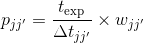

The repartition factor 
[*w**jj'*](){: .math_var }
is simply the proportion of transitions from state 
[*j*](){: .math_var } to state 
[*j'*](){: .math_var } among all transitions occurring from state 
[*j*](){: .math_var }. 
It can be expressed in number of state transitions 
[*N**jj'*](){: .math_var} such as:

{: .equation }
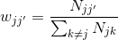

Repartition factors can be set via preset parameter files (by default, factors are set to uniform values); see 
[Remarks](#remarks) for more details.

Diagonal terms are calculated from off-diagonal probabilities such as:

{: .equation }
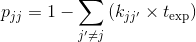

FRET state sequences are elongated by randomly drawing a next FRET value using the normalized off-diagonal transition probabilities 
[*p**jj'*](){: .math_var } such as:

{: .equation }
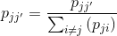

The duration of the corresponding plateau is randomly generated from an exponential distribution using the decay constant
[*k**jj'*](){: .math_var }. 
The advantage of random dwell time generation as opposed to time-step simulation is the possibility to include the time-averaging of abrupt state transitions within a time step.

The operation is repeated until the sequence length reaches the observation time and the number of sequences equals the number of molecules 
[*N*](){: .math_var }. 
The observation time is limited by the video length 
[*L*](){: .math_var } but can be randomly distributed by introducing fluorophore photobleaching.

<a class="plain" href="../assets/images/figures/sim-workflow-scheme-state-sequence.png">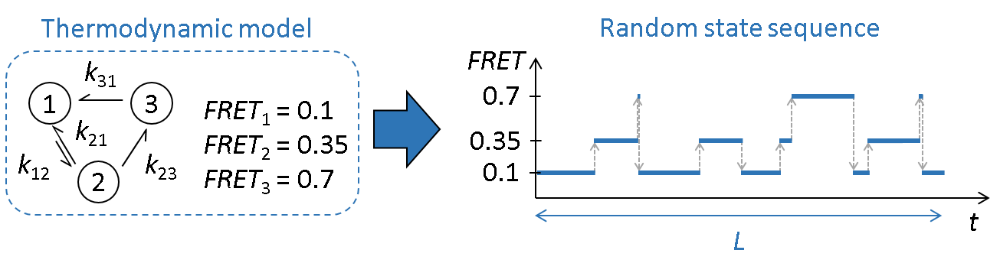</a>

To generate FRET state sequences:

{: .procedure }
1. Set parameters:  
     
   [Video length](panels/panel-video-parameters.html#video-length)  
   [Frame rate](panels/panel-video-parameters.html#frame-rate)  
   [Number of molecules](panels/panel-molecules.html#number-of-molecules)  
   [State configuration](panels/panel-molecules.html#state-configuration); see 
   [Remarks](#remarks) for more details  
   [Transition rates](panels/panel-molecules.html#transition-rates); see 
   [Remarks](#remarks) for more details  
   [Photobleaching](panels/panel-molecules.html#photobleaching)  
     
1. Press 
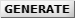 to generate random FRET state sequences,  
     
1. Generate new state sequences whenever one of the parameters is changed.

---

## Create intensity trajectories and images 

FRET state sequences are then converted into donor and acceptor fluorescence intensities using 
[*I*tot,em](){: .math_var }, the pure donor emission in the absence of acceptor.

Differences in donor and acceptor emission detection efficiencies and quantum yields is introduced here, by adjusting donor fluorescence intensities with the gamma factor 
[*&#947;*](){: .math_var }.

Imperfect experimental setup is simulated by adding channel-specific bleedthrough 
[*bt*](){: .math_var } and direct excitation 
[*dE*](){: .math_var } to the respective fluorescence intensities.

Final camera-detected intensity-time traces are obtained by adding channel-specific background and uniform camera noise.
If the chosen noise model does not include shot noise of photon emission, intensities are distributed following a Poisson distribution prior adding the camera contribution; see 
[Camera SNR characteristics](panels/panel-video-parameters.html#camera-snr-characteristics) for more information.

<a class="plain" href="../assets/images/figures/sim-workflow-scheme-convert-to-image-count.png">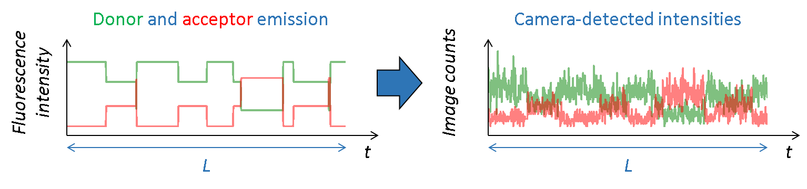</a>

Images in the single molecule video (SMV) are created one by one, with the first image corresponding to the first time point in intensity-time traces.

Like in a 2-color FRET experiment, horizontal dimensions of the video are equally split into donor (left) and acceptor (right) channels. 
Single molecules are then spread randomly on the donor channel and translated into the acceptor channel.

At molecule coordinates, pixel values are set to donor or acceptor pure fluorescence intensities, including gamma factor and setup bias.
All other sources of detected lights are then added as channel-specific background intensities that can be uniform, spatially distributed and/or dynamic in time. 

Pixels are then convolved with channel-specific point spread functions to obtain realistic diffraction-limited images and uniform camera noise is added to all pixels to convert fluorescence intensities to camera-detected signal. 

<a class="plain" href="../assets/images/figures/sim-workflow-scheme-build-video.gif">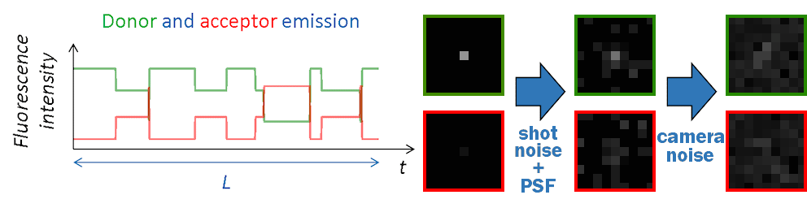</a>

To create intensity trajectories and images:

{: .procedure }
1. Set parameters:  
     
   [Video dimensions](panels/panel-video-parameters.html#video-dimensions)  
   [Pixel size](panels/panel-video-parameters.html#pixel-size)  
   [Bit rate](panels/panel-video-parameters.html#bit-rate)  
   [Camera SNR characteristics](panels/panel-video-parameters.html#camera-snr-characteristics)  
   [Molecule coordinates](panels/panel-molecules.html#molecule-coordinates)  
   [Donor emission](panels/panel-molecules.html#donor-emission)  
   [Cross-talks](panels/panel-molecules.html#cross-talks)  
   [Point spread functions](panels/panel-experimental-setup.html#point-spread-functions)  
   [Background](panels/panel-experimental-setup.html#background)  
     
1. Press 
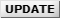 to convert FRET state sequences into camera-detected intensity trajectories and images. The execution time can be long; see 
[Remarks](#remarks) for details.  
     
1. Update intensity data whenever one of the parameters is changed.

---

## Export trajectories and video to files

Simulated data and simulation parameters can be exported to various file formats.
Intensities can be converted into photon counts or image counts before writing in files.
When exporting the SMV, video frames are successively written in files until the video length is reached.

To export data to files:

{: .procedure }
1. Set parameters:
     
   [File options](panels/panel-export-options.html#file-options)  
   [Intensity units](panels/panel-export-options.html#intensity-units)
     
1. Press 
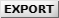 to start writing data in files. The execution time can be long; see 
[Remarks](#remarks) for details.

---

## Remarks
{: .no_toc }

To bypass the limitations of the user interface and (1), work with more than five states, (2), set pre-defined initial state probabilities and/or transition repartition factors, or (3), set parameters for individual molecules, simulation parameters can be loaded from external files; see 
[Pre-set parameters](panels/panel-molecules.html#pre-set-parameters) for more information.

Updating intensity data and writing SMVs to files can be relatively time consuming depending on which camera characteristics are chosen; see 
[Camera SNR characteristics](panels/panel-video-parameters.html#camera-snr-characteristics) for more information.

