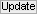

# Simulation workflow
{: .no_toc }

In this section you will learn how to create synthetic single molecule videos and trajectories. Exported data can then be used for 
[result validation](../tutorials/validate-results.html), 
[algorithm testing](../tutorials/test-algorithms.html) or external illustration.

The procedure includes three steps:

1. TOC
{:toc}

---

## Generate random FRET state sequences

A FRET state sequence is the ideal FRET trajectory followed by a single molecule. 
It consists in a succession of plateaus dwelling at a particular 
[*FRET**j*](){: .math_var } value before transiting to the next 
[*FRET**j'*](){: .math_var }. 

Sequences are created by randomly drawing FRET values and dwell times from the thermodynamic model, which includes possible 
[*FRET**j*](){: .math_var } values and state transition rates 
[*k**jj'*](){: .math_var }. 
The operation is repeated until the sequence length reaches the observation time and the number of sequences equals the number of molecules 
[*N*](){: .math_var }. 
The observation time is limited by the video length 
[*L*](){: .math_var } but can be randomly distributed by introducing fluorophore photobleaching.

To generate FRET state sequences:

{: .procedure }
1. Set parameters:  
     
   [Video length](panels/panel-video-parameters.html#video-length)  
   [Frame rate](panels/panel-video-parameters.html#frame-rate)  
   [Number of molecules](panels/panel-molecules.html#number-of-molecules)  
   [State configuration](panels/panel-molecules.html#state-configuration)  
   [Transition rates](panels/panel-molecules.html#transition-rates)  
   [Photobleaching](panels/panel-molecules.html#photobleaching)  
     
1. Press 
 to generate random FRET state sequences,  
     
1. Generate new state sequences whenever one of the parameters is changed.

---

## Create intensity trajectories and images 

FRET state sequences are then converted into donor and acceptor fluorescence intensities using 
[*I*tot,em](){: .math_var }, the pure donor emission in the absence of acceptor.

Differences in donor and acceptor emission detection efficiencies and quantum yields is introduced here, by adjusting donor fluorescence intensities with the gamma factor 
[*&#947;*](){: .math_var }.

Imperfect experimental setup is simulated by adding channel-specific bleedthrough 
[*bt*](){: .math_var } and direct excitation 
[*dE*](){: .math_var } to the respective fluorescence intensities.

Final camera-detected intensity-time traces are obtained by adding channel-specific background and uniform camera noise.
If the chosen noise model does not include shot noise of photon emission, intensities are distributed following a Poisson distribution prior adding the camera contribution; see 
[Camera SNR characteristics](panels/panel-video-parameters.html#camera-snr-characteristics) for more information.

Images in the single molecule video (SMV) are created one by one, with the first image corresponding to the first time point in intensity-time traces.
Like in a 2-color FRET experiment, horizontal dimensions of the video are equally split into donor (left) and acceptor (right) channels. 
Single molecules are then spread randomly on the donor channel and directly translated into the acceptor channel.

At molecule coordinates, pixel values are set to donor or acceptor pure fluorescence intensities, including donor anisotropy and setup cross-talks.
Channel-specific background is added to consider all sources of detected lights. 
Pixels are then convolved with channel-specific point spread functions to obtain realistic diffraction-limited images. 
Finally, uniform camera noise is added to all pixels to convert fluorescence intensities to camera-detected signal. 

To create intensity trajectories and images:

{: .procedure }
1. Set parameters:  
     
   [Video dimensions](panels/panel-video-parameters.html#video-dimensions)  
   [Pixel size](panels/panel-video-parameters.html#pixel-size)  
   [Bit rate](panels/panel-video-parameters.html#bit-rate)  
   [Camera SNR characteristics](panels/panel-video-parameters.html#camera-snr-characteristics)  
   [Molecule coordinates](panels/panel-molecules.html#molecule-coordinates)  
   [Donor emission](panels/panel-molecules.html#donor-emission)  
   [Cross-talks](panels/panel-molecules.html#cross-talks)  
   [Point spread functions](panels/panel-experimental-setup.html#point-spread-functions)  
   [Background](panels/panel-experimental-setup.html#background)  
     
1. Press 
 to convert FRET state sequences into camera-detected intensity trajectories and images. The execution time can be long; see 
[Remarks](#remarks) for details.  
     
1. Update intensity data whenever one of the parameters is changed.

---

## Export trajectories and video to files

Simulated data and simulation parameters can be exported to various file formats.
Intensities can be converted into photon counts or electron counts before writing in files.
When exporting the SMV, video frames are successively written in files until the video length is reached.

To export data to files:

{: .procedure }
1. Set parameters:
     
   [File options](panels/panel-export-options.html#file-options)  
   [Intensity units](panels/panel-export-options.html#intensity-units)
     
1. Press 
 to start writing data in files. The execution time can be long; see 
[Remarks](#remarks) for details.

---

## Remarks
{: .no_toc }

Updating intensity data and writing SMVs to files can be very time consuming depending on which camera characteristics are chosen; see 
[Camera SNR characteristics](panels/panel-video-parameters.html#camera-snr-characteristics) for more information.

Some parameters can be set by loading external files. This allows to bypass the limitations of the user interface in order to work with more than five states or set parameters for individual molecules; see 
[Pre-set parameters](panels/panel-molecules.html#pre-set-parameters) for more information.

