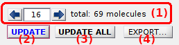
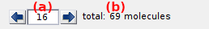
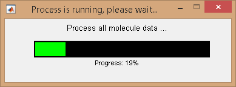

# Control area
{: .no_toc }

The control area consists in a navigation dashbord and the three main control buttons. 

Use this area to browse molecules in the sample and to refresh or export single molecule data.

## Area components
{: .no_toc .text-delta }

1. TOC
{:toc}

---

## Navigation dashboard

Defines the current molecule index.

The index of the molecule which is currently in display can be edited in **(a)** and the total size of the molecule sample is shown in **(b)**.

Press 
 or 
 to display the previous or next molecule in the sample, respectively.

After changing the current molecule index, the 
[Visualization area](area-visualization.html) is updated and the processing parameters of panels 
[Sub-images](panel-subimage.html), 
[Background correction](panel-background-correction.html), 
[Factor corrections](panel-factor-corrections.html), 
[Photobleaching](panel-photobleaching.html), 
[Denoising](panel-denoising.html) and 
[Find states](panel-find-states.html) are adapted to the current molecule.

---

## Process current molecule data

Press
 to update corrections and calculations for the current molecule.

Operations include all intensity corrections as configured in panels 
[Background correction](panel-background-correction.html), 
[Cross talks](panel-cross-talks.html), 
[Denoising](panel-denoising.html), 
[Photobleaching](panel-photobleaching.html) and 
[Factor corrections](panel-factor-corrections.html), as well as calculations of state trajectories as configured in panel 
[Find states](panel-find-states.html).

Usually, this functionality is used after changing any processing parameters in the sub-mentioned panels.

After processing, input data in modules 
[Histogram analysis](../../histogram-analysis.html) and 
[Transition analysis](../../transition-analysis.html) are immediately refreshed.

---

## Process all molecules data

Press 
 to update corrections and calculations for all molecules in the sample.

Operations include all intensity corrections as configured in panels 
[Background correction](panel-background-correction.html), 
[Cross talks](panel-cross-talks.html), 
[Denoising](panel-denoising.html), 
[Photobleaching](panel-photobleaching.html) and 
[Factor corrections](panel-factor-corrections.html), as well as calculations of state trajectories as configured in panel 
[Find states](panel-find-states.html).

After processing, input data in modules 
[Histogram analysis](../../histogram-analysis.html) and 
[Transition analysis](../../transition-analysis.html) are immediately refreshed.

Usually, this functionality is used before 
proceeding with histogram or transition analysis, 
[saving the MASH project](area-project-management.html#save-project) or opening the 
[Trace manager](#trace-manager).

---

## Export processed data

Press
 to open the export options.

Export options defines the file formats to export, including ASCII files and figures.

To set export options, refer to 
[Set export options](../functionalities/set-export-options.html).

