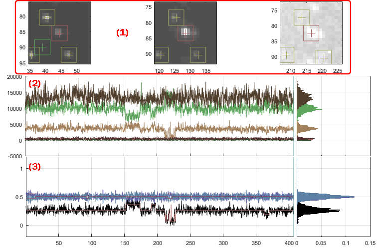
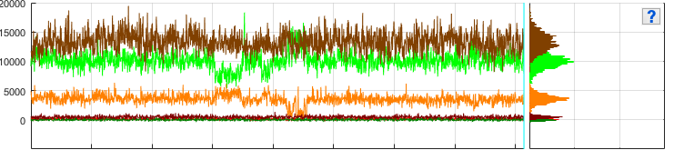

# Visualization area
{: .no_toc }

The visualization area is the main display of module Trace processing.

Use this area to visualize processed and calculated data.

## Area components
{: .no_toc .text-delta }

1. TOC
{:toc}

---

## Single molecule images

Single molecule images show a close-up of the current single molecule position in each detection channel.
Average image at specific laser illumination are used.
Laser illumination and image appearance can be adjusted in panel 
[Sub-images](panel-subimage.html).

Single molecule positions are indicated by crosses and framed by squares of dimensions used for intensity integration; see 
[Integration parameters](../../video-processing/panels/panel-intensity-integration.html#integration-parameters) for more information.

The position of the current molecule selected in the 
[Molecule list](panel-sample-management.html#molecule-list) is displayed in red, whereas other molecules are displayed in yellow.
When using the `Dark trace` background correction method, dark coordinates are shown in green; see 
[Background correction settings](panel-background-correction.html#background-correction-settings) for more information.

Any graphics in MASH can be exported to an image file by right-clicking on the axes and selecting `Export graph`.

---

## Intensity-time traces and histograms

Trace axes show the current single molecule intensity-time traces selected in 
[Plot in top axes](panel-plot.html#plot-in-top-axes), using intensity and time units defined in 
[Intensity units](panel-plot.html#intensity-units) and 
[Time axis](panel-plot.html#time-axis) respectively.

The time axis can be truncated by setting the starting point in 
[Time axis](panel-plot.html#time-axis) and the ending point in 
[Photobleaching cutoff](panel-photobleaching.html#photobleaching-cutoff).

Histogram axes show the corresponding intensity histograms built by sorting intensities in 100 bins between the minimum and maximum intensities.

Colors used in trace and histogram plots are defined in the project options; see 
[Edit project options](area-project-management.html#edit-project-options) for more information.

Any graphics in MASH can be exported to an image file by right-clicking on the axes and selecting `Export graph`.

---

## Ratio-time traces and histograms

Trace axes show the current single molecule FRET- and stoichiometry-time traces selected in 
[Plot in bottom axes](panel-plot.html#plot-in-bottom-axes), using time units defined in 
[Time axis](panel-plot.html#time-axis).

The time axis can be truncated by setting the starting point in 
[Time axis](panel-plot.html#time-axis) and the ending point in 
[Photobleaching cutoff](panel-photobleaching.html#photobleaching-cutoff).

Histogram axes show the corresponding histograms built by sorting FRET and stoichiometry values into bins of size 0.01 between -0.2 and 1.2.

FRET and stoichiometry calculations, as well as colors used in trace and histogram plots, are defined in the project options; see 
[Edit project options](area-project-management.html#edit-project-options) for more information.

Any graphics in MASH can be exported to an image file by right-clicking on the axes and selecting `Export graph`.

