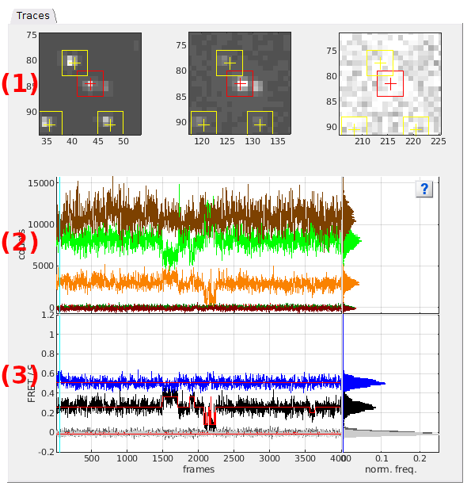
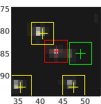
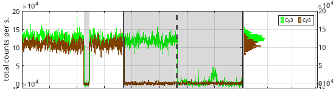
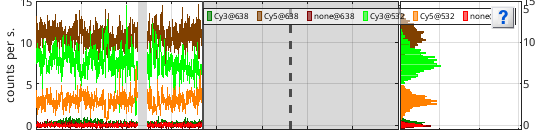
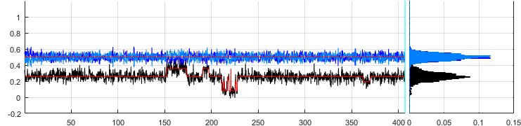

# Visualization area
{: .no_toc }

The visualization area is the main display of module Trace processing. 
It consists in one tab showing molecule images and trajectories.

Use this area to visualize processed and calculated data. 
Any graphics in MASH-FRET can be exported to an image file by right-clicking on the axes and selecting `Export graph`.

## Area components
{: .no_toc .text-delta }

1. TOC
{:toc}

---

## Traces

Use this tab to visualize the current molecule images and trajectories.

* **(1)** [Single molecule images](#single-molecule-image)
* **(2)** [Total emission intensity-time traces and histograms](#total-emission-intensity-time-traces-and-histograms)
* **(3)** [Intensity-time traces and histograms](#intensity-time-traces-and-histograms)
* **(4)** [Ratio-time traces and histograms](#ratio-time-traces-and-histograms)

*Plot colors:* Colors used in plots are defined in the experiment settings and can be modified any time by pressing 
 in the 
[project management area](../../Getting_started.html#project-management-area). 

*Time axis scale:* The time axis of trace axes can be scaled between the starting point defined in 
[Time axis](panel-plot.html#time-axis) and the ending point defined in 
[Photobleaching cutoff](panel-photobleaching.html#photobleaching-cutoff) by activating the appropriate option in 
[Time axis](panel-plot.html#time-axis).

*Intensity axis scale:* Limits of the intensity axis can be defined in 
[Plot in top axes](panel-plot.html#plot-in-top-axes).

*Axis units:* Intensity and time units are shown as defined in menu `Units` of the 
[menu bar](../../Getting_started.html#interface).

### Single molecule images
{: .no_toc }

Single molecule images show a close-up on the current single molecule position in each detection channel.
Average image at specific laser illumination are used.
Laser illumination and image appearance can be adjusted in panel 
[Sub-images](panel-subimage.html).

Single molecule positions are indicated by crosses and framed by squares used for intensity integration; see 
[Integration parameters](../../video-processing/components/panel-intensity-integration.html#integration-parameters) for more information.

The position of the current molecule selected in the 
[Molecule list](panel-sample-management.html#molecule-list) is displayed in red, whereas other molecules are displayed in yellow.
When using the `Dark trace` background correction method, dark coordinates are shown in green; see 
[Background correction settings](panel-background-correction.html#background-correction-settings) for more information.

The emission channel (here: "Cy3") and current laser illumination (here: 532nm) are indicated on the top of each sub-image

### Total emission intensity-time traces and histograms
{: .no_toc }

Trace axes show the current single molecule total emission intensity-time traces of emitters selected in 
[Plot in top axes](panel-plot.html#plot-in-top-axes).
Total emission intensity is calculated as the sum of intensities accross all channels upon emitter's specific laser illumination:

$$
I_{k,\mathrm{tot}} = \sum_i I_{i,\mathrm{em}}^{k,\mathrm{ex}}
$$

where $$I_{k,\mathrm{tot}}$$ is the total emission intensity of emitter $$k$$ and $$I_{i,\mathrm{em}}^{k,\mathrm{ex}}$$ is the intensity collected in channel $$i$$ upon illumination with specific excitation of emitter $$k$$.

Histogram axes show the corresponding total emission intensity histograms built by sorting intensities in 100 bins between the minimum and maximum intensities.

The legend lists the emitters for which the total emission trajectories are shown, using the format `[channel label]`.

Portions of the trajectories that are detected to be in a "off" state and consequently ignored in following analysis are indicated by a gray background.
The earliest photobleaching cutoff is shown with a vertical solid bar.
Following photobleaching events are shown with vertical dotted lines.

### Intensity-time traces and histograms
{: .no_toc }

Trace axes show the current single molecule intensity-time traces selected in 
[Plot in top axes](panel-plot.html#plot-in-top-axes), using intensity and time units defined in menu `Units` of the 
[menu bar](../../Getting_started.html#interface) as well as intensity limits defined in 
[Plot in top axes](panel-plot.html#plot-in-top-axes).
Histogram axes show the corresponding intensity histograms built by sorting intensities in 100 bins between the minimum and maximum intensities.

The legend lists all intensity signals using the format `[channel label]`@`[laser wavelength]`.

Portions of the trajectories that are detected to be in a "off" state are intentionally not drawn.
The earliest photobleaching cutoff is shown with a vertical solid bar.
Following photobleaching events are shown with vertical dotted lines.

Limits of the intensity axis are defined in 
[Plot in top axes](panel-plot.html#plot-in-top-axes).

### Ratio-time traces and histograms
{: .no_toc }

Trace axes show the current single molecule FRET- and stoichiometry-time traces selected in 
[Plot in bottom axes](panel-plot.html#plot-in-bottom-axes), using time units defined in menu `Units` of the 
[menu bar](../../Getting_started.html#interface), and histogram axes show the corresponding histograms built by sorting FRET and stoichiometry values into bins of size 0.01 between -0.2 and 1.2.

Portions of the trajectories that are detected to be in a "off" state are intentionally not drawn.
The earliest photobleaching cutoff is shown with a vertical solid bar.
Following photobleaching events are shown with vertical dotted lines.

FRET and stoichiometry calculations are defined in the experiment settings during project creation and can not be modified later. 
