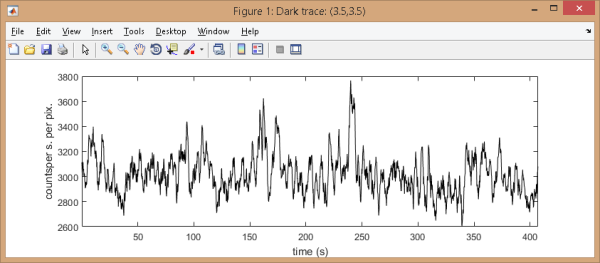

# Background correction
{: .no_toc }

Background correction is the fourth panel of module Trace processing. 
Access the panel content by pressing 
. 
The panel closes automatically after other panels open or after pressing 
. 

Background correction settings are specific to each molecule. 
Press 
 to apply current settings to all molecules. 
Corrections will be applied only after processing data by pressing 
; see 
[Process all molecules data](area-control.html#process-all-molecules-data) for more information.

Use this panel to estimate and subtract background intensities to intensity-time traces.

## Panel components
{: .no_toc .text-delta }

1. TOC
{:toc}

---

## Background correction settings

Use this interface to define the background correction method.

Background estimation methods are configured for individual intensity-time traces that can be selected in menu **(a)**.

MASH includes seven background estimation methods that can be selected in menu **(b)**.
To configure a method, set parameters **(c - g)** according to the detailed description given in the table below.

Each of these methods (except `Manual`) can be used to calculate a **single background value** or a **background trajectory**.
The second yields a more accurate correction, especially when the background is varying in time (*e. g.* in the case of a bleaching fluorescent background or a loss of focus).
The type of correction is selected by deactivating or activating the option **(h)**, respectively.

| filter                                            | description                                                                                                                                                                                                                                                                                                                                                                                                                                                                                                                   | default parameters                                                        |
| ------------------------------------------------- | ----------------------------------------------------------------------------------------------------------------------------------------------------------------------------------------------------------------------------------------------------------------------------------------------------------------------------------------------------------------------------------------------------------------------------------------------------------------------------------------------------------------------------- | ------------------------------------------------------------------------- |
| `Mean value`                                      | The background intensity is estimated as *I*high + **(c)** &#215; *HWHM*high, with *I*high and *HWHM*high the respective mean and half-width at half-maximum of the high intensity distribution, high intensities being higher than *I*mean + **(d)** &#215; *&#963;*I, with *I*mean and *&#963;*I the respective mean and standard deviation of the intensity distribution in the sub-image of dimensions **(d)**-by-**(d)** pixels. | **(c)** = 0, **(d)** = 20                                                 |
| `Most frequent`                                   | The background intensity is estimated as the most frequent value in the sub-image of dimensions **(d)**-by-**(d)** pixels and considering a binning interval of (*I*max-*I*min) / **(c)**.                                                                                                                                                                                                                                                                                                              | **(c)** = 100, **(d)** = 20                                               |
| `Median value`                                    | The background intensity is estimated in the sub image of dimension **(d)**-by-**(d)**, either as the median of median pixels in the row dimension if **(c)** = 1, or as an average between the medians of median pixels in the row dimension and in the column dimension if **(c)** = 2                                                                                                                                                                                                                                      | **(c)** = 2, **(d)** = 20                                                 |
| `Histothresh`                                     | The background intensity is estimated as the intensity corresponding to a probability **(c)** in the cumulative distribution of intensities in the sub-image of dimensions **(d)**-by-**(d)** pixels.                                                                                                                                                                                                                                                                                                                         | **(c)** = 0.5, **(d)** = 20                                               |
| `<N median values>`                               | The background intensity is estimated as the average of median pixels in each columns of the sub-image of dimensions **(d)**-by-**(d)** pixels                                                                                                                                                                                                                                                                                                                                                                                | **(d)** = 20                                                              |
| `Dark coordinates`                                | The background is calculated from a dark pixel located at position x=**(f)** and y=**(g)** that can be automatically found in a **(d)**-by-**(d)** sub-image if **(h)** is activated. When used to calculate a background trajectory, the background trace is smoothed with the denoising method [Sliding average](panel-denoising.html#sliding-average) and an sliding window size of **(c)** frames prior being subtracted                                                                                                                                                    |  **(c)** = 10, **(d)** = 20, **(e)** = 0, **(f)** = 0, **(g)** activated  |
| `Manual`                                          | The background intensity is estimated by the user and set in [Background intensity](#background-intensity)                                                                                                                                                                                                                                                                                                                                                                                                                    |                                                                           |

For method `Dark coordinates`, the dark pixel coordinates are shown by a green cross mark on the corresponding 
[Sub-images](area-visualization.html#single-molecule-images).

Background intensity-time trace are shown after pressing 
. 
In this case, an additional window appears and shows the dark trace plot in intensity units defined by menu `Units` of the 
[menu bar](../../Getting_started.html#interface).

---

## Background analyzer

Press 
 to open Background analyzer.

Background analyzer is used to to screen parameter settings for background estimation.

To use Background analyzer, please refer to 
[Use Background analyzer](../functionalities/use-background-analyzer.html).

---

## Background intensity

Displays the background intensity estimated by the method  and for the intensity-time trace selected in 
[Background correction settings](#background-correction-settings).

For method `Manual`, the background intensity to subtract must be set here.

When background trajectories are calculated, the mean value of the dark trace is displayed here.

The background intensity is given in image counts or in counts per second according to intensity units defined in menu `Units` of the 
[menu bar](Getiing_started.html#interface).

---

## Apply background correction

Activate this option to subtract the background from the intensity-time trace selected in 
[Background correction settings](#background-correction-settings), or deactivate this option to visualize the original intensity-time trace.

For more information about how background correction is performed, see 
[Background correction](../workflow.html#background-correction) in Trace processing workflow.

