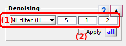
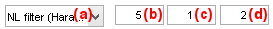
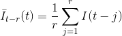
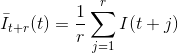
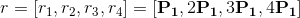
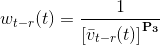
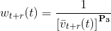
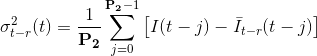
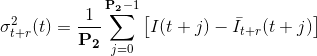
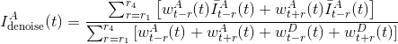

# Denoising
{: .no_toc }

Denoising is the sixth panel of module Trace processing. 
Access the panel content by pressing 
. 
The panel closes automatically after other panels open or after pressing 
. 

Use this panel to reduce artificially the noise amplitude in time traces.

## Panel components
{: .no_toc .text-delta }

1. TOC
{:toc}

---

## Denoising settings

Use this interface to define a denoising method.

Denoising applies to intensity-time traces. 
Intensity ratio-time traces are recalculated from smoothed intensity trajectories.

Three denoising methods are available and are described in the following sections:

* [Sliding average](#sliding-average)
* [NL filter (Haran)](#nl-filter-haran)
* [Wavelet (Taylor)](#wavelet-taylor)

Select the denoising method in menu **(a)** and set the corresponding parameters in **(b-d)**.
Method parametrizations are described in details in the table below.

| method                                         | parametrization                                                                                                                                                                     | default parameters              |
| ---------------------------------------------- | ----------------------------------------------------------------------------------------------------------------------------------------------------------------------------------- | ------------------------------- |
| `Sliding average`                              | **(b)**: frame window size used for average                                                                                                                                         | **(b)**=3                       |
| `NL filter (Haran)`[1](#references) | **(b)**: length factor used for causal and anti-causal mean calculations, **(c)**: frame range for variance calculations, **(d)**: exponent for weight enhancement                  | **(b)**=5, **(c)**=1, **(d)**=2 |
| `Wavelet (Taylor)`[2](#references)  | **(b)**: thresholding strength, **(c)**: threshold calculation for each decomposition level (1) or constant thresholds (2) , **(d)**: single (1) or iterative (2) denoising process | **(b)**=3, **(c)**=2, **(d)**=1 |

The MATLAB scripts for method `NL fitler (Haran)` was generously provided by Dr Stefan Krause from the Institute of Physics, Chemnitz University of Technology.

The MATLAB scripts for method `Wavelet (Taylor)` was downloaded from 
[LandesLab](https://github.com/LandesLab/Wavelet-Denoise) Github repository.

### Sliding average
{: .no_toc }

Each intensity data point is recalculated as the average value over a frame window composed of **(b)** frames and centered on the data point.

### NL filter (Haran)
{: .no_toc }

This algorithm performs the non-linear filtering procedure of Chung and Kennedy on donor and acceptor time traces. 
It smooths intensity-time traces of a FRET pair and emphasizes synchronized jumps in donor and acceptor intensity-time traces that are considered as FRET transitions.

In a first place, the causal and anti-causal means,
[*I*&#713;*t*-*r*(*t*)](){: .math_var } and 
[*I*&#713;*t*+*r*(*t*)](){: .math_var } respectively, are calculated for each data point 
[*t*](){: .math_var } of the intensity-time trace 
[*I*(*t*)](){: .math_var } such as:

{: .equation} 
 

and  over four different frame ranges 
[*r*](){: .math_var }, such as:

{: .equation }

with 
[P1](){: .math_var } the parameter set in **(b)**.

Then, for each data point 
[*t*](){: .math_var } is assigned a causal and an anti-causal weight, 
[*w**t*-*r*(*t*)](){: .math_var } and 
[*w**t*+*r*(*t*)](){: .math_var } 
respectively, that are inversely related to the corresponding variances, 
[*&#963;**t*-*r*2(*t*)](){: .math_var } and 
[*&#963;**t*+*r*2(*t*)](){: .math_var }, such as:

{: .equation} 
 

with 
[P3](){: .math_var } the parameter set in **(d)**, which emphasizes the differences between low- and high-weight data.

Causal and anti-causal variances represents the gap between the means and the experimental intensity: the higher the gap, the most probable a transition. 
Variances are calculated over a fixed frame range 
[*P2*](){: .math_var } such as:

{: .equation} 
 

with 
[P2](){: .math_var } the parameter set in **(c)** that represent the delay necessary for a transition to fully start and end.

Finally, smoothed intensities 
[*I*denoise(*t*)](){: .math_var } are calculated as the weighted sum of the causal and anti-causal mean intensities over all 
[*r*](){: .math_var } ranges, and normalized by the sum of donor and acceptor causal and anti-causal weights.
For instance, smoothed acceptor intensity is calculated such as:

{: .equation} 
 

### Wavelet (Taylor)
{: .no_toc }

The script first runs the Haar-wavelet decomposition on intensity-time traces and on several levels.
Thresholding is then performed on Haar coefficient according to three different strengths:
* firm thresholding: **(b)** = 1
* hard thresholding: **(b)** = 2
* soft thresholding: **(b)** = 3

Thresholds can either be calculated for each decomposition level by setting **(c)** = 1, or set constant by setting **(c)** = 2.
Denoised intensity-time traces are obtained by inversion of the wavelet transformation.

Denoising can either be performed in one simple process by setting **(d)** = 1, or by several iterative processes including time-shifting by setting **(d)** = 2. 
In the latter case, the final trace is averaged over the different process iterations.

**Note:** *The use of hard thresholding can be relatively time consuming and requires a bit of patience.*

### References
{: .no_toc }

1. G. Haran, *Noise reduction in single-molecule fluorescence trajectories of folding proteins*, *Chem. Physics* **2004**, DOI: [10.1016/j.chemphys.2004.05.017](http://dx.doi.org/10.1016/j.chemphys.2004.05.017)
1. J.N. Taylor, D.E. Makarov, C.F. Landes, *Denoising Single-Molecule FRET Trajectories with Wavelets and Bayesian Inference*, *Biophysical J.* **2010**, DOI: [10.1016/j.bpj.2009.09.047](https://doi.org/10.1016/j.bpj.2009.09.047)

---

## Apply denoising

Activate or deactivate this option to smooth or visualize the original intensity-time trace respectively.

For more information about the use of denoising in smFRET data analysis, see 
[Smooth trajectories](../workflow.html#smooth-trajectories) in Trace processing workflow.

---

## Apply settings to all molecules

Press 
 to apply 
[Denoising settings](#denoising-settings) to all molecules.

Corrections are applied to other molecules only when the corresponding data is processed, *e. g.* when pressing 
; see 
[Process all molecules data](panel-sample-management.html#process-all-molecules-data) for more information.

