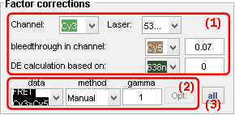
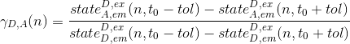
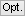
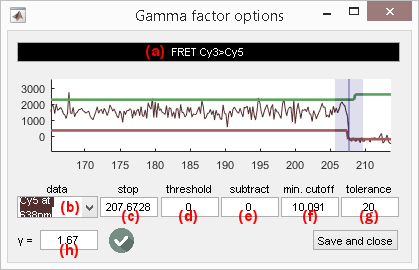
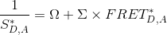
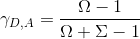
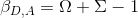
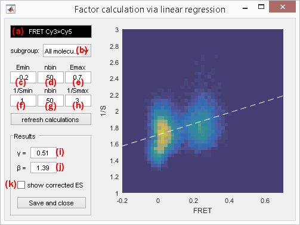
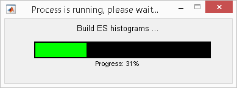

# Factor corrections
{: .no_toc }

Factor corrections is the ninth panel of module Trace processing. 
Access the panel content by pressing 
. 
The panel closes automatically after other panels open or after pressing 
. 

Factor correction settings are specific to each molecule. 
Press 
 to apply current settings to all molecules. 
Corrections will be applied only after processing data by pressing 
; see 
[Process all molecules data](area-control.html#process-all-molecules-data) for more information.

Use this panel to configure gamma and beta factors used in 
[Correct ratio values](../workflow.html#correct-ratio-values).

## Panel components
{: .no_toc .text-delta }

1. TOC
{:toc}

---

## FRET pair list

Use this list to select the FRET pair to configure the 
[Factor estimation method](#factor-estimation-method) or show the correction factors for.

Corresponding gamma and beta correction factors are shown in 
[Gamma factor](#gamma-factor) and 
[Beta factor](#beta-factor) respectively.

---

## Factor estimation method

Use this list to chose the method for estimating gamma and/or beta factors

Usually, the detection efficiency and quantum yield are different for the donor and the acceptor of a FRET pair. 
To put donor and acceptor intensities on the same scale and allow, for instance, the conversion of apparent FRET to absolute distances, these differences must be corrected.
Apparent FRET values are corrected with the gamma factor and apparent stoichiometries with both gamma and beta factor as described in 
[Correct ratio values](../workflow.html#correct-ratio-values).

Gamma and beta factors are specific to each FRET pair listed in 
[FRET pair list](#fret-pair-list) and can be set in three different ways:

- [`Manual`](#manual): set manually or by file import
- [`From acceptor photobleaching`](#photobleaching-based-calculation)[1](#references): calculated from acceptor photobleaching
- [`ES linear regression`](#es-linear-regression)[2](#references): calculated from global ES histogram

### Manual
{: .no_toc }

The gamma and beta factors specific to the FRET pair selected in the 
[FRET pair list](#fret-pair-list) are set manually in 
[Gamma factor](#gamma-factor) and 
[Beta factor](#beta-factor).

Factors of all molecules can also be loaded from an external file by pressing 
; see 
[.gam file](../../output-files/gam-gamma-factors.html) and 
[.bet file](../../output-files/bet-beta-factors.html) for more information about the file structure.

### Photobleaching-based calculation
{: .no_toc }

Photobleaching-based gamma calculation works with intensity state trajectories; see 
[Method parameters](panel-find-states.html#method-parameters) to configure the state-finding algorithm for donor and acceptor intensity-time traces.

The gamma factor 
[*&#947;**D*,*A*(*n*)](){: .math_var } correcting apparent FRET values for the donor-acceptor pair 
([*D*](){: .math_var },[*A*](){: .math_var }) on molecule 
[*n*](){: .math_var } can be calculated from intensity state trajectories 
[*state**A*,em*D*,ex](){: .math_var } and 
[*state**D*,em*D*,ex](){: .math_var }, before and after acceptor photobleaching such as:

{: .equation }

with 
[*t*0](){: .math_var } the detected photobleaching cutoff and 
[*tol*](){: .math_var } the tolerance window (in data points) around the photobleaching cutoff.

Acceptor photobleaching is detected in the acceptor intensity-time trace using the options accessed by pressing 
; options are specific to the FRET pair shown in **(a)**.

Any acceptor-time trace listed in menu **(b)** can be used for photobleaching detection.

Acceptor photobleaching is detected when the corresponding intensity-time trace drops below a certain intensity threshold defined in **(d)** providing a minimum cutoff value set in **(f)**.
To ensure detection at the very beginning of acceptor photobleaching, the detected cutoff position can be shifted downwards by a certain number of frames set in **(e)**. 
Photobleaching cutoff is shown in **(c)** and is indicated on the plot with a blue cursor.

The tolerance window defined around the photobleaching cutoff and used in the gamma factor calculation is set in **(g)** and is shown in the plot by a transparent blue zone around the cursor.

Parameters **(c)**, **(e)** and **(f)** are given in frame number or in second according to time units defined in menu `Units` of the 
[menu bar](Getting_started.html#interface), whereas the intensity threshold **(d)** is given in counts or counts per seconds according to the intensity units defined in the same menu.

When photobleaching was successfully detected and when donor and acceptor intensity states are different before and after photobleaching, the resulting gamma factor is shown in **(h)** and the icon 
 appears, otherwise the icon 
 is shown instead to inform that gamma factors can not be computed.

To save settings and FRET-pair-specific gamma factor, press 
.

### ES linear regression
{: .no_toc }

ES linear regression uses corrected intensity-time traces of <u>correctly labelled molecules</u> (with one donor and one acceptor).
Factor calculations will be reset every time these corrections change.

The gamma and beta factors 
[*&#947;**D*,*A*(*n*)](){: .math_var } and 
[*&#946;**D*,*A*(*n*)](){: .math_var } correcting apparent FRET and stoichiometry values for the donor-acceptor pair 
([*D*](){: .math_var },[*A*](){: .math_var }) on molecule 
[*n*](){: .math_var } can be calculated from the 2D representation of apparent FRET (x-axis) and inverse apparent stoichiometry (y-axis) values that are linked by the linear equation:

{: .equation }

with 
[&#931;](){: .math_var } the linear coefficient and 
[&#937;](){: .math_var } the intercept in function of which gamma and beta factors can be expressed, such as:

{: .equation }

{: .equation }

To increase calculation speed and obtain better data representation, FRET and inverse stoichiometry values are sorted into 2D bins giving the ES histogram.
The ES histogram is built using the options accessed by pressing 
; options are specific to the FRET pair shown in **(a)**.

The ES histogram can be built out of any molecule subgroup listed in menu **(b)**; molecule subgroups are defined by the molecule tags created in 
[Molecule selection](../functionalities/tm-overview.html#molecule-selection) and can be assigned to individual molecules in 
[Molecule selection](../functionalities/tm-overview.html#molecule-selection) or in 
[Molecule status](panel-sample-management.html#molecule-status).

The sorting of apparent FRET and inverse stoichiometry into bins is configured by the respective lower axis limits in **(c)** and **(f)**, higher axis limits in **(e)** and **(h)**, as well as the respective number of bins between the lower and higher limits in **(d)** and **(g)**.

To refresh the ES histogram and factor calculations after changing one of the above mentioned parameters, press 
.

The results of the linear regression are shown on the plot with a white dashed line.
Corresponding gamma and beta factors are displayed in **(i)** and **(j)** respectively.

The gamma- and beta-corrected ES histogram can be visualized by activating the option in **(k)**; see 
[Correct ratio values](../workflow.html#correct-ratio-values) for more information about how ratio values are corrected.

To save settings and FRET-pair-specific gamma factor, press 
.

2D-histograms are built with the MATLAB script `hist2` developed by Tudor Dima that can be found in the 
[MATLAB exchange platform](https://www.mathworks.com/matlabcentral/fileexchange/18386-2d-histogram-exact-and-fast-binning-crop-and-stretch-grid-adjustment?s_tid=prof_contriblnk).

### References
{: .no_toc }

1. J.J. McCann, U.B. Choi, L. Zheng, K. Weninger, M.E. Bowen, *Optimizing Methods to Recover Absolute FRET Efficiency from Immobilized Single Molecules*, *Biophys J.* **2010**, DOI: [10.1016/j.bpj.2010.04.063](https://dx.doi.org/10.1016%2Fj.bpj.2010.04.063).
2. J. Hohlbein, T.D. Craggs, T. Cordes, *Alternating-laser excitation: single-molecule FRET and beyond*, *Chem. Soc. Rev.* **2014** DOI: [10.1039/C3CS60233H](https://doi.org/10.1039/C3CS60233H)

---

## Gamma factor

Use this field to set or show the gamma factor specific to FRET pair selected in the 
[FRET pair list](#fret-pair-list).

If the 
[Factor estimation method](#factor-estimation-method) is set to `Manual`, the gamma factor is set here manually.
Otherwise, the gamma factor is automatically calculated and can only be displayed.

---

## Beta factor

Use this field to set or show the beta factor specific to FRET pair selected in the 
[FRET pair list](#fret-pair-list).

If the 
[Factor estimation method](#factor-estimation-method) is set to `Manual`, or `From acceptor photobleaching` the beta factor is set here manually.
Otherwise, the beta factor is automatically calculated and can only be displayed.

