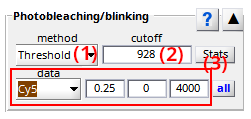
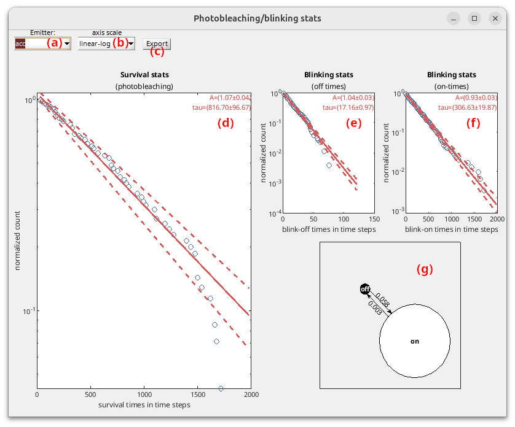
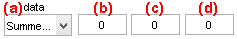
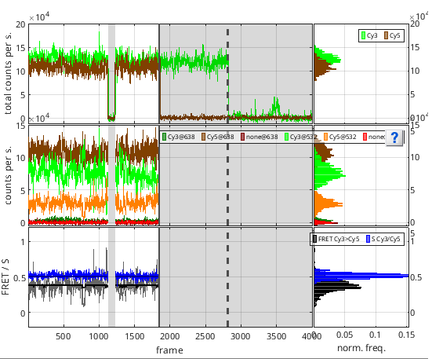

# Photobleaching/blinking
{: .no_toc }

Photobleaching/blinking is the seventh panel of module Trace processing. 
Access the panel content by pressing 
. 
The panel closes automatically after other panels open or after pressing 
. 

Photobleaching/blinking detection settings are specific to each molecule. 
Press 
 to apply current settings to all molecules. 
Corrections will be applied only after processing data by pressing 
; see 
[Process all molecules data](area-control.html#process-all-molecules-data) for more information.

Use this panel to detect and correct for dye blinking and photobleaching.

## Panel components
{: .no_toc .text-delta }

1. TOC
{:toc}

---

## Photobleaching/blinking detection method

Use this list to select the appropriate method for photobleaching/blinking detection.

Emitter photobleaching can either be detected visually or automatically, by respectively selecting `Manual` or `Threshold` in the list.

For `Manual` detection, the photobleaching cutoff must be set by hand in 
[Photobleaching cutoff](#photobleaching-cutoff).

For `Threshold`, automatic detection of blinking and photobleaching is performed by using the settings defined in 
[Threshold detection settings](#threshold-detection-settings).

---

## Photobleaching cutoff

Shows the time point at which the photobleaching event was detected. 
It is given in seconds or frame according to the time-axis units defined in menu `Units` of the 
[menu bar](../../Getting_started.html#interface).

For method `Threshold`, the earliest photobleaching cutoff detected with 
[Automatic detection settings](#threshold-detection-settings) is shown here.

For method `Manual`, the photobleaching cutoff must be set here.

---

## Stats

After applying `Threshold` photobleaching/blinking detection to all molecules with  and updating calculations with , press  to open statistics on photobleaching and blinking.

In order to access lifetimes until photobleaching, as well as "on" and "off" state lifetimes for each emitter $$k$$, survival distributions $$S$$ are fit with single exponential functions:

$$
S\!\left( \Delta t_{\mathrm{bleach},k} \right) = 1-CDF\!\left( \Delta t_{\mathrm{bleach},k} \right) = A_{\mathrm{bleach},k}\exp\!\left( -\frac{\Delta t_{\mathrm{bleach},k}}{\tau_{\mathrm{bleach},k}} \right)
$$

$$
S\!\left( \Delta t_{\mathrm{on},k} \right) = A_{\mathrm{on},k}\exp\!\left( -\frac{\Delta t_{\mathrm{on},k}}{\tau_{\mathrm{on},k}} \right)
$$

$$
S\!\left( \Delta t_{\mathrm{off},k} \right) = A_{\mathrm{off},k}\exp\!\left( -\frac{\Delta t_{\mathrm{off},k}}{\tau_{\mathrm{off},k}} \right)
$$

where $$\Delta t_{\mathrm{bleach}}$$ are the measured times until photobleaching, $$\Delta t_{\mathrm{on}}$$ and $$\Delta t_{\mathrm{off}}$$ are the dwell times in the "off" and "on" states, and where parameters $$A$$ are the exponential amplitudes and $$\tau$$ the state lifetimes.

Confidence intervals on fit parameters $$A$$ and $$\tau$$ are obtained by calculating the standard deviations over 100 bootstrap molecule samples.

Survival distributions of times until photobleaching, blink-off and blink-on dwell times are plot with blue circles in **(d)**, **(e)** and **(f)**, respectively, for the emitter selected in list **(a)** using the axis scale selected in list **(b)**.
The available axis scales are:
* `linear-linear`: time and probability axis are scaled linearly
* `log-linear`: time axis is scaled logarithmically and probability axis linearly
* `linear-log`: time axis is scaled linearly and probability axis logarithmically
* `log-log`: time and probability axis are scaled logarithmically

Bootstrap fit results are plot in red, with the mean fitting curve being represented by in solid line and 1$$\sigma$$ confidence interval by dotted lines.
Fit parameters and 1$$\sigma$$ confidence interval are written in the top-right corner of the plots.

To characterize blinking kinetics, rate constants $$k_{\mathrm{off},k}$$ and  $$k_{\mathrm{on},k}$$ that respectively govern transitions to the "off" or to the "on" state for emitter $$k$$ are calculated from "on" and "off" state lifetimes such as:

$$
k_{\mathrm{off},k} = \frac{1}{\tau_{\mathrm{on},k}}
$$

$$
k_{\mathrm{on},k} = \frac{1}{\tau_{\mathrm{off},k}}
$$

A state diagram summarizing blinking kinetics is drawn in **(g)**.

Press  to save statistics for emitter selected in **(a)** to a .txt file.

---

## Threshold detection settings

Use this interface to define the settings for automatic detection of photobleaching.

Settings are specific to the emitter selected in **(a)**, where only the emitters having a specific laser illumination defined in 
[Lasers](../../tutorials/set-experiment-settings/import-trajectories.html#lasers) are listed.

The algorithm for automatic detection of photobleaching inspects the total emission trajectory $$I_{\mathrm{tot}}$$ of each of the $$K$$ emitters in order to look for blinking and photobleaching events.
Total emissions are obtained by summing up intensities accross all emission channels collected upon the emitter's specific laser illumination:

$$
I_{\mathrm{tot},k} = \sum_{i=1}^K I_{i,\mathrm{em}}^{k,\mathrm{ex}} 
$$

where $$I_{i,\mathrm{em}}^{k,\mathrm{ex}}$$ is the intensity collected in emission channel $$i$$ upon illumination with laser specific to emitter $$k$$.

To counteract the undesirable effects of noisy fluctuations on threshold detection and make the algorithm more robust, trajectories are discretized using [`STaSI+vbFRET`](panel-find-states.html#stasivbfret) prior analysis, and a threshold **(b)** relative to the maximum discrete intensity is used.

Then, an “off” state is identified when the discretized trajectory falls below the threshold, and an “on” state when it rises back above it.
Portions of the trajectories that were detected in a "off" state are indicated with a gray background in in trajectory plots of the [Visualization area](area-visu.html) and the associated data is intentionally not plotted as it is ignored from the rest of the analysis.

Photobleaching is declared when 100% of the remaining trajectory is below the threshold providing a minimum photobleached duration set in **(c)** and given in time units defined in menu `Units` of the 
[menu bar](../../Getting_started.html#interface).
The resulting photobleaching time point is given in **(d)** and can be refreshed by pressing ; see 
[Process current molecule data](panel-sample-management.html#process-current-molecule-data) for more information.

Detected photobleaching events are represented by vertical dotted lines in trajectory plots of the [Visualization area](area-visu.html).

The photobleaching time point of the emitter that photobleached first is given as the global [Photobleaching cutoff](#photobleaching-cutoff) of the molecule that defines the end of the observation time.
Global molecule cutoff is represented by a vertical solid line in trajectory plots of the [Visualization area](area-visu.html).

