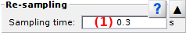

# Re-sampling
{: .no_toc }

Re-sampling is the fifth panel of module Trace processing. 
Access the panel content by pressing 
. 
The panel closes automatically after other panels open or after pressing 
. 

Trajectory re-sampling settings apply to the whole set of molecules.
Intensity calculations will be applied only after processing data by pressing 
; see 
[Process all molecules data](area-control.html#process-all-molecules-data) for more information.

Use this panel to configure the sampling time used in 
[Trajectory re-sampling](../workflow.html#trajectory-resampling).

## Panel components
{: .no_toc .text-delta }

1. TOC
{:toc}

---

## Trajectory sampling time

USe this field to define the new trajectory sampling time (in seconds). 
The new sampling time must be greater than the original one and lower than a tenth of the maximum trajectory length.

<u>default</u>: initial video (for simulation- and video-based projects) or trajectory sampling time (for trajectory-based projects).

