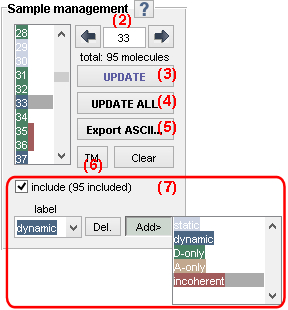
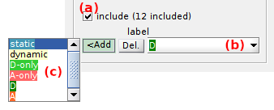
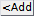

# Sample management
{: .no_toc }

Sample management is the first panel of module Trace processing. 
Access the panel content by pressing 
. 
The panel closes automatically after other panels open or after pressing 
. 

Use this panel to browse, sort and clear molecules in the project.

## Panel components
{: .no_toc .text-delta }

1. TOC
{:toc}

---

## Molecule list

Use this list to browse single molecules in your sample.

Molecules indexes are listed and colored according to the molecule tags defined in 
[Molecule status](#molecule-status).

After selection of a molecule in the list, the
[Visualization area](area-visualization.html) is updated and the processing parameters of panels 
[Sub-images](panel-subimage.html), 
[Background correction](panel-background-correction.html),
[Factor corrections](panel-factor-corrections.html), 
[Photobleaching](panel-photobleaching.html), 
[Denoising](panel-denoising.html) and 
[Find states](panel-find-states.html) are shown for the selected molecule.

---

## Molecule status

Use this area to define the current molecule status.

Molecule statuses are defined by the sample inclusion/exclusion and the subgroup assignment.

To exclude the molecule from the sample, deactivate the option in **(a)**. 
Time traces of excluded molecules are plotted on a darker background in the 
[Visualization area](area-visualization.html#intensity-time-traces-and-histograms) for easier identification.

Excluded molecules can be definitely deleted from the project by pressing 
.

To assign a specific tag to the current molecule, press 
 and select a tag in list **(c)**.
Tags assigned to the current molecule are listed in **(b)** and can be dismissed by pressing 
.

To define customed tags, please refer to 
[Use Trace manager](../functionalities/tm-overview.html#molecule-selection).

---

## Trace manager

Press 
 to open the 
Trace manager.

Trace manager is used to have an overview of all molecules in the sample and sort them into subgroups.

At opening, Trace manager imports and processes all single molecule data in the project up to gamma correction of FRET-time trace; see Trace processing 
[Workflow](../workflow.html) for more details. 
Processed time traces are then concatenated into on single trace and overall data histograms are built.

To use Trace manager, refer to 
[Use Trace manager](../functionalities/tm-overview.html).

