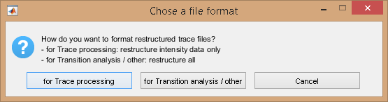
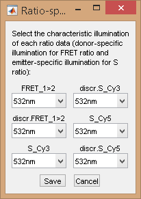

# Merge projects
{: .no_toc }

In some cases, it is interesting to merge traces of different projects to build a common data set, *e. g.* with the same experimental conditions.

For the moment, the merging process is performed on ASCII traces and independently of MASH-FRET.
In the future, the merging functionality will be directly available in MASH-FRET.

To merge several projects into one, follow the procedure described below.

## Procedure
{: .no_toc .text-delta }

1. TOC
{:toc}

**Note:** *The merging process induces a loss of single molecule videos and coordinates that were used in individual projects.
Therefore, it is recommended to (1) perform all adjustments of molecule positions and background corrections prior merging, and (2) to merge experimental data with same recording rate.
To bin trajectories to lower recording rates, please refer to 
[Bin trajectories](bin-trajectories.html)*

---

## Export traces to ASCII files

The merging process is performed on ASCII traces.
Therefore, intensity-time traces in the project must be exported to ASCII files.

To export traces to ASCII files:

{: .procedure }
1. Select module Trace processing in MASH's 
   [tool bar](../../Getting_started.html#interface)  
     
1. Import the project by pressing 
    and selecting the 
   [mash file](../../output-files/mash-mash-project.html)  
     
1. Open export options by pressing 
    and set the options as desired; please refer to 
   [Set export options](functionalities/set-export-options.html) for help.
     
1. Press 
    to start writing processed molecule data in files. 
     
1. Return to step 2 to export ASCII files from another project to merge with

---

## Restructure ALEX data

If single molecule data are recorded upon alternated laser excitation (ALEX), exported files need to be restructured to a MASH-importable format.

File reformatting is performed by using the function `restruct_trace_file` in MATLAB's command window.
After completion, the set of restructured ASCII files are available in a new sub-folder appended with the actual date: `\restructured DD-Mmm-YYYY`

Reformatting can be done in two ways:
- for Trace processing import, where only intensity data are formatted
- for Transition analysis import, where all data are formatted, including ratio data

To correctly format data for import in Transition analysis, the script must be informed about which laser wavelength is assigned to which ratio data. 

To restructure ALEX trace files:

{: .procedure }
1. Group all ASCII trace files to merge together into one directory
     
1. If not already done, add MASH-FRET to MATLAB's search path by going to `HOME → Set Path → Add with Subfolders`
     
1. In MATLAB's command window, type in `restruct_trace_file` and select the group directory; a window pops up:  
     
     
     
1. Choose the proper file format by pressing 
     to start formatting, or 
    to assign laser wavelengths to each ratio data  
     
     
	 
1. After assigning laser wavelengths press 
    to start formatting

---

## Create a merged project

To merge all traces into one project, the ASCII files need to be imported together in module Trace processing and saved to a new common 
[.mash file](../../output-files/mash-mash-project.html).
To correctly import data, MASH must be informed about the particular structure of the files.

Once the merged project is created, project parameters including FRET and stoichiometry calculations, must be re-defined.

To create the merged project:

{: .procedure }
1. Select module Trace processing in MASH's 
   [tool bar](../../Getting_started.html#interface)  
     
1. Set the import settings by pressing 
   ; see 
   [Set import options](set-import-options.html) for help  
     
1. Import data by pressing 
    and selecting the ASCII files to merge; this will add a new project to the project list  
     
1. Set the project parameters by pressing 
   ; see 
   [Set project options](../../video-processing/functionalities/set-project-options.html) for more information.
     
1. Save the merged project to a 
   [.mash file](../output-files/mash-mash-project.html) by pressing 
   .

