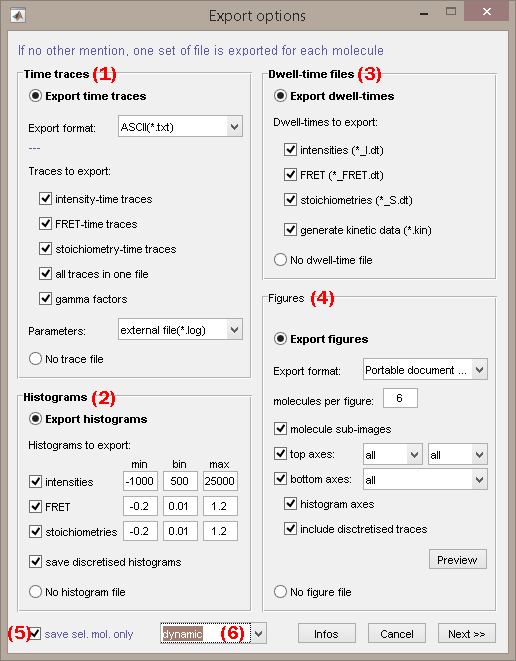
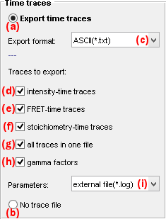
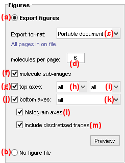

# Set export options
{: .no_toc }

Export options define the particular files to export from a project in module Trace processing.
The window is accessed by pressing 
 in the project management area of module Trace processing.

Press 
 to start file export.

## Window components
{: .no_toc .text-delta }

1. TOC
{:toc}

---

## Export trajectories and processing parameters

Defines particular time-traces and processing parameters files to export.

The export of time traces and trace processing parameters can be activated or deactivated by checking the box in **(a)** or in **(b)** respectively.

By selecting the proper format in list **(c)**, time traces can be exported to all or one of the following file formats:
- [customed format (*.txt)](#customed-format)
- [HaMMy-compatible (*.dat)](../../output-files/dat-hammy-traces)
- [vbFRET-compatible (*.mat)](../../output-files/mat-vbfret-traces)
- [SMART-compatible (*.traces)](../../output-files/traces-smart-traces)
- [QUB-compatible (*.txt)](../../output-files/txt-qub-processed-traces)
- [ebFRET-compatible (*.dat)](../../output-files/dat-ebfret-traces)

Processing parameters can be exported in the header of files with customed format, or to individual files by selecting the proper option in list **(i)**; see 
[Processing parameters file](../../output-files/log-processing-parameters.html) for more information about the file structure.

### Customed format
{: .no_toc }

The content of these trace files is customizable and can include:
* <u>intensity-time traces</u> if box **(d)** is activated
* <u>FRET-time traces</u> if box **(e)** is activated
* <u>stoichiometry-time traces</u> if box **(f)** is activated
* <u>trace processing parameters</u> if selected in list **(i)**

Specific data-time traces can be exported to one common ASCII file per molecule or to individual ASCII files, by respectively activating or deactivating the box in **(g)**.

See 
[Processed trace files](../../output-files/txt-processed-traces.html) for more information about the file structure.

---

## Export histograms

Defines particular histogram files to export.

The export of histograms can be activated or deactivated by checking the box in **(a)** or in **(b)** respectively.

Single molecule histograms can be exported to individual 
[.hist files](../../output-files/hist-histograms) for the following data:
* <u>intensity</u> if box **(c)** is activated
* <u>FRET</u> if box **(d)** is activated
* <u>stoichiometry</u> if box **(e)** is activated

Histograms are build with the x-axis defined by the axis limits set in **(g)** and **(i)** and a bin size set in **(h)**.

If desired, <u>histograms of states trajectories</u> inferred for the selected data can also be exported by activating the box in **(f)**.

---

## Export dwell times

Defines particular dwell-times and dwell-time statistics files to export

The export of dwell times and dwell time statistics can be activated or deactivated by checking the box in **(a)** or in **(b)** respectively.

Dwell times in states trajectories can be exported to individual 
[.dt files](../../output-files/dt-dwelltimes) for the following data:
* <u>intensity</u> if box **(c)** is activated
* <u>FRET</u> if box **(d)** is activated
* <u>stoichiometry</u> if box **(e)** is activated

If desired, <u>statistics on dwell times</u> of the selected data can also be exported by activating the box in **(f)**; see 
[Dwell time statistics files](../../output-files/kin-dwelltime-stats.html)

---

## Export figures

Defines particular figure files to export.

The export of figures can be activated or deactivated by checking the box in **(a)** or in **(b)** respectively.

By selecting the proper format in list **(c)**, figures can be exported to one of the following file formats:
- Portable Document Format (PDF)
- Portable Network Graphics (PNG)
- Joint Photographic Experts Group (JPEG)

Figures are exported as pages displaying a specific number of molecules set in **(d)**.
For format PDF, pages are exported to a single file, whereas for formats PNG ad JPEG, pages are exported to individual files with file names appended with the corresponding molecule indexes.

The content of figure files is customizable and can include:
- <u>sub-images</u> of molecules, if box in **(f)** is activated
- <u>intensity-time traces</u> of emitters selected in list **(h)** and upon illumination selected in list **(i)**, if box in **(g)** is activated
- <u>intensity ratio-time traces</u> selected in list **(h)**, if box in **(j)** is activated

If desired, <u>histograms</u> and/or <u>state trajectories</u> inferred for the selected time traces can also be included by activating the respective boxes in **(l)** and/or in **(m)**.

The resulting customed figure can be previewed by pressing 
.

PDF export uses the MATLAB script `append_pdfs` developed by Oliver Woodford that can be found in the 
[MATLAB exchange platform](https://www.mathworks.com/matlabcentral/fileexchange/31215-append_pdfs).

**Note:** *Exporting PDF figures requires the installation of Ghostscript that can be downloaded 
[here](https://www.ghostscript.com/)*

---

## Molecule status

Defines the status of the molecule sample to export.

To only export the molecules that are selected in the 
[Molecule list](../panels/panel-sample-management.html#molecule-list), activate the box in **(a)**.

To export a sub-group of molecules defined by their labels, select the proper label in list **(b)**.

