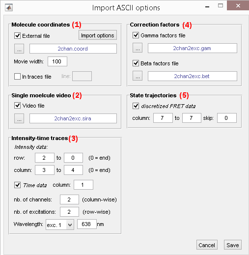
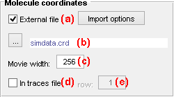
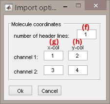
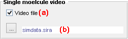
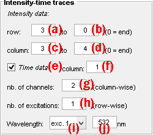
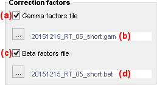
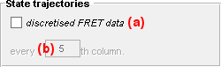

# Set project import options
{: .no_toc }

## Window components
{: .no_toc .text-delta }

1. TOC
{:toc}

---

## Molecule coordinates

Defines import options for single molecule coordinates.

---

## Single molecule video

Defines import options for single molecule video.

---

## Intensity-time traces

Defines import options for intensity and time data.

---

## Gamma factors

Defines import options for gamma factors.

---

## State trajectories

Specifies the presence of state trajectories in the file.

