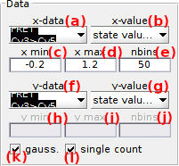

# Use Trace manager
{: .no_toc }

The trace manager allows to visualize data of all single molecules in the project, and is used to sort molecules into sub-groups and/or exclude irrelevant traces from the set.
Trace manager is accessed by pressing 
 in the 
[Sample management](../panels/panel-sample-management.html#trace-manager) panel of module Trace processing.



## Window components
{: .no_toc .text-delta }

1. TOC
{:toc}

---

## Histogram

Use this interface to define molecule data used for sorting and display.

---

## Selected range

Use this interface to create a molecule subgroup based on molecule data.

---

## Molecule subgroups

Use this interface to tag the molecule subgroup.

---

## Histogram plot

Use this interface to visualize selected molecule data distribution.

---

## Concatenated trace plot

Use this interface to visualize the time-traces that belong to the molecule subgroup.

