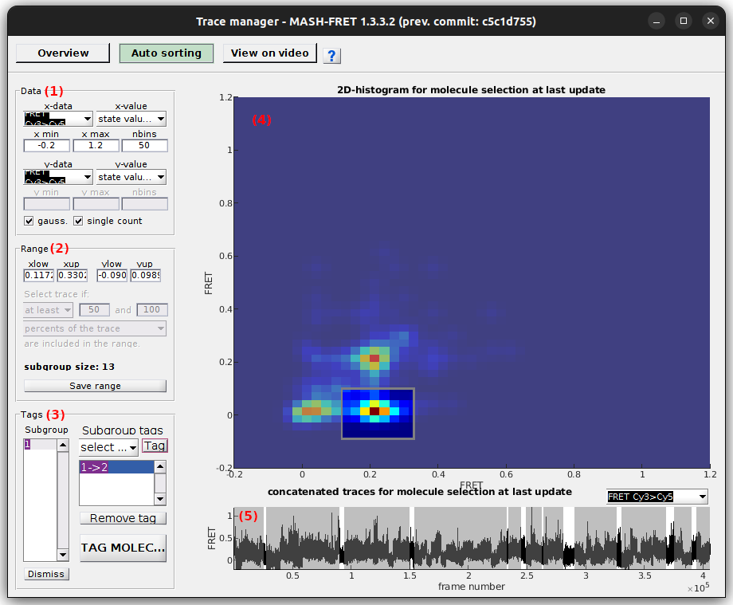

# Use Trace manager
{: .no_toc }

The trace manager gives an overview of all single molecules in the project and allows to assemble a molecule selection as well as to give molecules specific tags.

It is accessed by pressing 
 in the 
[Sample management](../components/panel-sample-management.html#trace-manager) panel of module Trace processing.

Trace manager is used to sort molecules into sub-groups and/or exclude irrelevant traces from the set.
It is composed of three modules:

---



Automatic sorting is used to tag groups of molecules based on specific data criteria.
Tags are eventually applied to individual molecules after pressing 
.

Automatic sorting is divided into three panels **(1-3)** and one visualization area **(4-5)**.

## Interface components
{: .no_toc .text-delta }

1. TOC
{:toc}

---

## Data

Use this panel to define the data to be sorted and displayed.

Auto-sorting works with the molecule selection assembled in 
[Overview](tm-overview.html).
The 1D- or 2D- histogram used in Auto-sorting will be recalculated each time the molecule selection changes.

Data available for 1D- or 2D-sorting are listed in menu **(a)** (x-axis) and **(f)** (y-axis) and include:
* `[E] at [W]nm` for intensity data, with `[E]` the emitter and `[W]` the laser wavelength
* `total [E] (at [W]nm)` for intensity-time traces of emitter `[E]` in absence of any acceptor and upon emitter-specific excitation wavelength `[W]`
* `FRET [D]>[A]` for FRET data, with `[D]` and `[A]` the donor and acceptor emitters respectively
* `S [D]>[A]` for stoichiometry data  associated to the FRET pair where `[D]` and `[A]` are the donor and acceptor emitters respectively
* `FRET [D]>[A]-S [D]>[A]` for 2D FRET-Stoichiometry data 

For 1D-sorting, menu **(f)** must be set to `none`.

Data are sorted into bins defined by **(c)** (lowest limit), **(d)** (highest limit) and **(e)** (bin size) for the x-axis, and by **(h)**, **(i)** and **(j)** for the y-axis.

Data can be counted as one count per molecule in the 2D-histogram by activation option **(l)**.

2D-histograms can be displayed with Gaussian filtering by activating option **(k)**.

Molecule sorting can be performed on full-length data-time traces or state trajectories, but also on different descriptive statistics or state data.
The type of data sets can be selected in menu **(b)** (x-axis) and **(g)** (y-axis) and include:
* `original time traces (frame-wise)` for full-length data-time traces
* `state trajectories (frame-wise)` for full-length data state trajectories
* `means (molecule-wise)` for the means of the data-time traces
* `minima (molecule-wise)` for the maxima of the data-time traces
* `maxima (molecule-wise)` for the minima of the data-time traces
* `medians (molecule-wise)` for the medians of the data-time traces
* `nb. of states (molecule-wise)` for the number of states in state trajectories
* `nb. of transitions (molecule-wise)` for the number of state transitions in state trajectories
* `mean dwell time (molecule-wise)` for the average state dwell times of the state trajectories
* `state values (state-wise)` for the individual state values in the state trajectories
* `state dwell times (state-wise)` for the individual state dwell times in the state trajectories
* `state lifetimes (state-wise)` for the individual state lifetimes $$\tau$$ estimated from transition numbers $$N_{ij}$$ and trajectory length $$L$$ with: $$\tau_i=\frac{L}{\sum_{j \neq i} N_{ij}}$$

For 2D-sorting, x-axis and y-axis data sets must occur on the same scale (`frame-wise`, `molecule-wise` or `state-wise`).

To use the options `state trajectories`, `nb. of states`, `nb. of transitions`, `mean dwell time`, `state values` or `state dwell times`, all the molecules of the selection must have the corresponding data-time trace discretized.
If some state trajectories are missing, a warning pops up.

To perform 2D-sorting on the transition density plot, x-axis and y-axis data must be identical and the `state values` set must be chosen for both.

Resulting 1D- or 2D-data histogram is plotted in 
[Histogram plot](#histogram-plot).

---

## Range

Use this interface to configure sorting settings

The data set defined in panel 
[Data](#data) is sorted according to a specific value range.
The range is defined by a minimum value set in **(a)** or **(c)** and a maximum value set in **(b)** or **(d)**  for the x- or y-axis respectively.
Range bounds can also be defined by simply clicking on the 
[Histogram plot](#histogram-plot).

The range is represented on the
[Histogram plot](#histogram-plot) with out-of-ranges values being covered by a transparent black mask.

If the data set is scaled `frame-wise` (data `original time traces` or `state trajectories`), the confidence level for inclusion in the range must be defined.
The confidence level can be set as:
- `at least` with the minimum confidence level set in **(f)**
- `at most` with the maximum confidence level set in **(f)**
- `between` with the minimum and maximum confidence levels set in **(f)** and **(g)** respectively

The confidence levels in **(f)** and **(g)** can be expressed in trace percentage or in number of data points per trace by selecting the respective options `percents of the trace` or `data points` in menu **(h)**.

The resulting number of molecule included in the current range is displayed in **(i)**.

To define a subgroup affiliation for the molecules included in the current range, settings must be saved by pressing 
. 
Additionally, when saved, range settings can be accessed any time in the subgroup list of panel 
[Tags](#tags).

---

## Tags

Use this interface to define subgroup affiliations (tags).

Ranges saved in panel 
[Range](#range) are listed in **(a)** and can be deleted from memory by pressing
.

To define a subgroup affiliation for the molecules included in range selected in list **(a)**, choose a tag in menu **(b)** and press 
.
All tags assigned to the selected subgroup are listed in **(c)** and can be removed one by one by pressing 
.

Molecule tags are eventually applied to individual molecules after pressing 
; as the operation can not be reversed, a confirmation warning pops up.

---

## Histogram plot

Use this interface to visualize the data distribution and define the data range by clicking.

Data is distributed into a 1D- or 2D-histogram built with settings defined in 
[Data](#data).

Ranges defined in 
[Range](#range) or defined by clicking on the plot, are highlighted in white for 1D-histograms and within a gray rectangle for 2D-histograms.
Out-of-range data covered with a transparent black mask.

---

## Concatenated trace plot

Use this interface to visualize the time-traces affiliated to the current molecule subgroup.

The concatenated trace plot shows time-traces of the molecule selection at last update in panel
[Overall plots](tm-overview.html#overall-plots).

Concatenated trace plot allows to visualize which time traces are included or excluded from the current subgroup.
Included time traces are highlighted with a white background and excluded time traces are covered with a transparent black mask.

Data available for concatenated trace plot are listed in menu **(a)** and include:
* `[E] at [W]nm` for intensity-time traces, with `[E]` the emitter and `[W]` the laser wavelength
* `total [E] (at [W]nm)` for intensity-time traces of emitter `[E]` in absence of any acceptor and upon emitter-specific excitation wavelength `[W]`
* `FRET [D]>[A]` for FRET-time traces, with `[D]` and `[A]` the donor and acceptor emitters respectively
* `S [D]>[A]` for stoichiometry data  associated to the FRET pair where `[D]` and `[A]` are the donor and acceptor emitters respectively
