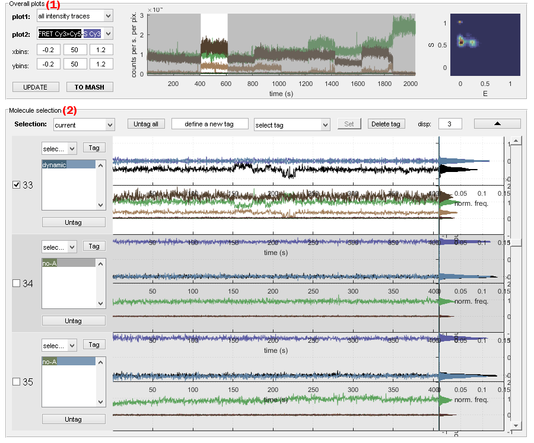
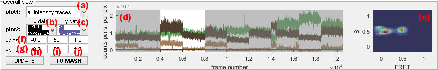
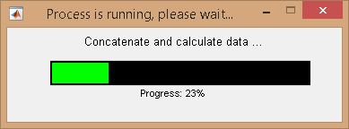
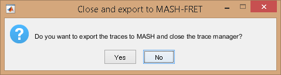
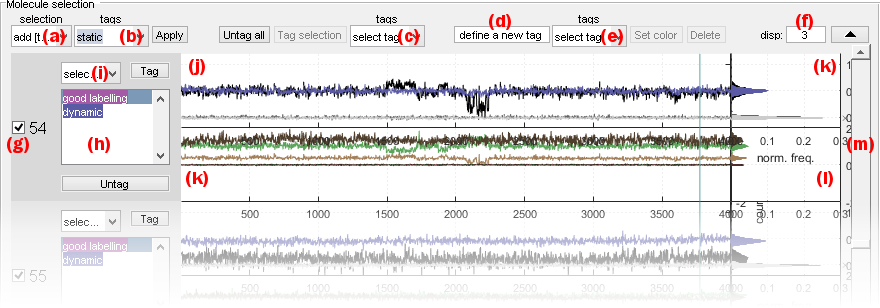
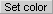
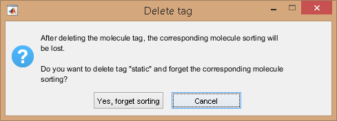
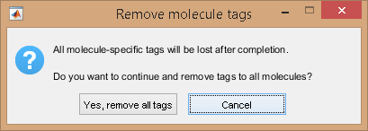

# Use Trace manager
{: .no_toc }

The trace manager gives an overview of all single molecules in the project and allows to assemble a molecule selection as well as to give molecules specific tags.

It is accessed by pressing 
 in the 
[Sample management](../panels/panel-sample-management.html#trace-manager) panel of module Trace processing.

Trace manager is used to sort molecules into sub-groups and/or exclude irrelevant traces from the set.
It is composed of three modules:

---



Overview is used to browse individual molecules and assemble a molecule selection.
The final molecule selection is exported to module Trace processing by pressing 
.

Overview is divided into two panels **(1-2)**.

## Interface components
{: .no_toc .text-delta }

1. TOC
{:toc}

---

## Overall plots

Use this interface to identify outliers in the molecule selection by controlling irregularities in data distributions.

Overall plots show the following cumulated data plots for the molecule selection assembled in panel 
[Molecule selection](#molecule-selection):
- [Concatenated traces](#concatenated-traces) shown in axes **(c)**
- [Histograms](#histograms) shown in axes **(d)**

Data plots must be updated after modification of the molecule selection by pressing 
.

The final molecule selection is exported to module Trace processing by pressing 
; as the operation can not be reversed, a warning pops up.

### Concatenated traces
{: .no_toc }

Concatenated time traces of selected molecules allow to identify outliers.

For instance, intensity-time traces with abnormally high or low intensities are easily visible and are good candidates for exclusion from the set.

Data available for concatenated trace plot are listed in menu **(a)** and include:
* `[E] at [W]nm` for intensity-time traces, with `[E]` the emitter and `[W]` the laser wavelength
* `total [E] (at [W]nm)` for intensity-time traces of emitter `[E]` in absence of any acceptor and upon emitter-specific excitation wavelength `[W]`
* `FRET [D]>[A]` for FRET-time traces, with `[D]` and `[A]` the donor and acceptor emitters respectively
* `S [D]>[A]` for stoichiometry data  associated to the FRET pair where `[D]` and `[A]` are the donor and acceptor emitters respectively

Selected molecules that are in view in panel
[Molecule selection](#molecule-selection) are highlighted with a white background, whereas excluded or out-of-view molecules are covered with a transparent black mask.

Individual molecules can be accessed and shown in 
[Molecule selection](#molecule-selection) by simply clicking on the corresponding portion of the concatenated time trace.

### Histograms
{: .no_toc }

Overall 1D- or 2D-data histograms are used to identify different sub-populations in the sample and to control the homogeneity of data distribution.

For instance, the presence of single labelled species is easily identified by peaks centered on 0 and 1 in the overall stoichiometry histogram and indicates the need for further sample refinement.

For 1D histogram plot, menu **(c)** must be set to `none` and menu **(b)** to one of the following data to histogram:
* `[E] at [W]nm` for intensity histograms
* `total [E] (at [W]nm)` for intensity histograms in absence of any acceptor
* `FRET [D]>[A]` for FRET histograms
* `S [D]>[A]` for stoichiometry data  associated to the FRET pair where `[D]` and `[A]` are the donor and acceptor emitters respectively

For 2D histogram plot, menu **(b)** and **(c)** must be set to data to plot in the x- and y-dimension respectively.

Data are sorted into bins defined in columns **(h)** (lowest limit), **(i)** (number of binning intervals) and **(j)** (highest limit) and in row **(f)** or **(g)** for the x- or y-axis respectively,.

2D histograms are built with the MATLAB script `hist2` developed by Tudor Dima that can be found in the 
[MATLAB exchange platform](https://www.mathworks.com/matlabcentral/fileexchange/18386-2d-histogram-exact-and-fast-binning-crop-and-stretch-grid-adjustment?s_tid=prof_contriblnk).

---

## Molecule selection

Use this interface to assemble or review the molecule selection.

Panel Molecule selection shows individual data plots defined by 
[Plot](../panels/panel-plot.html) for individual molecules that can be browsed using the sliding bar in **(m)**. 

The interface can be optimized by adjusting the number of molecules per page in **(f)**, and hiding the panel 
[Overall plot](#overall-plot) by pressing 
.

Intensity-time traces and histograms are respectively shown in axes **(j)** and **(k)**, whereas FRET- and stoichiometry-time traces and histograms are respectively shown in axes **(k)** and **(l)**. 

Individual single molecule data are inspected one by one to define their status, which includes:
* [Sample exclusion](#sample-exclusion) 
* [Subgroup affiliation](#subgroup-affiliation)

For instance, single molecules with incoherent intensity-time traces can be excluded from the selection and static FRET traces can be affiliated to the `static` subgroup. 

[Overall plots](#overall-plots) must be updated after finishing modifications in 
[Sample exclusion](#sample-exclusion) by pressing 
.

### Sample exclusion
{: .no_toc }

Selection or exclusion of individual molecules is done by activating/deactivating the option in **(e)**.

To help with sample selection, groups of molecules can be selected/unselected at the same time using the list of criteria in menu **(a)**.
Selection criteria are:
- `current`: uses the current selection (default)
- `all`: selects all molecules
- `none`: exclude all molecules
- `inverse`: select excluded molecules and exclude selected molecules in the current selection
- `add [Tag]`: add molecules affiliated to subgroup selected in menu **(b)** to the current selection
- `add not [Tag]`: add molecules that are not affiliated to subgroup selected in menu **(b)** to the current selection
- `remove [Tag]`: remove molecules affiliated to subgroup selected in menu **(b)** from the current selection
- `remove not [Tag]`: remove molecules that are not affiliated to subgroup selected in menu **(b)** from the current selection

Press 
 to refine the molecule selection according to these settings.

### Subgroup affiliation
{: .no_toc }

Subgroup affiliations (tags) are listed in **(e)**.

<u>Create a new tag</u> by typing the new tag name in **(d)**, and pressing 
 to modify the associated color (can be modified any time).

<u>Delete a tag</u> by selecting the tag in menu **(e)** and pressing 
; as the operation can not be reversed, a confirmation warning pops up if some molecules are affiliated to the corresponding subgroup.

Tags of individual molecules are listed in **(h)**.

<u>Tag individual molecules</u> by selecting a tag in menu **(i)** and pressing 
.

<u>Remove tag from individual molecules</u> by selecting a tag in menu **(i)** and pressing 
.

<u>Remove tag from all molecules</u> at once by pressing 
.
In this case, all molecule tag listed in **(h)** will be irreversibly cleared.
As the operation can not be reversed, a confirmation warning pops up.

<u>Tag molecules included in selection</u> all at the same time by selecting the desired tag in menu **(c)** and pressing 
.
As the operation can not be reversed, a confirmation warning pops up.

<u>Perform more advanced molecule tagging</u> by defining groups of molecules using specific data criteria with the tool 
[Automatic sorting](tm-automatic-sorting.html).
To identify molecule subgroups in the video, molecule tags can be visualized on the average video image with tool  with the tool 
[Video view](tm-video-view.html).
