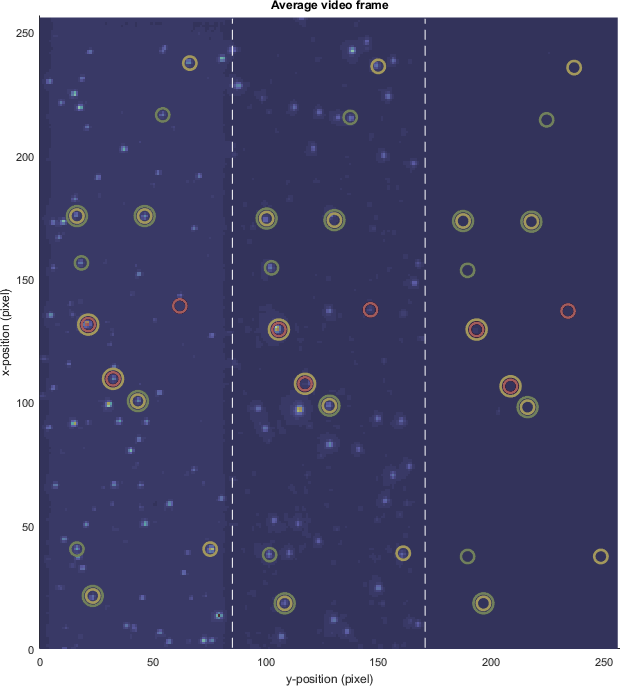
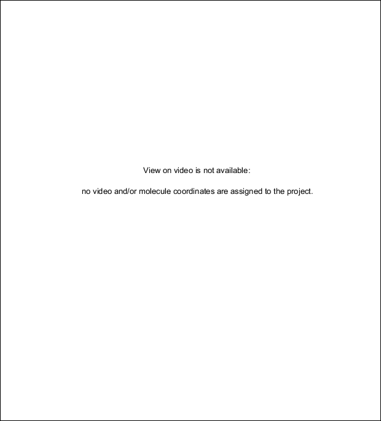

# Use Trace manager
{: .no_toc }

The trace manager gives an overview of all single molecules in the project and allows to assemble a molecule selection as well as to give molecules specific tags.

It is accessed by pressing 
 in the 
[Sample management](../components/panel-sample-management.html#trace-manager) panel of module Trace processing.

Trace manager is used to sort molecules into sub-groups and/or exclude irrelevant traces from the set.
It is composed of three modules:

---



Video view is used to visualize single molecule statuses in the video. 
Video view uses the single molecule video and single molecule coordinates associated with the project.

Video view is divided into one management area **(1-3)** and one visualization area **(4)**.

## Interface components
{: .no_toc .text-delta }

1. TOC
{:toc}

---

## Laser illumination

Use this menu to define the video frames taken into account for building the average image shown in the
[Visualization area](#visualization-area).

For experiments using alternated laser excitation (ALEX), video frames can be averaged over each laser illuminations.

Laser-specific average images allow to visualize the molecules labelled with the emitters that are specifically excited at this wavelength.
For instance, molecules labelled with Cy5 will be better visualized on the video frames recorded upon illumination at 638nm.

Select in the list the specific laser illumination wavelength to average video frames over, or choose `all` to average over all video frames.

---

## Molecule selection

Use this menu to define which molecule selection is shown in the
[Visualization area](#visualization-area).

To show:
- selected molecules only, choose the `selected` option
- excluded molecules only, choose the `unselected` option
- selected and excluded molecules, choose the `all` option

---

## Tag list

Adjust these options to show/hide specific molecule subgroups.

The affiliation of molecules to subgroups is defined by the molecule tags, with each subgroup tag being defined by a specific name and color.
When molecules have no tag, they are automatically affiliated to the `not labelled` subgroup colored in white.

To show molecule subgroups in the
[Visualization area](#visualization-area) whose tag name is written in **(b)**, activate the corresponding option in **(a)**.

---

## Visualization area

Use this interface to visualize molecule subgroups in the video.

If the project is associated with a single molecule video and single molecule coordinates, single molecules are shown on the average video frame calculated for the chosen
[Laser illumination](#laser-illumination) with colored circles centered on the corresponding molecule positions.
Circles are colored according to the tag-specific color and can be multiple if the same molecule is affiliated to several subgroups.

If the project is not associated with a single molecule video nor/or with a set of single molecule coordinates, Video view is not available and the visualization area display a warning.

